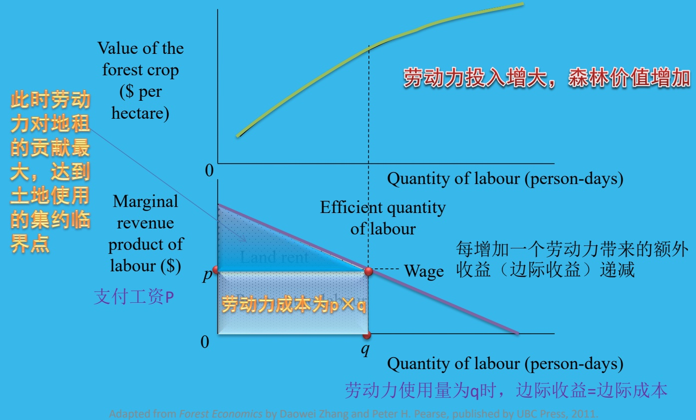
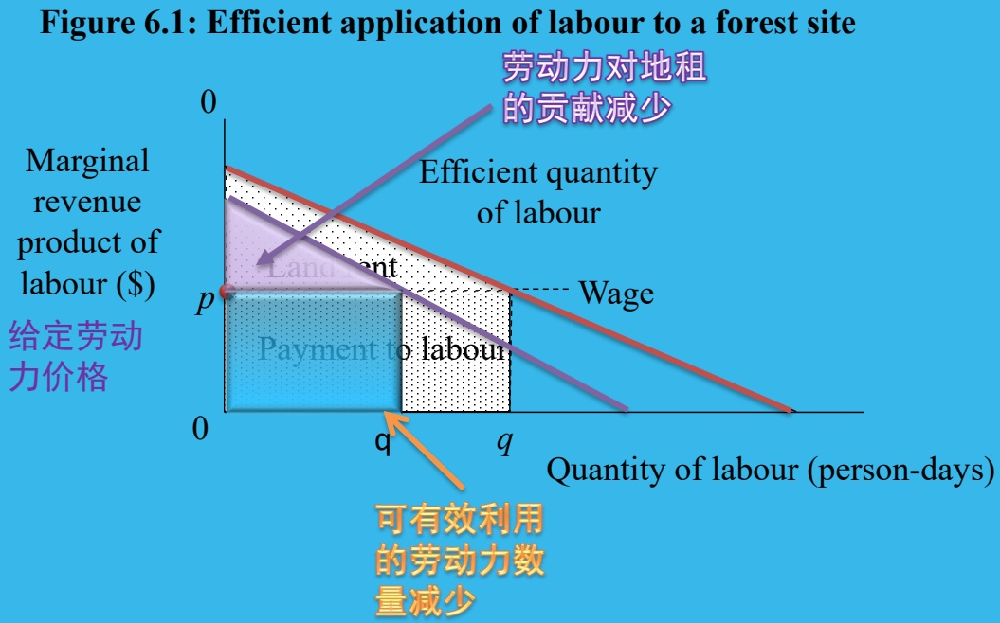
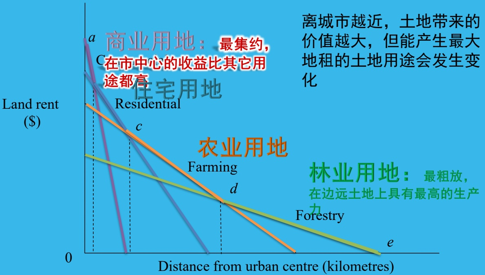
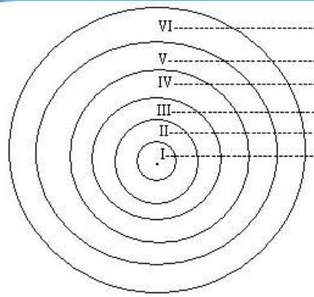
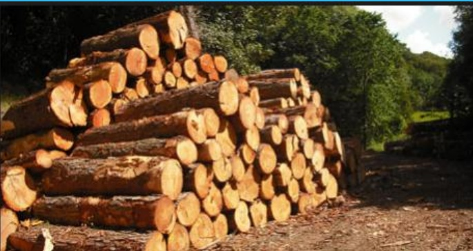
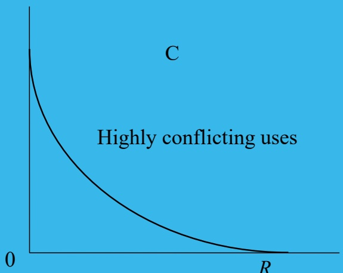
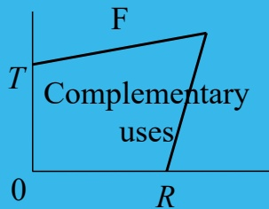
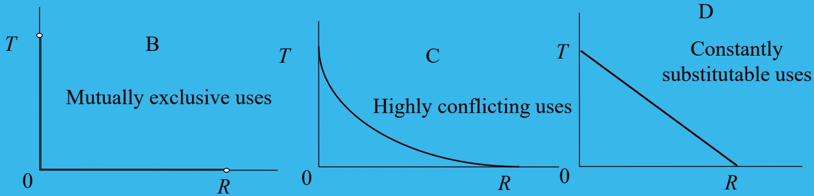
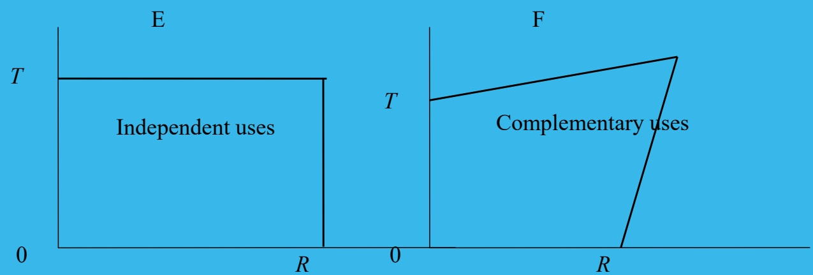

# 林业经济学（双语）-第四讲-土地配置与多边利用-2024

> Source: `林业经济学（双语）-第四讲-土地配置与多边利用-2024.pptx`
> Generated: 2026-02-25 17:24
> Pages/slides processed: 65

---
## Page 1

Land Allocation and Multiple Use 

第四讲：土地配置和多边利用

---

## Page 2

讨论：一片森林同时具有木材价值、非木材价值，如何来进行权衡与选择？

---

## Page 3

## Contents 

Intensity of Land Use 

Extensive Margin of Land Use 

Allocation among Uses 

Combinations of Uses 

Practical Difficulties 

An Ilustration:Land-Use Change 

Associated with the Rise of Institutional 

Timberland Ownership in the United 

States

---

## Page 4

What should we do?

The purpose:maximize thenet return 

---

## Page 5

# Attention to economic efficiency at  two levels 

给定用途时

配置劳动力和其它投入以产生最大收益

The most efficient way to manage land for any particular purpose How to apply labour and other inputs to generate the maximum return under a given land use 

未给定用途时

从土地的多种用途中找到能产生最大净收益的一种或几种组合

Selecting gamong the alternative uses to find the one,or the combination of uses,that yields the highest net return

---

## Page 6

土地使用的

集约程度Intensity of Land Use

---

## Page 7

# 在一片土地上，投入多少资本劳动力 最合适？

---

## Page 8

# What is intensity of land use?

land-use intensity is the extent to which land is used.

It is an indication of the amount and degree of development in an area,and a reflection of the effects generated by that development.

确定林业管理的最佳集约程度：

投入要素：土地、劳动力一资本等

在土地要素的供给量不变的情况下

应该使用多少劳动力和资本，来实现地租的最大化

---

## Page 9

假定：

一投入劳动力越多，同一片森林的价值越高

-2、但劳动力带来的边际收益会下降

如何确定劳动力的最佳使用量？

---

## Page 10

Figure 6.1: Efficient application of labour to a forest site 

---

## Page 11

不同生产力的林地，受其它生产要素的影响程度不同

---

## Page 12

Figure 6.1: Efficient application of labour to a forest site 

Value of the forest crop ($ per hectare)

Quantity of labour (person-days)

如果土地本身的生产力较低（不够肥沃、位置偏远、地形难以生产等）

土地对劳动力的报酬较低。劳动力的边际产品收益下降。

Adapted from Forest Economics by Daowei Zhang and Peter H. Pearse, published by UBC Press, 2011.

---

## Page 13

土地生产率较低，劳动力的边际产品收益较低或较快递减

AdaptedfromForestEconomicsbyDaoweiZhangandPeterH.Pearse,publishedbyUBCPress,2011.

---

## Page 14

因此：

生产力较高的林地，比生产力较低的林地更值得进行集约的营林

---

## Page 15

补充小知识：

“过密化”（“内卷化”）

参考阅读：黄宗智-《华北的小农经济与社会变

迁》《1368-1988年间长江三角洲小农家庭与乡

村发展》

## Involution 

-过密化描述一种“没有发展的增长”

一在人口压力下，通过劳动力或劳动时间的超量投入来实现产出增长，但劳动生产率无法提高-在一些情况下，过密化可能导致社会经济的停滞

---

## Page 16

# 土地使用 的  粗放临界点

Extensive 

Margin of Land 

Use

---

## Page 17

概念对比：

集约临界点与粗放临界点

---

## Page 18

# What is extensive margin?

There are two ways 

to increase 

production 

扩张生产的集约临界点——在给定的土地上进行更集约的经营

扩张生产的粗放临界点——将更多的土地用于森林培育

Cultivate forest land more intensive Intensive Margin 

Bring more land into forest production Extensive Margin

---

## Page 19

价格的变化带来生产水平的变动

生产水平的变动导致对林地利用方式的改变

产品价格将影响粗放临界点

---

## Page 20

# 土地的使用量随着价格变化

当木材价格较低时，地租也较低

只使用那些较高生产力的土地用于生产木材

当木材价格升高时，地租随之升高

低生产力的土地也逐渐用于生产木材

---

## Page 21

Figure 6.2: Relationship between price of timber and productive timberland 

木材价格为p时

均衡产量为q 

有I公顷土地被用于生产

---

## Page 22

Figure 6.2: Relationship between price of timber and productive timberland 

Productive timberland (hectares)更多土地被用于木材生产

Adapted fromForest Economics byDaowei Zhang and Peter H. Pearse, published by UBC Press, 2011.

---

## Page 23

## 用途的 选择

Allocation among Uses 

## 3

---

## Page 24

# 土地具有不同用途

农业、林业、游乐等….….

每种用途都能产生净收益

将两种或两种以上用途结合也能产生净效益

因此必须对不同的用途进行选择和分配

在特定的时间空间

如何选择能产生最大地租的土地用途?

---

## Page 25

# 不同特征与不同用途

土地有不同用途

土地有不同特征

肥沃程度

离市场远近

地形

可接近程度

农田

用材林薪炭林果树林游憩生态

每个特征的重要性与土地利用的目的紧密相关

---

## Page 26

# 示例：离城市中心的远近

距城市越近，对商用地价值的影响更高距城市越近，土劲禁排复影响相对较小

---

## Page 27

Figure 6.3: Efficient allocation of land among different uses 

---

## Page 28

## 参考：

－ 德国经济学家杜能(Johann Heinrich von Thünen)1826年提出

## 农业区位理论

放牧区或家畜饲养区（黄油、奶酪、活牲畜）

-三圃式农业区（黑麦、大麦、休闲轮作）谷草式农业区（谷类、牧草休耕轮作）-轮作式农业区（谷物和饲料作物轮作）林业区

-自由农作区（易腐烂的产品）

---

## Page 29

## Note 

First,the differential rent is the rent the land earns in excess of its opportunity cost 

Third the allocation of land to its highest use ultimately depends on the value of the outputs and the inputs in each alternative use,and because these constantly change SO does the efficient allocation of land 

Second,it is not always efficient to allocate to a particular use the most productive land for that use 

Finally,note that markets function only imperfectly in allocating land among uses

---

## Page 30

# 级差地租(differential lrent)

土地的多种用途中，产生最大效益的用途是效率最高的用途

次好用途产生的地租代表了土地的机会成本

超过机会成本之外的额外地租就是差额地租/级差地租(differential rent)

---

## Page 31

## 土地分配

仅根据某一种用途的生产力进行土地分配并非最有效的分配方法

还要考虑这片土地的不同特征，，以及不同用途

其它用途是否能带来更高的收益？

如何将土地分配到最佳用途，最终取决于各种用途所能产生的价值和投入的成本

---

## Page 32

## 粗放利用边界

技术、成本_价格的变化使不同最佳用途的边界发生变化，这就是粗放利用边界粗放利用边界附近的土地分配经常发生变化，但粗放利用边界内的土地利用则趋向稳定

---

## Page 33

## 市场失灵

土地市场的竞争将土地向那些最能有效利用土地资源的人手中聚集

但市场并非完美

土地利用分配过程对变化着的经济条件和政府政策的反应都是迟缓的

此外，外部性的存在也会使土地的社会效益和社会成本无法被市场价格所反映，导致土地利用分配出错

---

## Page 34

# 不同用途 的组合 

Combinations of uses

---

## Page 35

## 多边利用(Multiple use)

Multiple use is a popular idea,frequently extolled as a means of reconciling the growing and often conflicting demands on natural resources 

But it is also a vague concept,presenting a good deal of difficulty to resource manager who seek to apply it 

多边利用虽然被认为是解决自然资源不同需求间冲突的好方法，但也是个非常模糊的概念

---

## Page 36

## 待回答的问题

在何种程度上结合两种或各种用途在技术上是可行的？

在技术可行的情况下从经济或社会角度来考虑，何时和如何做才合适？

当考虑多边利用时，需要牺牲多少某种用途来换取另一种？

When,and to what extent,is it t technically feasible to accommodate two or more uses?

In those cases where it is technically possible,when is it desirable to do SO on economic or social grounds?

When multiple use is desirable how much of one use should be sacrificed for another?

---

## Page 37

## 1相互依赖性和生产可能性 Interdependence and production nK possibilities 

## 特殊情况1：任何用途都不经济特殊情况2：只有一种用途能产生地租

人们对土地没有任何需求

如一些极为偏远和不可及的林地

在这些地区，天然林的存在同样不具备经济采伐价值

它们虽然能为生态环境发挥有益的作用，但如果人们没有意识到这种价值，也就不存在决策问题

只有一种用途

一些生产性森林、草地，或边远游乐资源等

只能用于林业用途

有土地利用的集约程度问题，但不存在在相互竞争的用途中进行土地分配的问题

It is useful to identify ytherange condiw the possibilities or multiple euse

---

## Page 38

## Competing uses 

要讨论如何选择和分配不同用途，首先要分析不同用途间的相互依赖关系最常见的是-：“竞争性用途”，要要生产某种产品，必须要牺牲其它产品[Tale]

---

## Page 39

Figure 6.4: Types of production possibilities for two products on a tract of land 

Cubic metres of timberT per year 

T：如果不提供任何游乐功能，一片林地每年可以生产T立方米木材

靠近垂直坐标，曲线斜率较小，表示牺牲较少的木材产量就能提供一些游乐

Competing uses 

提供游乐越多，再多提供一天游乐所需牺牲的木材量越大

Recreation days per year 

R：如果不生产任何木材，一片林地每年可以提供R天的游乐

因此：凸离原点的生产可能性曲线，意味着两种产品间的边际转换率递增

生产可能性曲线的弯曲程度反映了在可能的组合范围内变化着的两种产出的竞争程度

Adapted from Forest Economics by Daowei Zhang and Peter H. Pearse, published by UBC Press, 2011.

---

## Page 40

Figure 6.4: Types of production possibilities for two products on a tract of land 

互斥用途：

两种用途之间完全不兼容

如原始林保护和木材生产

要么生产T单位木材，要么保留R平方

米原始林

两者不能同时进行

---

## Page 41

Figure 6.4: Types of production possibilities for two products on a tract of land 

高度冲突性用途：

边际转换率递减

连续增加某种产品产出时失去的另一种

产品产量越来越少

对景观森林来说，一旦出现木材工业，会严重破坏景观效果

但该木材工业继续扩大生产，对景观效果造成的进一步破坏却越来越少

这种关系并不常见

---

## Page 42

Figure 6.4: Types of production possibilities for two products on a tract of land 

恒定替代性用途：两种产出的替代率保持不变一个林分里的薪柴和工业用材可能属于这种情况也比较少见

相互独立性用途：两种用途之间互相不发生影响。

可以在不相互发生损害的情况下进行生产。

如森林的涵养水源用途和游憩用途之间

互补性用途：一种用途能促进另一种用途价值的提高如木材生产管理过程中的林下经济

仅有的相关点是在拐点处

其它沿着边界线的点和边界线内的点技术上都是低效的

---

## Page 43

2、相对价值与最佳组合

Relative Values andOptimumCombinations 

同一块土地有两种用途

需要考虑两者之间如何来进行适当平衡

以获取最大地租为目标，需要考虑两种相

互依赖产品的相对价值

假设：在木材生产产量（立方米）和森林

游憩（天数）之间权衡

有：

---

## Page 44

# 木材产量与森林游憩间的权衡

## 年木材产量（立方米）

木材和游乐间的相对价值：$\mathsf{V}_{\mathrm{t}}$ 的木材与$\mathtt{V}_{\mathtt{R}}$ 的游乐价值相等。

此时，两种产品实物生产的替代率刚好等于价值之间的替代率，即边际转换率刚好等于边际价值之比——实现最佳组合，产生的总价值最高

---

## Page 45

# 其它生产可能性形式的最佳方法

对互斥产品、高度冲突和恒定替代性用途的产品

价值交换线将与生产可能性曲线相交于垂直坐标或水平坐标上

表明生产用该坐标计量的那种产品能最大地租

因此：通常的解决方法是只生产那种能获得最大地租的产品

---

## Page 46

## 相互独立和互补性用途可以相互容纳

拐点处就是生产可能性曲线和价值交换线的切点

---

## Page 47

## 3 -用额外投入扩大生产可能性

使用较多的土地劳动力或资本生产可能性将向外扩展

产生新的最佳生产组合E 

如果所得的额外价值超过投入要素的成本

那么这种扩大生产是有利的

---

## Page 48

## -生产的联合和分离的形式

在实际生活中，生产多种产品的最有效的形式要复杂得多，差别也很大

有些情况下，如果两种或多种产品能够从森林中同时生产，就有可能达到它们的最有效状态（如生产木材和增加碳汇可以同时进行）

同时，也可以在森林的不同地区、不同时间段分别进行生产

如在不同地区分别进行游憩和木材生产

在不同时间段分别进行放牧和木材生产

---

## Page 49

# 5、竞争性的土地利用：工业用材生 产和环境服务 

森林所能提供的木材生产和环境服务在很大程度上是对土地的竞争性利用

一些小范围的冲突性利用，在更大的范围上就变成了竞争性利用

对竞争性利用意味着最优选择是找到两种产出的最优组合，而非只生产其中一种产品

可以对少量森林进行集约型经营木材生产，其它大量森林用于提供环境服务

·如：速生丰产林、分类经营理论

---

## Page 50

## 中国的森林分类经营

## 商品林

## 生态公益林

---

## Page 51

(生态)公益林non-commercialforest -为维护和创造优良生态环境，保持生态平衡，保护生物多样性等满足人类社会的生态孺求和可持续发展为主体功能，主要是提供公益性、社会性产品或服务的森林、林木、林地.

## 分类定义

商品林commercialforest 

-以生产木（竹）材和提供其他林特产品，获得最大经济产出等满足人类社会的经济需求为主体功能的森林、林地、林木，主要是提供能进入市场流通的经济产品。

---

## Page 52

森林分类系统

<html><body><table border="1"><tbody><tr><td>类别</td><td>林种</td><td>二级林种</td><td>主导功能</td></tr><tr><td rowspan="8">公益林</td><td rowspan="8">特种用途林</td><td>国防林</td><td>保护国界1掩护和屏障军事设施</td></tr><tr><td>科教实验林</td><td>提供科研、科普教育和定位观侧场所</td></tr><tr><td>种质资源林</td><td>保护种质资源与遗传基因、种质测定、繁育良种、培育新品种</td></tr><tr><td>环境保护林</td><td>净化空气、防污杭污、减尘降噪、绿化美化小区环境</td></tr><tr><td>风景林</td><td>维护自然风光和游憩娱乐场所</td></tr><tr><td>文化林</td><td>保护自然与人类文化遗产，历史及人文纪念</td></tr><tr><td>自然保存林</td><td>留存与保护典型森林生态系统、地带性顶极群落、珍贵动植物栖息地与 繁殖区和具有特殊价值森林</td></tr><tr><td></td><td></td></tr><tr><td rowspan="6">防护林</td><td>水土保持林</td><td>减缓地表径流、减少水力侵蚀、防止水土流失、保持土城肥力</td></tr><tr><td>护路护岸林</td><td>保护道路、堤防、海岸、沟粟等墓础设施</td></tr><tr><td>防风固沙林</td><td>在荒澳区、风沙洽线减缓风速、防止风蚀、固定沙地</td></tr><tr><td>农田牧场防护林</td><td>改普农区牧场自然环境、保障农牧业生产条件</td></tr><tr><td>其他防护林</td><td>防止并阻隔林火蔓延、防雾、护渔、防烟等</td></tr><tr><td></td><td></td></tr><tr><td rowspan="7">商品林</td><td rowspan="2">用材林</td><td>一般用材林</td><td>培育工业及生活用材、生产不同规格材种的木（竹）材</td></tr><tr><td>薪炭林</td><td>生产木质热能原料和生活嫩料</td></tr><tr><td rowspan="4">经济林</td><td>果品林</td><td>生产干、鲜果品</td></tr><tr><td>油料林</td><td>生产工业与民用油加工原料</td></tr><tr><td>化工原料林</td><td>生产松脂、橡胶、生漆、白蜡、紫胶等林化原料</td></tr><tr><td>其他经济林</td><td>生产饮料、药料、香料、调料、饲料、花卉、林（竹）食品等林特产品及 加工原料</td></tr></tbody></table></body></html>

---

## Page 53

## 实用中的 困难

Practical Difficulties 

## 5

---

## Page 54

# 林地市场常常不能有效分配资源

公有制的森林限制了市场作用的发挥

土地利用的外部性，导致政府利用分区制或其它控制措施来决定私人所有者如何利用土地

税收干扰了经济刺激，而无价格的成本和收益也干扰了市场信号和决策

---

## Page 55

# 实现土地利用最佳问题的两个方面

在一定的管理集约程度上·决定利用的最佳集约程度决定最有利的产品和效益或生产可能的增加量为多组合少

选择生产可能性曲线上的最佳点

两个问题都要求注意有关的经济价值和生产技术可能性

---

## Page 56

## 案例

假定

存在一片森林

每年连续生产1200立方米木材

并提供1000个游乐日

每立方米木材的价格是20元

每个游乐日的价值是25元

牺牲一半游乐容量，可以额外生产800立方

米木材

---

## Page 57

## 案例

牺牲一半游乐容量，可以额外生产800立方

米木材

牺牲游乐容量的价值：500游乐日×25元/

天=12500元

额外生产木材的价值：800立方米×20元/

立方米=16000元

带来16000-12500=3500元收益增加

这种组合的变换比原先的组合更经济

---

## Page 58

## 案例

假定：这种新组合已经是最佳组合

资源规划者估计：如果每年增加15000元管

理支出

可以将两种产品的产量各提高50%

即增加250个游乐日和1000立方米木材

则增加的收益为

250×25+1000×20=26250元

收益>成本

扩大生产是有利的

---

## Page 59

# 实践中的困难：数据获取

难以获取不同产品间的技术相互依赖关系

由于森林生产不同产品和服务的复杂性分析增加一种产出要损失多少另一种产出极为困难

获取相应的经济资料也有困难

需要每种产品的边际成本和边际收益

在同时生产两种或多种产品时，需要将成本在这些产品中进行分配

集约经营对拓宽生产可能性的程度可能也更为复杂

生产可能性曲线的扩展将会是不对称和不规则的

对效益的计量也常常比较困难

市场价格经常不可靠

必须对市场失调加以调整

对无价格效益的价值加以测算

---

## Page 60

一个例证：美国林地

所有权

变动所带来的土地利用变化

An Illustration:Land-Use Change Associated with the Rise of Institutional Timberland Ownership in the United States

---

## Page 61

## 案例：

20世纪90年代中期以前工业公司拥有6600万英亩用材林，占美国全部用材林的13%

曾提供了美国30%的木材供应量

机构投资者雇佣用材林地

投资管理机构

(Timberland 

Investment 

Management 

Organization,TIMOs)

来管理和经营

几乎所有的大型森林公司或是变成了以林地为核心的不动产投资信托公司(RealEstate Investment Trusts,REITs)或是将他们的大部分用材林卖给了机构投资者

现在，森林工业企业主要进行森林产品的加工和生产

在卖出林地是与购买他们林地的机构投资者签订期限不等的木材供应合同

---

## Page 62

## 案例

研究者发现，拥有自己的林地能够增加森林工业企业的营利能力和降低他们的风险

为什么工业企业要卖掉他们的林地，而非

自己来经营？

为什么机构投资者要买这些林地？

林地对机构投资者的价值要高于森林工业企业

---

## Page 63

为什么林地投资管理机构(TIMOs)和以林地为核心的不动产投资信托公司(REITs)能够获得比工业企业更高的收益?

解释1：森林工业公司的财务压力（低收入债务负担等）

解释2：制度和政策因素

美国的会计准则严重低估了林地的价值，树木的生长不被认为是资产的增长，使工业林所有者的资产被低估，成为被投资者追逐的对象。为了避免被强购或兼并，只能出售林地资产

《退休金安全法案》要求机构投资者寻求多样化的投资形势

税收政策更偏向机构投资者而非森林工业企业

解释3：机构投资者可以将林地更为灵活地配置给回报更高的用途

---

## Page 64

## 案例总结

在过去的20多年中

美国大多数以生产木材为目的的工业企业

的林地被机构投资者所购买

机构投资者的目标是追求利润最大化

通过生产木材产品和非木材产品

以及将林地转为其它用途来实现它们的目

标

经济环境、政府的法律、规则、税收政策

和会计制度都对此产生了重要影响

---

## Page 65

## Note 

土地的集约经营边际

-由土地以外的投入的边际收益和该投入的市场

价格所决定

林地的粗放边际

－林业生产时，净收益为零的林地

对多种用途土地进行分配和规划

－依据地租最大化原则

- 用生产可能性曲线分析不同用途间的技术依赖

关系

-以及几种用途的相对价格

---
