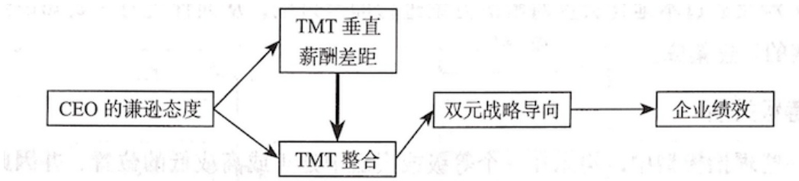
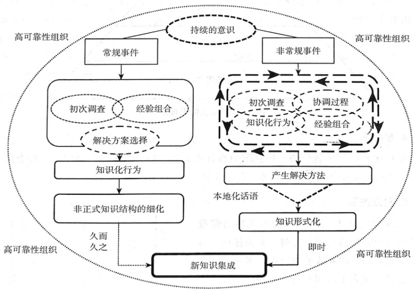
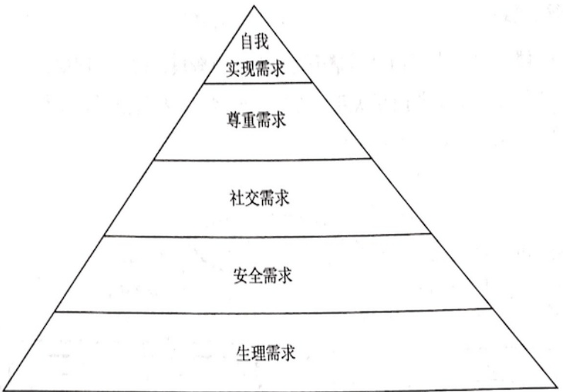
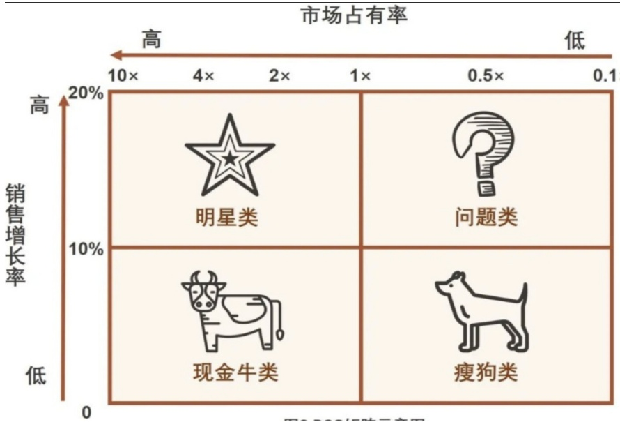
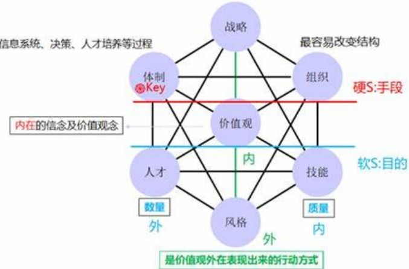
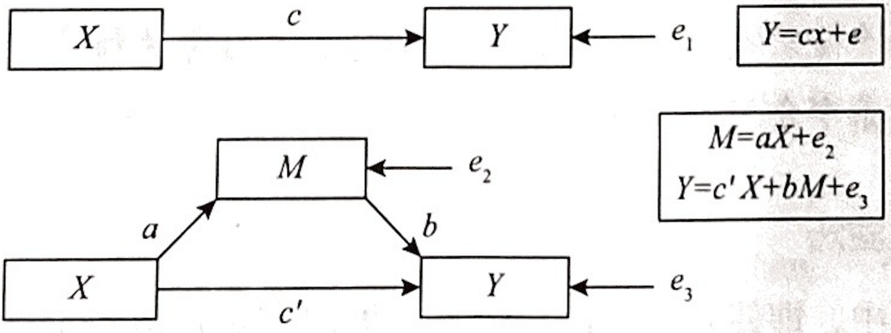

# 管理研究方法ppt

> Source: `管理研究方法ppt.pdf`
> Generated: 2026-02-26 14:53
> Chunks processed: 32

---
## Page 1

# 管理研究方法

---

## Page 2

# 第一章管理研究方法概述

---

## Page 3

第一节管理科学研究的一般范式  
=什么是实证研究  
  
/实证研究设计的基本目的  
三实证研究设计的一般过程  
四、实证研究论文的一般结构

---

## Page 4

## -什么是实证研究

：1.实证研究是基于对事实、客观的现象、数据进行系统的验证，进而得出结论的研究

2.实证研究的三大特征：以证据为依托、有数据、可以重复验证

）3.实证研究既包括定量研究，也包括定性研究

---

## Page 5

## 二、 实证研究设计的基本目的

## （一） 回答研究问题

1.研究问题的回答通常以研究假说（研究假设）的形式出现

2.研究设计的目的是通过数据收集和分析，为假说中所涉及的变量关系提供有效的验

证，从而判断研究者的理论预期是否得到了观察数据的支撑

## （二） 满足实证研究效度的要求

1.合理安排研究过程，确保研究结论的可靠性

2.严谨的研究设计基于变量的操作化质量、数据类型的选择、样本的确定等

## （三） 控制研究中涉及的各种变异量

1.根据研究问题选择合适的研究方法

2.有效控制可能造成因变量发生变化的各种变异量

---

## Page 6

三实证研究设计的一般过程  
（一）确定研究主题  
  
（二）文献回顾和探索性访谈  
（三）定义研究问题  
  
（四）进行研究假设  
  
(五）搜集数据  
  
（六）分析数据  
  
（七）结果报告

---

## Page 7

四[实证研究论文的一般结构  
（一）引言  
  
（二）文献综述(理论基础与研究假设)  
（三）研究设计  
  
（四）实证研究与结果分析  
  
(五)结论与讨论

---

## Page 8

第二节问题的提出  
=什么是好的研究问题？  
1如何确定科研选题？

---

## Page 9

## 1 什么是好的研究问题？

## （一） 此研究问题是否有人关注？是否有意义？

1.智力对农民创业的影响研究——是一个好问题吗?2.受教育程度对农民创业的影响研究———是一个好问题吗?3.互联网使用对农民创业的影响研究——是一个好问题吗?

---

## Page 10

# （二）此研究是否能为已知的理论提供一个新的视角，或是否有助 于解决一个尚未解决的问题? 

• 1.理论贡献：在多大程度上发展了前人的研究，回答了前人没有回答的问题（提高工资是否有利于增加员工绩效，是一个好问题吗？）

2.要么能够为现有现象提供一种新的解释，要么能发现一种前人未曾观察到的新现象

---

## Page 11

## （三） 研究问题的范围是否合适?

·1.范围不能太广：什么是好的营销战略?

• 2.范围不能太窄：XX企业采取的XX营销活动是否提高了市场占有率?

## （四） 是否有足够的时间和资源来完成研究?

· 1.时间：有多长时间可以用于研究？是否足够搜集资料?

• 2.资源：文献资源、数据资源、访谈的进入途径

## （五） 研究问题是否能带来一定的实践贡献?

提出研究问题后，可以进一步问自己，如果得到了这个问题的答案，该答案有什么应用价值?

---

## Page 12

如何确定科研选题？  
（一）个人学术兴趣驱动  
（二）文献驱动  
  
（三）学术会议驱动  
  
(四)与实践从业人员学习交流  
（五)与同事或同学交流

---

## Page 13

第三节文献回顾  
  
[文献回顾的主要类型  
文献回顾的基本步骤  
三、撰写文献回顾的注意事项

---

## Page 14

## 1 文献回顾的主要类型

## (一) 背景回顾

关注不同的背景和环境下，对同一个问题的不同分析思路和分析方法

## （二） 历史回顾

按时间顺序，追述某个主题历年来的发展，找出研究进程、发展脉络和学术前沿

## （三) 理论回顾

比较对于同一个研究主题发展出的不同理论

## （四） 方法论回顾

比较同一个主题的不同研究在方法论上的相同点和不同点

---

## Page 15

## 文献回顾的基本步骤

## （一） 界定和细化主题

从一个定义清楚、焦点明确的研究问题开始

## （二） 文献搜集

1.从与研究主题相关的影响因子最大的期刊开始，收集经典文献和前沿文献2.经典文献：提出了某个领域的原始概念、或极大推进了某个研究领域的发展3.前沿文献：顶级期刊近5年的文献

4.可以根据前沿文献的参考文献来追踪经典文献和更多文献

---

## Page 16

# （三）初步文献阅读和总结

· 1.读标题、摘要，初步划分研究模块

• 2.按照理论划分

• 3.按照研究方法划分

· 4.按照关键变量划分

• 5.建立各个模块的表格，统计此研究主题的发展史，构建该主题的发展脉络

---

## Page 17

## (四） 详细阅读文献并做出总结

• 1.筛选出与研究主题最密切的文献进行详细阅读

• 2.尽量一次读完，并反复读一些重要文献

• 3.敢于发现文献的缺陷

• 4.整理每篇文献的研究问题、所用理论、变量的定义和测量、分析方法、研究结论、局限性、可能的启发，并整理到图表中

## (五） 根据文献阅读的内容撰写文献回顾

---

## Page 18

## 三、 撰写文献回顾的注意事项

## （一） 全面回顾相关重要文献

1.如果发现搜不到文献，很可能是选错了关键词

2.如果发现和你的选题完全一致的文献，思考你的创新点在哪里

3.既不要遗漏文献，也不要大量回顾无关文献

## （二） 整合文献而非简单罗列文献

1.以研究问题为单位组织文献综述

2.对比不同文献在理论和方法上的差异，添加自己的评论与讨论

---

## Page 19

## （三） 说明此前研究存在的缺漏以及弥补缺漏的重要性

1.不要故意贬低前人研究

2.客观总结哪些领域存在缺漏，出现缺漏的原因以及填补该缺漏的重要性

## （四） 说明你的研究如何弥补现有文献的缺漏

1.研究的创新来源于对已有文献缺漏的填补

2.可以是视角的创新、方法的创新，也可以是数据的创新

---

## Page 20

第四节理论基础与研究模型  
[确定研究主题的因变量和自变量  
选择适当的理论基础  
  
三、构建研究模型框架

---

## Page 21

一确定研究主题的因变量和自变量  
(一)因变量：研究主题的核心要素  
（二）自变量：对研究主题产生影响的关键要素

---

## Page 22

## 一 选择适当的理论基础

## （一） 什么是理论?

1.理论是指经过大量测试，能广泛运用到一个较大领域的一般因果模型2.理论基础的选择与自变量息息相关

## （二） 什么是好的理论?

1.可靠性：理论中每一个概念的内涵清楚，概念之间的关系有一定的认可度2.适用性：具有明确的边界条件，一个理论只有在一定条件下解释某种现象的出现

---

## Page 23

## 三、 构建研究模型

## （一） 什么是研究模型?

1.模型框架体现了研究中所有变量间的关系，既包括自变量对因变量的影响大小和方向，也包括了自变量通过何种机制或路径作用于因变量，还包括了在不同条件下，自变量对因变量的影响大小和方向是否存在差异

：2.理论基础为整篇文章的模型框架服务，负责解释变量间为何存在因果关系

·3.一篇论文的研究模型可以包括一到三个理论基础，最好不要超过三个

---

## Page 24

## （二） 论文中常见的研究模型框架

1.是什么：what 2.为什么：why 3.何种情景：when 4.何种机制：how

---

## Page 25

第五节因果关系  
[因果的单独运作性  
因果的相关性  
三、景影响方向性

---

## Page 26

## I 因果的单独运作性

（一）因果关系的单独运作性是指对一个因变量Y而言，看它是否受到某个自变量X的影响，需要保持其他因素不变，只允许X和Y变化

（二）在研究设计中，需要在可能的条件下最大限度的控制可能影响因变量的噪声变量

---

## Page 27

## （三） 实验研究最能体现因果关系的单独运作性，可分为实验室研究和现场研究(准实验研究）

### 1. 简单随机对照实验：

将实验对象随机分为实验组（treatment group）和对照组（controlgroup），其他条件相同，只有测试变量X在两组不同

### 2. 准实验：

在现实情况下出现的试点或"自然实验”，需要通过计量方法论证实验组和对照组在控制变量方面具有可比性

---

## Page 28

# （四）基于一手数据或二手数据的实证研究也能在一定程度上显示 因果关系的单独运作 

，设置多个控制变量，以确保自变量和因变量之间的因果关系，包括个人层面、团队层面、组织层面、行业层面、区域或国家层面的控制变量等

---

## Page 29

## 二、 因果的相关性

（一）相关性指的是果与因一起变化，即自变量与因变量总是一起变化

（二)）要证明两个因素是否有因果关系，首先要证明两个因素存在关联

（三）常用的方法是采用统计学中的相关性计算，判断两个因素之间是否存在显著相关，如显著，是正相关还是负相关，相关系数的大小代表了关联性的大小

---

## Page 30

## （四） 关于相关性的注意事项：

）1.相关性不代表因果性：两个有因果关系的要素必然相关，但相关要素未必存在因果关系

）2.混淆变量：一些变量与自变量和因变量都相关，会导致自变量和因变量之间产生虚假的相关关系

3.多重共线性：一些控制变量与自变量高度相关，加入模型后会导致自变量的系数不显著

---

## Page 31

## 三 影响方向性

（一）因果关系的方向性是指因果变化之间的时间顺序

（二）在互为因果的关系中，需要排除反向影响，明确单向的因果关系

（三）自变量和因变量之间的关系并非只有线性正相关和负相关两种，还存在非线性关系，如先增加后减少的倒U型曲线，只有当自变量增加或减少到一定程度才影响因变量的J型曲线等

---

## Page 32

第六节研究假说  
[什么是研究假说？  
研究假说的具体要求  
三、研究假说的注意事项

---

## Page 33

# 一什么是研究假说？

研究假说是对自变量与因变量之间可验证关系的陈述

---

## Page 34

## 研究假说的具体要求

## （一） 至少包括一个自变量和一个因变量

1.简单关系：一个自变量X直接影响一个因变量Y 2.中介效应：自变量X通过中介变量M影响因变量Y 3.调节效应：自变量X对因变量Y的影响随着M的变化而变化

## （二） 不仅要提出自变量和因变量之间的关系，还要指出它们是如何相关的

1.如：企业学习能力对企业绩效有显著的正向影响

2.或：相比其他行业，高科技行业的企业学习能力对企业绩效的正向影响更大

---

## Page 35

## （三） 研究假说必须可验证

1.可证伪性：一个研究假说只有能被验证是否是错误的，才是科学的研究假说

2.定义越明确、详细、具体，研究假说可被检验的程度越高

3.如：企业学习能力究竟意味着什么？具体用什么来衡量？哪些企业可以被界定为“高科

技企业"？企业绩效包括哪些衡量指标?

4.不好的研究假说：拥有"狼性文化"的企业更容易获得成功

---

## Page 36

## 三、 研究假说的注意事项

## （一） 明确假说的贡献

### 1. 侧重于某一个或一类自变量

(1)影响因变量的因素有多个，其中一些自变量已经得到了较多研究(2)本研究侧重于关注以往研究者忽视的某个重要自变量

### 2. 专注于因变量，包括所有可能的影响因素

(1)以往研究者只关注与因变量中的某个侧面(如企业绩效中的财务绩效)(2)本研究关注其中另一个经常被忽视的重要侧面(如强调非财务绩效的重要性）

---

## Page 37

## （二） 每一个研究假说只讨论一个自变量与一个因变量之间的关系

● 1.如果一个研究中包括了多个自变量对一个因变量的影响，那么在假设中应该分别提出，而非堆叠在一起

2.注意控制变量需要包括在模型中，但不一定需要包括在假设中

## （三） 避免同义反复，即自变量的定义与因变量之间不能重叠

（四）避免命定论，即无法证伪的假说

---

## Page 38

第七节变量的定义  
[变量定义的重要性  
变量与变量值的区别  
三、变量的类型

---

## Page 39

# 一什么是变量?

变量是具有可变化特征的因素

---

## Page 40

变量定义的重要性  
  
（一)让非本领域的读者能读懂文献，传播知识  
（二）是假设论证的基础，变量的定义要与理论保持一致  
（三）是是变量测量的基础

---

## Page 41

## 三、 变量与变量值的区别

(一）变量值：一个变量所描述的特征或数量

（二）如变量是受教育程度，变量值就是小学以下、小学、初中一高中、大学及以上等

---

## Page 42

## 四、 一变量的类型

（一）按变量发挥的作用分类  
  
1.自变量：不依赖其他变量，自身可以变化的变量  
2.因变量：依赖其他变量的变化而发生变化的变量  
3.调节变量：衡量自变量与因变量之间作用情景的变量  
4.中介变量：自变量通过中介变量对因变量发生作用  
5.控制变量：自变量以外的其他可能影响因变量的变量

---

## Page 43

## （二） 按变量可量化的程度分类

### 1. 名义变量：

无法排序，变量值之间没有顺序和等级的差异，只用于区分变量的类别，取值数字不代表大小，如"省份”，“性别”

### 2. 有序变量：

可以按照一定的逻辑排序，如"非常不同意""比较不同意"“一般""比较同意”“非常同意”

### 3. 定距型变量：

不仅可以排序，且变量值之间的差是有意义的，但定距变量不存在基准零值，只有相对零值，0不代表没有，比如温度、海拔

### 4. 比率型变量：

相比定距型变量，有绝对0值，0代表没有，比如工资、员工规模

---

## Page 44

## （三） 根据是否由模型本身决定

### 1. 内生变量：

非政策变量，是指在经济体制中完全由经济因素所决定的，由模型决定且完全不受政策因素影响的变量，是具有每种概率分布的随机变量

### 2. 外生变量：

政策性变量，是在经济体制中受政策因素决定而不由经济因素决定的变量，会影响内生变量，但不受其他内生变量的影响，模型系统不研究其参数

---

## Page 45

第八节数据的搜集与分析  
I 数据搜集方法  
  
[问卷调查中的抽样方法  
三数据分析方法

---

## Page 46

## 1 数据搜集方法

## （一） 实验法

1.当研究者的关注焦点是确定变量间的因果关系，需要剔除各种替代解释对研究结论的影响时，实验法是最好的选择

2.将被试者随机分配到代表自变量不同程度的各个实验组和控制组中，观察不同组自变量对因变量的影响差异

3.实验法结论可靠性较高，但成本也相对较高，且可能存在一定伦理问题或条件限制

---

## Page 47

## （二） 准实验法

·1.无法随机分配实验对象时，可采取准实验法

• 2.在自然场合下进行观察后收集数据

• 3.缺点：无法使用随机分配消除混淆变量和替代解释，内部效度略低

• 4.优点：对研究条件要求较低，可操作性较强，研究结论适用范围相对较广

---

## Page 48

## （三） 问卷调查

·1.是定量研究中使用最多的方法

）2.对被调查者干扰较小、可操作性较强

3.应尽量选择已经成熟的、经过多次研究验证、信度和效度较高的量表；如果没有成熟的量表，则需要自己开发

：4.样本量要求较大

5.问卷搜集信息应包括自变量、因变量、调节变量、中介变量、控制变量

---

## Page 49

## (四） 二手数据

1.客观性和可重复性较高

·2.是他人基于一定的研究目的或是制度要求搜集或发布的数据，不是专门为了本研究而设计的，因此可能缺乏本研究需要的变量

3.研究者在使用二手数据时，通常未能直接与研究对象发生直接接触，可能存在信息的损失或扭曲

·4.可以通过公共或公开的渠道获得，常见的公开披露数据有上市公司数据、专利数据、工业企业普查数据、年鉴数据等

---

## Page 50

## (五） 案例研究

1.属于定性式实证研究

）2.收集数据的方法包括访谈、观察、实务分析、口述史、叙事分析、历史法等，最常用的是访谈

3.相比问卷调查，访谈具有更大的灵活性以及对意义进行解释的空间，信息损失更少

4.访谈包括结构型访谈、非结构型访谈、半结构型访谈等

---

## Page 51

## （六） 文本分析

· 1.针对收集到的客观文本数据，开展定性与定量结合的分析方法

• 2.采用一定标准对文本构建类目并编码，在此基础上开展分析并得出结论

· 3.包括质性文本分析和量化文本分析

· 4.质性文本分析：通过对大量文本的编码提炼出理论

• 5.量化文本分析：使用字数统计、词频或词语组合统计等量化方法

---

## Page 52

## 问卷调查中的抽样方法

## （一） 概率抽样

1.在限定的被研究对象中，每一个单位都具有同样的被抽中概率

2.概率抽样使得样本统计结果能够推断总体状况

---

## Page 53

## （二） 非概率抽样

### 1. 目的抽样：

按照研究目的抽取能够为研究问题提供最大信息量的研究对象，也被称为理论性抽样，即按照研究设计的理论指导抽样

### 2. 滚雪球抽样：

通过一定渠道找到一位知情人士，获取相关信息后请对方推荐下一位知情人士，直到信息饱和为止

---

## Page 54

### 3. 机遇式抽样：

在调研过程中根据当时观察到的情况灵活抽样

### 4. 目的性随机抽样：

在质性研究中，确定研究目的和范围后，对较大范围的研究对象开展小规模随机抽样

### 5. 方便抽样：

受当地实际情况限制，只能根据研究者自身的方便抽样，可信度较低，因果推论容易不严谨

### 6. 综合式抽样：

在研究的不同阶段采取不同抽样方式

---

## Page 55

三、数据分析方法  
  
（一）样本概况与描述性统计  
（二)相关分析与多重共线性检验  
（三）常见回归模型  
  
（四）进一步分析

---

## Page 56

# 第二章论文的选题、摘要和引言

---

## Page 57

第一节论文的选题  
[什么是好的研究问题  
1研究问题的常见来源

---

## Page 58

一什么是好的研究问题  
（一）相关性  
  
（二）可管理性  
  
（三）可延伸性  
  
（四）清晰简明性  
  
（五）趣味性

---

## Page 59

## （一） 相关性

### 1. 所选择的研究问题应与所在领域的研究对话相关

### 2. 需要阅读改研究对话下关键的理论文章和实证文章

(1)第一个建立该研究对话的学者的文章

(2)出现关键转折点的文章

(3)此研究对话下相关的文献综述或元分析文章

---

## Page 60

## （二） 可管理性

1.所提出的研究问题要在自身的研究范围内

）2.是否有能力获取与研究问题相关变量的数据？

3.是否有能力将研究问题的概念与所获得的观察、现象、指标或变量联系起来?

## (三) 可延伸性

）1.好的研究问题通常能够形成一个体系，彼此之间有较强的逻辑关系

• 2.一个大的研究选题下可以有多个子研究课题

---

## Page 61

## (四） 清晰简明性

• 1.研究问题的说明最好能被精简成一句简单明了的陈述句

• 2.每一篇论文最好只识别一个研究目标

## （五） 走趣味性

1.避免跟风研究问题

：2.避免仅仅为了方便来确定研究问题

---

## Page 62

-研究问题的常见来源  
（一）建立一个新的研究领域  
（二）完善现有研究领域的研究问题

---

## Page 63

# （一）建立一个新的研究领域

· 1.现有理论无法解释某个新的管理现象，如"创业的集聚现象”

2.现有理论无法解释某个现实生活中的现象，如"农村社会关系中的面子现象

---

## Page 64

## （二） 完善现有研究领域的研究问题

### 1. 现有研究不完整：

先前的文献只聚焦于某个全局的一部分，未阐述其他部分

如：社会资本分为认知社会资本、结构社会资本和关系社会资本，在应用社会资本理论探讨社会资本对个人成长和职业成功的影响时，现有研究着重于关系社会资本和结构社会资本的作用，而忽略了认知社会资本的角色

---

## Page 65

### 2. 现有研究不充分

研究研究对某个问题的解释主要采用了A理论，而忽略了还有其他理论可以解释这个问题；或者现有研究只关注了某个因素的积极影响，忽略了其消极影响

，如：现有研究较多使用地理经济理论来解释创业集聚现象，较多关注规模效应和集聚带来的创新，但较少讨论在创业过程中本地社会关系网络存量的作用

又如：现有研究更多强调社会资本带来的好处，但对社会资本对企业运行和绩效带来的问题缺乏足够的讨论

---

## Page 66

### 3. 现有研究不正确

说明之前的研究结果不可靠，攻击性较强，需要谨慎使用

·可以指出前人在基础假设上的应用错误导致结论错误，如在投资市场上，投资者往往出现不理性的投资行为，导致金融市场出现严重波动

也可以指出前人研究过程中的不严谨导致的研究结论错误，如一些研究者发现，有关自制力的部分行为心理学实验无法复现；或者在引入新的方法后，发现研究得出了与前人相反的结论

---

## Page 67

### 4. 现有研究相互冲突

现有实证研究表明两个变量之间的关系存在正相关/负相关、显著/不显著等相互冲突的关系，如”一些实证研究结果表明，创业导向与企业绩效呈现正相关关系，但另一些实证结果却呈现不相关甚至负相关关系”

现有研究在证明两个变量之间究竟存在替代还是互补关系时，得出截然相反的结论，如详细的契约与信任之间究竟是替代关系还是互补关系?

在现有研究相互冲突时，最好能够指出本研究发现了什么样的结合点，或者不同关系的适用条件

---

## Page 68

第二节论文的摘要  
I 什么是摘要  
  
摘要写作的三个步骤  
三、摘要写作常见问题  
四、好摘要的标准及检查完善

---

## Page 69

一什么是摘要  
  
（一）摘要的定义、功能及特征  
（二）摘要的内容  
  
（三）摘要的重要性

---

## Page 70

## (一) 摘要的定义、功能及特征

### 1. 定义

摘要是对某项研究的研究背景、研究意义、研究目的、研究问题、研究内容、研究方法、研究思路及过程、研究发现及结论和相关政策建议的简要概括

---

## Page 71

### 2. 功能

## (1) 概括：

通过对论文主要内容的概括总结，让读者能够在较短的时间内对论文的研究内容与研究价值有一个总体性的认识

## (2) 突出：

尽可能激发读者阅读全文的兴趣

---

## Page 72

### 3. 特征

## (1) 独立性：

摘要是独立成文，既不是文章目录或者研究思路的"重演"，也不是文章结论的简单复制

## (2) 内容性：

摘要要有实质性的具体内容，不能讲套话和空话，且这些内容应该与正文保持一致

## (3) 新颖性：

摘要最好能体现论文的创新点，如新视角或新方法等，这是吸引读者读下去的关键

---

## Page 73

## （二) 摘要的内容

### 1. 研究目标：

说明这篇文章要做什么，交代清楚问题和假说

### 2. 研究内容：

说明这篇文章是怎么做的，交代研究设计的思路和方法技术

### 3. 研究结论：

说明研究发现，回答开头提出的问题并明确告知假说检验结果

### 4. 研究价值：

阐述研究发现有什么意义，包括所检验假说的理论价值和政策含义

---

## Page 74

## (三） 摘要的重要性

### 1. 提纲作用：

在论文写作前，帮助作者从内容入手来组织论文结构与写作

### 2. 总结作用：

在论文完成后，帮助作者检查全文的思路、方法和创新点

---

## Page 75

摘要写作的三个步骤  
（一)第一步：找榜样  
（二）第二步：摒弃错误认识  
（三）第第三步：技术动作拆解

---

## Page 76

## （一） 第一步：找榜样

· 1.从《经济研究》《管理世界》《中国工业经济》等顶级期刊搜集10篇相关主题的论文，研读其摘要

2.品味四类重要句型

（1)研究目标句：这篇论文的研究目标和研究问题是什么?

（2)研究内容句：这篇论文的研究框架、设计、方法和步骤是怎样的?

（3)研究结论句：研究结果是否验证了假说？

（4)研究价值句：这篇论文的理论意义和政策含义是什么？

3.临摹：挑选重要期刊上的论文，在读完文章后尝试为其撰写摘要，并将自己写的摘要和作者对比

---

## Page 77

## （二） 第二步：摒弃错误认识

1.直接套用其他论文摘要中的句式术语，如研究目的、研究思路等

）2.将论文的目录或章节再讲一遍

·3.大谈研究背景及意义，不谈自己的论文

·4.主要讲思路和方法，不讲研究结论

·5.主要讲统计和计量分析结果，不讲论文整体结论

---

## Page 78

## （三） 第三步：技术动作拆解

### 1. 写摘要的三步写作动作

•（1)概括：概括该研究的目标、内容、结论及价值

• （2)聚焦：聚焦于研究的假说检验，这是论文的核心，要将摘要的每一部分内容都和假说检验关联起来，明确问题和假说，并交代清楚假说的理论逻辑和对应的经验证据

（3)论证：突出这项研究的创新点，包括研究角度、方法技术等，并明确假说的验证对于推进“认识分歧点"或"认识空白点"的价值是什么

---

## Page 79

### 2. 摘要中的四个句子

## (1) 研究目标句：

①一句话讲清楚研究目的

②使用"描述”、“衡量”、“分析”、“构建”、“解释”、“揭示”、“设计”、“评价”等动词

③说明研究运用的条件和手段

④强调关注的一个或几个研究问题

---

## Page 80

## (2) 研究内容句

①常规句."使用…方法对.…进行实证分析”

②可以瞄准研究目标分成几步，并说明这几步是什么关系

）③交代清楚全文的研究思路和方法

---

## Page 81

## (3) 研究结论句

• ①对研究目标句提出的问题进行正面回应· ②不要将统计结果重新照抄一遍

## (4) 研究价值句

①与政策建议有关，需要注意理论的适用范围

②与研究结论要密切相关

---

## Page 82

三、摘要写作常见问题  
（一）内容不完整  
  
（二）内容缺乏个性  
（三）内容概括性不够

---

## Page 83

## 三、 摘要写作常见问题

## （一） 内容不完整

1.研究背景繁杂冗长，与文章主题关联不大

2.研究内容不具体、只有套话，甚至用研究方法凑数

3. 研究思路交代不清楚，与研究方法、内容不匹配

4.研究结论缺失，或与假说对接不上

5.政策建议脱离文章内容，缺乏针对性

---

## Page 84

## （二） 内容缺乏个性

1.研究背景或意义和自己的研究关系不大，引用不当2.研究思路或过程借用别人的套话，看不出实际内容

## （三） 内容概括性不够

1.研究背景过长，离研究主题过远

2.摘要变成了论文目录的翻版

3.摘要变成了论文正文的压缩版

4.研究过程与研究发现杂糅在一起，导致重复冗长

---

## Page 85

四一好摘要的标准及检查完善  
（一）好摘要的标准  
  
（二）检查与完善

---

## Page 86

## （一） 好摘要的标准

### 1. 内容充实：

科学的问题、合理的方法、明确的结论和建议

### 2. 符合规范：

多学习好论文中的摘要格式和写法

### 3. 表达贴切：

摘要的句子不要直接摘抄论文的句子，而是用不同的话精炼贴切地表达

---

## Page 87

## （二） 检查与完善

1.内容是否连贯，句子与句子之间是否顺畅，推敲“目标——内容——结论——价值“这一

逻辑链条

2.摘要内容与正文是否一致，关键假说、方法、结论和政策建议要检查清楚

3.注意内容之间的平衡，不要出现某一部分内容过多或过少的现象，中心和重点要围绕

论文的假说检验，不要偏题

4.是否有聚焦假说的明确中心点，研究发现与研究目标是否一致

5.背景的长度是否过于冗长，是否偏离了研究主题

6.避免在摘要中大幅套用空话，避免大幅引用他人观点

---

## Page 88

第三节论文的引言  
  
I 什么是引言  
  
-引言的内容与结构  
  
三引言写作常见问题  
  
四、引言的示例与剖析（练习）

---

## Page 89

什么是引言  
  
（一）定义  
  
（二）功能、作用与对象  
(三)特征

---

## Page 90

## （一） 定义

• 1.引言是结合经验事实与已有研究，对自身研究的内容、创新性及重要性的论证

• 2.内容：核心是论证此项研究的重要性及研究意义，包括创新点、理论价值以及现实意义

3.形式：包括以下六部分

（1)研究背景：研究的现实背景和科学问题，包括事实、数据、新闻等

(2)文献评述：简要说明现有文献的主线、脉络、分歧、不足及评价

 (3)研究目标、内容及特点

(4)研究发现

(5)研究价值及意义

(6)研究的内容安排

• 4.表达方式：结合已有研究及自己的研究发现，论证本研究的重要性、创新性及可行性

---

## Page 91

## （二） 引言的功能、动作与对象

### 1. 引言的功能

实现三个目标

(1)提出问题/假说使用文献综述作为素材(2)检验假说

使用研究设计作为素材

## (3) 论证假说

使用实证分析作为素材，针对问题、运用理论、研究方法及经验证据等论证假说的合理性、创新性及理论价值

---

## Page 92

### 2. 引言写作的动作：概括、比较和论证

## (1) 概括：

概括文献综述部分的问题与假说、研究设计部分的分析框架、研究策略以及实证分析部分的经验证据，目的是为后续的分析和比较奠定内容基础

## (2) 比较：

a)比较原有认识和论文认识之间的差异与联系

b)比较假说内在逻辑与经验证据之间的差异与联系

c)为论证假说的创新性和逻辑合理性服务

---

## Page 93

## (3) 论证：

a)论证问题和假说的重要性和准确性：所揭示的认识分歧点是否有道理b)论证研究设计的合理性：研究框架和分析策略是否匹配和有效c)论证假说的价值：所检验假说是否推进了理论认识，是否有助于实践

---

## Page 94

## (三) 引言的特征

### 1. 独立性：

独立成文，阅读引言即可理解全文大意

### 2. 论证性：

不能仅仅介绍文章大意，而是要在写法上体现论证过程和逻辑

### 3. 创新性：

选题和立意要新颖，能够指出本研究相对过往研究的创新点，吸引读者注意力

---

## Page 95

引言的内容与结构  
（一）内容  
  
（二）结构  
  
（三）检查要点  
  
（四）注意事项

---

## Page 96

## （一） 内容

### 1. 研究背景:

从现实世界中观察到的变化、冲突或矛盾，引出所研究领域中的关键问题

### 2. 文献述评：

(1)紧密围绕研究问题，回顾相关研究进展，可按时间脉络或正反观点展开

(2)与下文专门的文献综述章节不同，引言部分的文献综述更注重凸显本研究的贡献和价值

(3)文献综述要对以往研究有评价，从而引出本研究能做到而别人没能做到的地方在哪里

---

## Page 97

### 3. 研究目标、内容及特点

(1)目标要明确

(2)内容要具体，可以分条来写

(3)特点突出研究假说的创新点，并与前面的文献综述紧密联系，前后呼应

### 4. 研究发现

(1)交代检验假说的结果

(2)和前面提出的问题和研究目标一一对应

(3)最重要的研究发现写在最前面

---

## Page 98

### 5. 研究价值与意义

(1)理论上的突破

(2)实践上的运用价值(3)方法或视角上的创新

### 6. 内容安排

(1)交代全文结构

(2)最好不要只是罗列全文目录(3)要有研究部署或设计的感觉

---

## Page 99

## （二） 结构

### 1. 在行文顺序上呈现出“问题——已有研究——本研究"三者间的关系

(1)提出问题：研究背景

(2)评述针对该问题所进行的研究：文献述评

(3)本研究的目标、思路、内容和可能的创新点：研究目标、内容及特点、研究发现、研究价值和意义

(4)内容安排

---

## Page 100

### 2. 在段落的衔接上前后呼应

：（1)研究背景段的最后一句要切题，并引领第二段研究述评里的问题

• (2)文献述评段首句要和前一段最后一句相呼应

·(3)文献述评段的最后一句点出未来可能的突破方向

(4)研究目标段的第一句要和前面指出的突破方向关联起来

---

## Page 101

### 3. 把握住论证这个基本逻辑

(1)研究的视角、思路和方法都要与文献述评中的已有研究形成对比，凸显本研究的创新价值

(2)研究价值与研究意义同样要结合文献述评和研究内容，基于研究发现或结论展开

---

## Page 102

## （三） 村检查要点

• 1.基本事实是否交代清楚

·2.尝试用一句话概况要研究的问题，并预判一下，若该问题得到解决，能否在理论上推进对某领域的认识？

3.引言是否有力论证了本研究的价值或创新性？

4.行文上是否逻辑顺畅？

5.引言和正文内容是否出现句子的重复？

---

## Page 103

## （四） 注注意事项

）1.设置引人入胜的引子，突出主流趋势，引发读者好奇心

·2.明确研究目的，以"问题"为中心，所有内容围绕这个问题而展开

）3.打好文献基础，在比较中凸显研究的创新点

• 4.可以在完成研究假说检验或数据分析结束之后撰写引言，也可以完成论文其他部分以后最后撰写引用

5.引用的总字数不超过论文的10%，但撰写时间可能需要25%到50%

---

## Page 104

三、引言写作常见问题  
  
(一)缺乏论证  
  
（二）进入主题太慢  
  
（三）研究问题不明确  
  
（四）理论价值或政策意义缺乏针对性  
（五）不够精炼  
  
(六）试图用“复制粘贴"蒙混过关

---

## Page 105

## （一） 缺乏论证

1.缺乏对本研究自身内容逻辑的论证

2.缺乏对本研究相对已有研究的边际贡献的论证

## （二） 进入主题太慢

1.研究背景篇幅过长

2.研究背景与研究主题关联度不大

---

## Page 106

## （三） 研究问题不明确

1.没有提出需要回答的科学问题

2.提出的科学问题不符合学术同行认可的规范和要求

3.提出的科学问题不具有相对应的理论基础

4.提出的科学问题无法具体展开分析和验证

---

## Page 107

## (四） 理论价值或政策意义缺乏针对性

1.引言并未针对自身研究，而是针对整个领域来谈理论或政策意义2.胡乱引用、东拼西凑

## （五） 不够精炼

1.重点不突出

2.逻辑线索不清晰

---

## Page 108

## （六） 试图用“复制粘贴"蒙混过关

1.重复使用翻版句式

2.无法实现引言论证的功能

## （七） 过度承诺

1.引言为了吸引读者注意设置了较高期望，但后续研究内容并未兑现承诺2.提出的理论贡献或创新点与全文实际不符

---

## Page 109

## 四、 引言的示例与剖析（练习）

（一）挑选两篇自己感兴趣的实证论文，在引言部分找出该文章的研究背景、文献述评、研究目标、内容及特点、研究发现、研究价值与意义以及内容安排六个方面的内容，拆解和揣摩每个部分的功能、动作和对象，比较两篇论文在这六个方面的异同

（二）划出引言各部分的段落之间的过渡句，找到每段最后一句和下一段段首句之间的衔接关系，观察每一段内部的总分结构，句子之间如何形成逻辑联结

（三）划出哪些句子凸显了本研究的中心问题，哪些句子强调了研究的创新点，并分析引言其他各部分是如何为研究的中心问题和创新点服务的

---

## Page 110

# 第三章如何写文献综述

---

## Page 111

第一节什么是文献综述  
[定义  
  
功能  
  
三、特征

---

## Page 112

## 一 定义

对迄今为止与某一研究问题相关的各种文献进行查阅和分析，以了解该领域的研究进展和现状

## 一 功能

（一）界定已有理论认识与现有现象之间的差距，或已有理论认知之间的矛盾和分歧（二）提出待检验的假说

---

## Page 113

## 三、 特征

## （一） 展示性

1.反映作者对这一研究领域全貌、研究脉络以及对内部结构的整体把握2.展示作者对该领域研究的熟悉程度与思考深度

## （二） 导向性

1.文献综述要导向某个具体的结论2.要指出前人研究的不足和未来研究的起点

---

## Page 114

## （三） 研究性

1.文献综述本身是一项研究工作，要有论证过程

2.需要在展示已有文献基础上，分析相关研究并论证所提出问题和假说在理论与实践上的重要性及价值

## （四） 对比性

1.梳理和归类已有研究，对比在某个问题上不同研究的不同认识2.在研究者自己的认识和已有研究之间对比，凸显研究者观点的不同

---

## Page 115

第二节节文献收集  
  
1如何广泛搜索所需文献  
1如何进行文献质量判断

---

## Page 116

## 一 如何广泛搜索所需文献

## （一） 高校图书馆:

1.英文文献：Web of Science, Elsevier ScienceDirect, Scopus, Springer Link, Wiley 2.中文文献：知网、万方等

## （二） 校外资源：

1.谷歌学术镜像、百度学术2.Sci-hub

---

## Page 117

## I 如何进行文献质量判断

## （一） 英文期刊质量判断

1.FT50:

《金融时报》（Financial Times）认定的50本经管类权威杂志

2.UTD24:

美国德克萨斯州大学达拉斯分校选出的商学院最顶尖的24种学术期刊

### 3. JCR分区：

汤森路透分区（可在Webof Science）中检索，中科院分区：中国科学院国家科学图书馆制定的分区

---

## Page 118

## （二） 中文期刊质量判断

·1.北大核心与CSSCI南大核心

• 2.国家自然科学基金委员会管理科学部认定的重要期刊

：3.所在学科的权威期刊

---

## Page 119

## （三） 文章质量判断

1.客观指标：引用率  
  
2.主观分析：  
·（1)研究主题是否得到了清晰的论述  
  
•（2）论述是否可信、有条理  
  
）（3）研究是否有相关理论支撑  
  
·（4）研究数据来源是否真实可靠  
  
·（5）研究所使用的方法论是否恰当  
  
•（6)研究背后的假定条件是否可行以及如何实现  
•（7)研究的意义以及是否填补了研究缝隙

---

## Page 120

第三节文献梳理  
[阅读和筛选  
分类与归纳  
三、打表格、做笔记

---

## Page 121

一阅读和筛选  
  
(一)通过标题、摘要做初步筛选  
  
（二）先阅读某个研究主题相关的综述类论文  
（三）接着阅读最新发表的论文  
  
(四）再阅读该研究主题相关的最经典论文  
（五）定下研究目标后，筛选与之最相关的论文

---

## Page 122

## 分类与归纳

## （一) 在阅读过程中，记录关键信息

：1.文献基于的研究缝隙

· 2.使用了什么模型

· 3.采用了什么理论

·4.使用了什么数据

·5.选择了什么测量指标和分析方法

·6.得出了什么结论

· 7.文献本身有什么缺漏

---

## Page 123

# （二）根据关键信息做进一步归纳分类，为文献综述写作服务

•1.研究背景• 2.关键概念• 3.测量维度· 4.调研量表• 5.相关因素· 6.影响因素• 7.总结与展望

---

## Page 124

三、打表格、做笔记  
(一)泛读表格  
  
·1.题录  
  
• 2.使用的数据  
  
• 3.研究主题(关键被解释变量)  
• 4.研究思路各(关键解释变量）  
• 5.基本方法  
  
· 6.主要结论

---

## Page 125

## （二) 精读表格

### 1. 如何提出假说

(1)假说依托的理论或概念

(2)用于检验假说的方法和依据

( 3)不同假说之间的关系

---

## Page 126

### 2. 变量选择与度量

(1)列出所有自变量、因变量、控制变量、中介变量、调节变量、工具变量(2)记录每一个变量的数据来源、计算方法、选择依据

### 3. 模型与方法的选择

(1)记录文献使用的模型和方法

(2)说明方法的优点和缺陷

(3)比较方法的变迁和争议

---

## Page 127

第四节文献综述的内容与结构  
[文献综述的内容  
  
0文献综述的结构

---

## Page 128

## 一 文献综述的内容

## （一） 分析什么

• 1.关于某个管理现象已有理论认识存在分歧点或不足的原因• 2.改善这个理论认识不足的可能方向

---

## Page 129

## （二） 怎么分析

### 1. 归纳：

根据文献综述所关注的领域或对象，将紧密相关的研究与文献梳理出来，归纳要尽量做到全面并有代表性

### 2. 分类比较：

概括已有研究在理论认识或解释上的差异

### 3. 评价：

在归纳和分类比较基础上，从某个标准出发对以往文献进行评价，指出问题的存在

### 4. 验证：

论证以往研究中存在的问题，并指出其具体形式和背后的原因

### 5. 猜想：

从新的理论视角或新的经验现象出发，通过分析，提出新的假说，从而明确研究者自己所要确立的论点、论证思路和相关证据

---

## Page 130

## _文献综述的结构

## （一） 结构应按分析来布局

• 1.采用"总——分——总"结构

· 2.总：文献综述的目标、关注领域、研究对象，展开角度和思路、包括的具体内容及结构安排等，凸显分歧点的存在

·3.分：分点论述分歧具体在哪里

· 4.总：最后总结并明确改善方向

---

## Page 131

## （二） 结构由分节来完成

1.第一段交代分节的依据及缘由

：2.可以依靠文献结构图来做分节

·3.将相关内容集中放在一个模块内阐述

·4.每个模块的小标题最好是观点句

·5.分节的标准是能够更好呈现已有研究的分歧点

## （三） 最后一部分要有一个小结

1.总结已有研究的分歧点是什么2.指出改善现有研究的可能思路是什么

---

## Page 132

第五节文献综述写作的要点和步骤  
以目标为导向  
  
通过打表格总结文献  
  
三、画出文献结构图  
  
四、分类与分点  
  
五、文献综述写作的步骤  
  
六、文献综述的衡量标准与检查要点  
七、文献综述写作常见问题

---

## Page 133

## -以目标为导向

(一)围绕某个研究对象，梳理和概括已有的理论认识

（二）通过分析，揭示已有理论认识的分歧点和形成原因

（三）针对分歧点及其背后的原因，提出一个推进理论认识和改善不足的可能方向

---

## Page 134

## 通过打表格总结文献

（一）根据某个或某几个具体标准，归总、概括相关研究文献的内容，然后进行比较和评价

（二）打表格尽量做到全面，关键是可比性，尽量找出差异

（三）分类示例：作者（年份）、使用的数据、研究思路、分析方法、主要结论

（四）在打表格之前，需要先想清楚文献综述的写作目的、方便筛选排序做好分类

---

## Page 135

## 三、 画出文献结构图

（一）文献结构图可以用图表将所涉及的文献理出层次和结构

（二）需要综述的内容较多时，可以借助文献结构图直观展示出综述的内容及其相互之间的联系

（三）三种顺序类型：时间顺序、空间顺序、逻辑顺序

---

## Page 136

## （四） 可以检查以下问题

：1.文献结构图是否有效地为研究目的服务

· 2.是否覆盖了所有相关文献

· 3.不同模块之间的关系是否有逻辑

• 4.文献结构图的内容完成之后，文献综述的目的是否能实现

---

## Page 137

## （五） 示例

成员主导型金融组织治理研究文献结构图

<html><body><table border="1"><tbody><tr><td>组织目标</td><td>目标的多元性</td><td>基于成员角色的目标差异 社会目标和经济目标的差异</td></tr><tr><td></td><td></td><td></td></tr><tr><td>治理问题</td><td>多重角色与治理问题</td><td>三大利益群体和四组委托代理关系</td></tr><tr><td></td><td>委托代理关系分析</td><td>成员与管理者委托代理关系</td></tr><tr><td></td><td></td><td>净借款者与净储蓄者委托代理关系</td></tr><tr><td></td><td>管理者与借款者委托代理关系</td><td>治理机制的特点</td></tr><tr><td>治理机制</td><td>治理机制的分类</td><td></td></tr></tbody></table></body></html>

---

## Page 138

## 四一 分类与分点

## （一） 分类

1.分类的目的是呈现出分歧点，因此应根据分歧点产生的原因来设计分类标准，如思

路、理论、观点、方法、数据等

2.分类要尽量做到穷尽，避免遗漏

3.确保分类之间互斥，不能模棱两可

---

## Page 139

### 4. 举例：

## (1) 理论解释

已有争论对A和B的关系，主要集中于替代和互补两类主要关系

①替代关系.…

②互补关系.…

## (2) 经验研究

①二元logit模型②多项logit模型③结构方程模型④....

---

## Page 140

## ( 3)经验研究得出的主要观点

①A与B之间不存在任何关系

②A与B存在部分独立性

③A与B存在不完全替代

④A与B存在互补关系

⑤取决于条件C的区别，A与B既相互互补又有替代关系

---

## Page 141

（二）分点  
1.并列写法：  
列举不同论点  
2.时间顺序写法：  
交代理论变迁  
3.正反写法：  
说明观点争议

---

## Page 142

## 五、 文献综述写作的步骤

## （一） 搜索文献

1.不少于30篇，陈述选择理由2. 找到与自己研究最相关的1-3篇3. 不遗漏最重要的文献和最新文献

---

## Page 143

五、文献综述写作的步骤  
（二）打表格  
  
(三)画文献结构图  
  
（四）依据图表写作内容  
（五）用小标题串联整理  
(六）检查完善

---

## Page 144

## 六、 文献综述的衡量标准与检查要点

## （一） 衡量标准

• 1.文献全面2.论证充分3.逻辑清晰

## （二） 检查要点

1.是否有概括性的“帽子”

2.是否能画出清晰的文献结构图

3.是否做好了对相关文献的梳理、分析、比较与评价：4.是否有结论，是否能引出自己的研究问题和假说

---

## Page 145

## 七、 文献综述写作常见问题

（一）罗列和复制

（二）偏离了提出和论证问题的轨道

（三）分析中缺少假说

（四）分类不合理

（五）缺乏比较，无法揭示已有认识的问题或分歧

（六）论证乏力，无法提出明确的改进方向

---

## Page 146

# 第四章如何构建理论框架与研究假说

---

## Page 147

第一节研究框架的基本内涵  
[理论模型的内涵及作用  
常见理论模型种类

---

## Page 148

## 一 理论模型的内涵及作用

## （一） 什么是理论?

1.理论的形成是为了解释、预测或理解某个现象

2.提出新的理论是为了在临界边界假设的范围内挑战和扩展现有的知识

---

## Page 149

## （二） 理论的作用是什么？

1.给旧数据新的解释和意义，帮助理解和编码新的研究数据以供未来的研究使用

2.对以前没有确定解决方案的新问题给出解答

3.识别出重要的新问题，规定需要解决的最关键的研究问题，最大限度地理解该问题并

为研究问题制定或评估解决方案

4.鉴别我们已掌握的知识中哪些实施是重要的、哪些是不重要的

5.指导研究工作并改善专业实践

---

## Page 150

## （三） 什么是理论模型?

1.理论模型是指能支撑研究理论的结构，可以具体化为一个思维分析图

2.理论模型介绍和描述了论文中使用的解释研究问题的理论，将论文的文献综述部分中

讨论的理论和概念与研究假说联系起来

3.理论模型包括支撑研究的主要理论、研究中探索的概念以及研究中使用的理论和概念

之间的相互作用

4.在定量研究中，更多使用理论模型这一术语；而在定性研究中，则更多使用"概念框架“这一术语

5.理论模型可以用来进一步分析现有的发现和假设，也可以用来制定和评估作者自己的

假设，还可以在今后的定性或定量研究中检验假设

---

## Page 151

## 一 常见理论模型种类

## （一） 因果关系

通常使用有边框的矩形和箭头来绘制，箭头出发点的构念导致或影响箭头到达点的构念，如企业绩效理论模型

---

## Page 152

## （二） 流程关系

构念之间根据逻辑和顺序存在着流程上的先后关系而非因果关系

---

## Page 153

## （三） 等级关系

在一些理论中，构念在一个等级或层级中处于或高或低的位置，并因此建立联系，如马斯洛需求层次理论

---

## Page 154

## (四） 坐标图

帮助读者快速识别图中垂直或水平比例上的坐标，确定某个构念的位置，并了解该构念和其他构念的联系，如波士顿矩阵

---

## Page 155

## （五） 对立关系

1.处于持续张力下的两种对立竞争关系，双方此消彼长，但缺少任何一方都会导致失衡

2.如公平与效率，关系导向领导行为和任务导向领导行为

---

## Page 156

## （六） 相似性关系

由具有相似主题的构念群组成某个理论模型，如麦肯锡“7S"模型

---

## Page 157

第二节 提出研究框架的常见方法  
-定量研究中构建理论模型的方法  
.定性研究中构建概念框架的方法

---

## Page 158

## 一、 定量研究中构建理论模型的方法

## （一） 确定构念

1.提炼研究问题，如"如何提高顾客的重复购买率？“→"是否增加顾客满意度，就能增加顾客的忠诚度？“→”是否提高服务质量，能够增加顾客满意度，进而提高顾客忠诚度？”

2.找出问题中的关键构念：“顾客忠诚度”"顾客满意度”"服务质量”

3.思考不同构念扮演的角色

---

## Page 159

## （二） 确定构念之间的关系

1.广泛阅读文献，查阅其他研究者如何解决类似问题

2.回顾所掌握的所有理论，选择其中最能解释关键构念之间关系的理论3.讨论这个理论相关的假设或命题，并找出它们与本研究之间的相关性

---

## Page 160

## （三） 确定组织构念的方式

### 1. 构念分组

(1)根据已有文献，总结某个构念的内涵之中是否包含不同的维度，如组织承诺（员工对其所在组织的忠诚度）中，包含了规范承诺、持续承诺和情感承诺(2)思考是否需要向已有的构念中添加新的维度；或已有研究是否更多只关注其中某个或某些维度，而忽略了其他重要维度

---

## Page 161

### 2. 理论分组

(1)对于不同构念之间的关系，可能存在不同的理论解释(2)通过广泛阅读文献，整理不同构念之间关系的相关理论解释(3)多参考一些主流期刊的文献综述，了解某个领域内的常见理论

---

## Page 162

## (四） 绘制理论模型图

1.放置构念

(1)将每一个构念放到一个椭圆形状中

(2)尽可能保持构念名称的简洁和准确

2.以假设为基础连接构念

(1)用带箭头的实线表示构念之间的关系

(2)在每两个构念间的关系旁加上对应的假设序号，用H表示假设，用数字1、2、3

表示序号，如果一个假设包含多个部分，在数字后继续添加小写英文字母a、b、c，

如H1a，H1b等

(3)指出假设的方向性，即正向影响还是负向影响，用（+）（-）号表示

---

## Page 163

## [定性研究中构建概念框架的方法

## （一） 从资料中产生构念，对资料进行逐级登录

1.开放式登录（开放性译码）：打散已有的资料，阅读后重新给出定义，将资料中体现的重要概念提取出来

2.关联式登录（主轴译码）：找出并建立不同概念之间的关联，从而建立起已有资料中不同部分之间的联系

3.核心式登录（选择性译码）：对概念类属进一步归类总结，找出相关的"核心类属”，将其他概念尽可能集中到与核心类属有关的编码上

---

## Page 164

## （二） 对比资料和概念

1.比较不同的资料和概念2.分析其中存在的关系3.总结出类属和属性

---

## Page 165

## (三） 发展理论性概念

1.将编码过的资料按概念类属进行对比，赋予每一个概念属性

2.整合概念类属及其属性，比较不同的概念类属，并将它们之间的关系联系起来

3.提出初步的理论雏形，确定理论的内涵和外延，利用原始资料验证理论，使其不断

优化

4.描述已有的资料、概念、类属、属性以及类属之间的关系，并陈述理论

---

## Page 166

## (四） 理论性抽样

1.将上一步建立的初步理论当成抽样标准，来指导接下来的资料收集

2.根据已有的编码系统，对新的资料进一步编码

3.同时进一步根据新的资料内容完善理论编码系统

---

## Page 167

## (五） 构建理论

1.形成最终的几个基本构念2.绘制构念之间的关系图3.得到最终的理论模型

---

## Page 168

第三节假设提出的常见方法  
一研究假设的特征  
  
1假设的来源  
  
三、提出假设的方法  
  
四、撰写假设的步骤  
  
五、注意事项

---

## Page 169

## 第三节假设提出的常见方法

## 研究假设的特征

（一）假定性：还没有得到充分的证据支持，不能是一望就可知结论的论断

（二）科学性：要建立在理论依据或者实践经验的基础上

（三）可验证性：要能够设计一个实验或者通过某种近似实验的调研方法、数据分析等

来检验其正确性

（四）逻辑性：要阐明两个变量间的关系，并有相应的理论支持

(五）多样性：根据同一个现象可能提出多个不同的假设

---

## Page 170

二、假设的来源  
  
（一）理论依据  
  
（二）实践经验  
  
（三）共同价值观或民间智慧

---

## Page 171

## 三、 提出假设的方法

## （一） 利用类比法提出假设

1.将某个领域内得到验证的假设用于另一领域2.要注意前提条件的相似性及不同领域的可比性

## （二） 通过中介关系提出假设

1.分析两个变量之间究竟因为什么样的路径而产生因果或相关关系2. 提出和以往研究不同的作用路径

---

## Page 172

## （三） 通过实践提出假设

## (四） 结合多个理论提出假设

1.利用一个概念框架将不同理论观点结合起来，并阐明它们之间的相关差异

2.解释不同理论对某一个问题的适用性和使用条件

3.说明不同理论之间如何形成互补

---

## Page 173

## 四、 撰写假设的步骤

## （一） 确定变量

1.每一个假设只包括一个自变量和一个因变量2.如果有多个自变量或因变量，提出多个不同的假设

## （二） 生成一个简单的假设

1.把最初关于变量之间关系的想法写成一个简单的陈述2.暂时可以不考虑术语、以及相互作用的方向

---

## Page 174

## （三） 确定方向

1.预测自变量对因变量的影响方向

2.提出的方向预测最好有文献作为基础

3.如果不同的方向都有文献支持，列出分假说H1a，H1b，H1c 

## (四） 具体化

1.将假设尽可能变得具体

2.可以是针对某个特定人群或其他特定条件

3.也可以是针对某个关键属性

---

## Page 175

## (五） 可测试化

1.假设中的自变量和因变量要有方法来测量2.尽可能选择客观变量

3.如果是主观变量，要有相应的量表来测量

## （六） 撰写研究假设

1.将具体、可测量的假设写下来2.可以有多个假设，注意假设之间的关系

---

## Page 176

## （七） 说明假设

1.统计检验实际上证明的是与假设相反的情况不正确(拒绝零假设)

2.需要想清楚，我写下的假设，其零假设意味着什么（两个变量之间没有相关关系，两个实验的结果没有区别.……)

## (八） 检验假设

---

## Page 177

## 五、 注意事项

## （一） 在文献阅读过程中注意学习假设的提出方法

1.从文献来看已有假说和相关内容

<html><body><table border="1"><tr><td>假说名 称</td><td>假说 内容</td><td>对应的 问题</td><td>与该假说有 关的文献</td><td>与该假说有关 的理论认识</td><td>你为什么支 持该假说</td><td>你为什么反 对该假说</td></tr><tr><td>假说 (1)</td><td></td><td></td><td></td><td></td><td></td><td></td></tr><tr><td>假说 (2)</td><td></td><td></td><td></td><td></td><td></td><td></td></tr><tr><td>假说</td><td></td><td></td><td></td><td></td><td></td><td></td></tr><tr><td></td><td></td><td></td><td></td><td></td><td></td><td></td></tr><tr><td></td><td></td><td></td><td></td><td></td><td></td><td></td></tr></tbody></table></body></html>

---

## Page 178

### 2. 根据文献提出新假说

<html><body><table border="1"><tr><td>假说名 称</td><td>假说 内容</td><td>与该假说 相关的理 论</td><td>与该假说相 关的变量与 指标</td><td>与该假说最 相关的“靶子 假说”</td><td>靶子假说 所在的文 献来源</td><td>你的新假说比 “靶子假说”好 在哪里</td></tr><tr><td>新假说 (1)</td><td></td><td></td><td></td><td></td><td></td><td></td></tr><tr><td>新假说 (2)</td><td></td><td></td><td></td><td></td><td></td><td></td></tr></table></body></html>

---

## Page 179

## 五、 注意事项

（二）提出的假设要具体，但不能具体到缺乏实验以外的适用性

(三）不要使用感受和观点性的语句，如“我相信”“我认为”……

---

## Page 180

# 第五章如何选择研究方法

---

## Page 181

第一节管理学研究的常见方法

第二节案例研究法

第三节5实验研究法

第四节 问卷调查法

第五节 二手数据法

第六节文本分析法

---

## Page 182

第一节管理学研究的常见方法  
科学研究与思辨研究的区别  
管理学研究的方法分类

---

## Page 183

## 一 科学研究与思辨研究的区别

## （一） 什么是科学研究

以事实为依据，根据对现实世界所进行的直接观测或由实践而来的真知，并通过标准、规范的结构化过程以概括事物的普遍规律

## （二） 什么是思辨研究

依靠个人感官和意识的力量，无须建立在直接观测的结果上，对现象进行高度的概括，依赖于灵感和顿悟，难以通过他人进行重复性的检验

---

## Page 184

## 二、 管理学研究的方法分类

## （一） 解释主义流派

1.定性研究

2.着力于对客观事物及现象做出解释认知

3.有利于对复杂具体的问题、事件、情境、现象进行深入剖析和全方位的观察描述，以开辟新领域、创造新知识

4.包括案例研究法、文本分析法、扎根理论法、访谈法等

---

## Page 185

## （二） 实证主义流派

### 1. 定量研究

2.着力于探索客观事物及其现象的客观规律

3.将问题、事件、情境、现象赋予数值内涵，通过数量化对其进行测量、计算，以便用数据验证理论和所提出的假设关系，有利于检验事物之间的相关和因果关系，并将结果从样本推广到更大范围，提出行动建议和指南

4.包括实验研究法、问卷调查法、二手数据法等

---

## Page 186

第二节案例研究法  
什么是案例研究  
  
案例研究的特点  
  
三、案例研究的使用情境  
四、案例研究的优点  
  
五、案例研究的缺点  
  
六、案例研究的流程  
  
七、案例研究的效度和信度检验

---

## Page 187

## 一 什么是案例研究

案例研究是在考虑情境和研究问题的契合性基础上提出研究设计，同时采用独特的数据收集和分析技术开展的定性研究方法。

---

## Page 188

## 二、 案例研究的特点

案例研究能够在原汁原味保留现实生活原貌、保持有意义特征的情况下，帮助全面了解复杂的社会现象

---

## Page 189

# 三、案例研究的使用情境

当被研究对象发生在现实生活场景中，现象难以从背景中抽离时

---

## Page 190

## 四、 案例研究的优点

（一）与实验法相比，案例研究不是图控制变量，也不从仔细挑选的样本中收集数据，而是针对一个案例深入挖掘

（二）与调查法相比，案例研究能够对发生在这个案例周围的特定交互关系进行详细描述，从而更有助于背景的探索，加深了解程度

（三）有利于摆脱现有研究和过去经验的束缚，更有助于构建新的理论框架，能够更好地应用与全新的管理学研究领域

---

## Page 191

## 五、 案例研究的缺点

（一）相较于问卷调查法等使用统计抽样技术的研究方法，案例研究结论的可推广性容易受到质疑

（二）案例研究的现象存在于整体的大环境中，研究范围的界定实属不易

---

## Page 192

## 六、 案例研究的流程

## （一） 启动

1.确定研究问题

2.找出可能的前期构念

3.为构念测量打下更好的基础

---

## Page 193

## （二） 案例选择

1.进行研究设计，但不局限于理论与假设，以保持理论弹性

2.聚焦于特定的群体，约束外部的变异，提高外部适用性和推广度

3.理论抽样而非随机抽样，聚焦于具有理论意义的案例(如选择那些能够增补理论类别的案例，或是挑战现有理论的案例)

---

## Page 194

## （三） 选择研究工具和研究方法

1.采用多种方法搜集数据，通过三角验证的方式强化研究基础

2.定性与定量数据相结合，形成关于证据的综合性观点

3.配备多名研究人员，产生多样化的观点与间接

## (四） 进入现场

1.反复进行数据收集与分析，做现场笔记，实时分析并及时对数据收集方法进行调整

2.采用灵活多样、随机应变的数据收集方式，允许研究人员更好地利用浮现的研究主题和独特的案例特点

---

## Page 195

## (五） 证据分析

1.进行案例分析，熟悉数据并进行初期理论建构

2.利用多种技术寻求跨案例的共同模式，促使研究人员排除初始印象的干扰，通过多重视角寻找证据

## （六） 形成假设

1.针对每一个构念所得证据进行复核，精炼相关构念的定义、信度和测量

2.横跨各案例进行逻辑复现，证实、延伸、精炼理论，建立内部效度

3.寻求各个变量之间关系背后的原因

---

## Page 196

## （七） 文献对话

1.与矛盾文献进行对比，构建内部效度、提升理论层次、精炼构念定义

2.与相似文献进行对比，提升类推和普遍性，改善构念定义，提升理论层次

## （八） 结束研究

1.尽可能达到理论的饱和

2.当边际效用的提升空间越来越小时，选择结束案例研究进程

---

## Page 197

## 七、 案例研究的效度和信度检验

## （一） 构念效度

1.在资料收集阶段采用多元的证据来源，形成证据链

2.在报告撰写阶段要求证据的主要提供者审查、核实案例研究草案

3.确保案例研究中的构念得到有效检验

## （二） 内部效度

1.在证据分析阶段进行模式匹配，尝试进行解释建立

2.分析与目前的解释相对立的竞争性解释和使用逻辑模型等方式，确保因变量的变化确实是由于自变量的变化所引起的

---

## Page 198

## （三） 外部效度

1.在研究设计阶段用理论来指导单案例的研究

2.通过重复、复制的方法进行多案例的研究

3.确保本案例研究结果对于其他类型案例的适用性，以及结果和理论的类推能力与范围

## (四） 信度

1.在资料收集阶段采用案例研究草案

2.建立案例研究数据库等

3.确保案例研究过程的可靠性和可重复性

---

## Page 199

## 第三节古实验研究法

## I 什么是实验研究法？

（一）实验研究是特意设计某些特殊的系统和流程，通过控制和观察操作变量之间的因果关系以得到具有明确意义的结论

（二）利用实验研究方法，进行审慎设计和有控制的实验，能够检验与操作变量和事物状态相联系的概念模型，可以定量地检验理论、假说和模型。

---

## Page 200

## 二、 实验研究法的主要类型

## （一） 现场研究：

1.在自然环境下进行的有控制的实验

2.优势：发生在自然状态下，更接近现实的情景，被试不容易察觉到自己参与了实验，且现场研究测试的样本相对而言比较完备，因而具有较高的外部效度

3.劣势：现场研究容易受到很多外部因素的干扰、因果检验能力相对较低、实验花费相对较高、内部效度相对较低

---

## Page 201

## （二） 实验室研究：

1.在人造的环境中进行实验，从而将外部因素对于研究的影响降到最低

2.优势：不相干因素干扰较小、内部效度较高、检验因果的能力相对较强

3.劣势：样本较为局限、实验结果可能与现实情况并不完全相符、外部效度相对较低

---

## Page 202

## 不同实验方法的选择依据

## (一） 实验室研究

1.研究重点在于测定总体的抽象概念之间的因果关系时

2.研究需要去除干扰因素，了解某种特定环境下可能发生的现象时

3.自变量可以控制、研究周期较短、研究环境对于研究索要检验的因果关系假设至关重要时，适合采取实验室研究

---

## Page 203

## （二） 现场研究

1.研究成果要应用于特定的现实环境、人群和时间段时

2.现实制约和伦理限制使得实验室研究无法控制时

3.研究主题涉及社会关系，且持续时间较长时间

---

## Page 204

## 四、 实验研究的主要环节

## （一） 研究环境的设置

在实验开始之前向参与者介绍实验背景，解释各种活动的总体框架以及实验的任务需求

## （二） 变量的操控

将变量转化为可以操作或观察的形式

保障被参与者被分配到各个实验组的机会是均等的

---

## Page 205

## （三） 操作控制的检查

评价操作控制是否对参与者产生了预期的影响

## (四） 因变量的测度

自我报告式：通过问卷或访谈让实验者自己报告他们的判断或评价

：非自我报告式：通过观察实验者完成各种任务时的表现来做出评价

## （五） 实验结束后的谈话

了解参与者是否真正理解了要他们做的事，是否严格准确地按照要求进行等。

对于某些采用了“欺骗手段"的实验，结束后要向参与者做出必要的解释

---

## Page 206

## 五、 实验研究法的优缺点

## (一） 优点

1.便于寻求因果关系：通过对其他条件的控制使自变量的作用独立出来，以判断自变量与因变量之间有多大程度的因果关系

2.可控性强：为了验证变量之间的因果关系，需要对其他因素进行严格的控制，以确保实验在一种相对"纯化"的条件下进行

3.相对容易复制且费用较低

---

## Page 207

## (二） 缺点

1.受实验人员的影响较大：参与实验本身就是一项社会活动，这一活动本身就影响了被试，使得他们与平时的行为表现有差异

2.现实性不强：因为实验是在"纯化"的状态下进行的，现实生活中各种因素相互影响、错综复杂，因而实验控制越严苛，现实性就越弱

3.伦理和法律的限制

---

## Page 208

## 第四节1问卷调查法

## -什么是问卷调查法？

问卷调查法就是运用标准化、结构化的问卷，向选取的某社会群体的对象样本提出问询，并通过对所获得的的资料进行统计分析，进而辨析和认识总体状况以及规律的研究方法。

---

## Page 209

-使用问卷调查的一般程序  
（一)明确问题  
  
（二）问卷设计  
  
（三）抽样设计  
  
(四）调研实施  
  
(五）回收和审查问卷  
  
（六)调查结果统计分析  
  
（七）撰写报告

---

## Page 210

三、问卷调查法的三个基本假设  
  
（一）大多数问卷调查的参与者能够认真仔细阅读问卷内容  
（二）大多数问卷调查的参与者有能力理解问卷内容  
（三）大多数问卷调查会真实坦诚地填写问卷内容

---

## Page 211

## 四、 量表的选择与开发

## （一） 如何选择成熟的量表?

### 1. 选择具有较高信度和效度的量表

## (1) 内容效度

①反映了测量内容能否充分且准确地表达所需测量的构念

②反映了所有测量题项中的内容分配比例能否准确反映所需测量的构念之中各个成分的

重要性

③问卷的遣词造句是否合适，是否符合被调查者的语言习惯和文化背景

④通过邀请同领域的专家学者对量表的每一项测量指标进行主观判断，针对有争议的地

方进行进一步讨论并达到一致

---

## Page 212

## (2) 内部结构效度

①用测量工具得到的数据结构（构念的维度是一维还是多维、构念的每个维度下包含哪

些指标等）是否符合我们预期的构念结构

②当不清楚构念背后具备哪些结构时，采用探索性因子分析方法

③当想要检验构念背后的结构是否符合预期时，采用验证性因子分析方法

## (3) 区分效度

①要求一个测量不会与代表其他构念的测量强相关

②使用多质多法矩阵来检验

③观察是否具有不同特质的构念测得数值之间的相关系数比较小

---

## Page 213

## (4) 收敛效度

①一个测量会与代表同样构念的测量强相关

②使用多质多法矩阵来检验

③用不同方法（如问卷或观察、自评或他评）测量具有同一特质的构念测得数值之间的

相关系数比较大

## (5) 内部一致性效度

①用于评价量表内部各个指标之间一致性的效度②Cronbach α系数（克隆巴赫系数）>0.7

---

## Page 214

## (6) 重测效度

①用于考察同一个量表在不同时间的稳定性

②同一份问卷、同一批人，不同时间测两次，如果构念的数值在这个时间内没有发生改

变，则两次测量的不同就只是随机误差所导致的

### 2. 选择高质量的国际权威期刊上的量表

---

## Page 215

## （二） 如何自行开发量表?

### 1. 构念说明

(1)构念是为了研究管理现象而发展出来的抽象概念(2)构念说明就是为了阐明研究现象的核心特征，明确理论的边界

---

## Page 216

### 2. 产生测量指标

(1)通过焦点小组或深度访谈，从各个层面汲取题项，从而产生一手的测量指标(2)从研究研究中甄选相近或类似的题项，以产生二手的测量指标

---

## Page 217

### 3. 预试数据收集

## (1) 小样本：

包含最多题项分量表的题项数的3-5倍为原则

## (2) 判断抽样：

根据研究人员的需要或方便，依其主观的判断有意抽取研究所需样本

## (3) 便利性抽样：

根据方便性原则抽取所需样本

---

## Page 218

### 4. 净化指标

(1)定性方法：使用内容效度检验

(2)定量方法：CITC净化、量表信度净化、探索性因子分析净化等5.信度分析

6.效度分析

7.量表维护和使用

---

## Page 219

## 五、 问卷的结构和安排

## （一） 封面信

1.又称卷首语

2.主要包含调查者的自我介绍、情况说明、调研目的、调研价值、不会带来利益损失和隐私泄露的生命、祝福语、署名、联系方式等。

## （二） 指导语

1.用于知道问卷填答者正确填答问卷2.解释问卷中复杂难懂的问题或概念3.做出填答的规范示例

---

## Page 220

## （三） 问题和可选项

1.开放式问题：不提供可选答案2.封闭式问题：有若干可选答案

## (四） 编码

1.对于问卷设计的问题和答案选项用代码表示（问题编码以字母开头，选项最好统一用数字编码）

2.有助于研究者更方便的对问卷进行统计录入和分析

---

## Page 221

## 六、 问卷调查法的优点和缺点

## （一） 优点

1.较为高效、低成本地描述大样本特征

2.较好的匿名性、能够获得较为客观真实的资料

3.标准化、能尽量避免人为偏误

4.信息编码、分析及解释相对简单

---

## Page 222

## (二） 缺点

1.回复率和质量有时难以保证

2.对调查设计尤其是问卷设计的要求高

3.对情境因素和深层次心理因素的揭示能力有限

4.缺乏弹性，结论往往较为肤浅，难以根据实际调查情况灵活调整

---

## Page 223

## 第五节二手数据法

## 一 手数据和二手数据的对比

## （一） 一手数据

1.内涵

研究者为解决当前研究问题这一特定的目的而获取的原始资料2.特点

(1)获取成本较高

(2)收集时间较长

(3 )数据收集过程中通常需要和研究对象发生直接接触

(4）数据所有权归研究者所用

---

## Page 224

## （二） 二手数据

### 1. 内涵

他人或机构为了别的目的先前收集整理的资料如统计报告、行业市场报告、账目等

### 2. 特点

(1)获取成本较低

(2)收集时间较短

(3)数据收集的过程中通常不需要与研究对象发生直接调研接触

(4)数据来自于公共或公开渠道

---

## Page 225

## 、二手数据的来源和分类

## （一） 内部二手数据

1.在所研究的组织内部产生或已经存在的资料

2.直接可用的内部二手数据：制度文件、调研报告、销售报告、财务报告、会计账目等

3.需要整理的内部二手数据：采购、销售、财务初始凭证等

4.内部二手数据可获得性强、获取成本低

---

## Page 226

## （二） 外部二手数据

1.公开发行类数据：可以从政府部门或其他实体（如贸易协会）处获得的公开出版的数据

(1)政府数据：普查数据、统计数据、统计年鉴数据等

(2)普通商业数据：上市公司财务报表等

2.有偿信息服务类数据：需付费购买的商业数据库、研究报告等

---

## Page 227

## 三、 二手数据的质量评价标准

<html><body><table border="1"><tr><td>评价标 准</td><td>考察要点</td><td>具体说明</td></tr><tr><td>研究目 的</td><td>为什么要收集这些数据</td><td>数据收集的目的要与研究目的相关</td></tr><tr><td>研究内 容</td><td>研究问题、关键变量、研 究单位</td><td>数据收集与手头研究问题的需求和覆盖范围一致</td></tr><tr><td>研究方 法</td><td>数据收集方法、抽样方法</td><td>数据的收集和处理的规范性与可靠性能够保证数 据结论的有效性</td></tr></table></body></html>

---

## Page 228

续表：

<html><body><table border="1"><tr><td>评价标 准</td><td>考察要点</td><td>具体说明</td></tr><tr><td>数据来 源</td><td>数据收集者的专业水平、数据发布者的专业素 质</td><td>能够保障数据来源的可靠 性</td></tr><tr><td>研究时 间</td><td>数据是否陈旧过时</td><td>数据越新、时效性越强</td></tr></table></body></html>

---

## Page 229

## 四、 二手数据的优点与缺点

## （一） 优点

1.可充分利用现成资料，快捷、便利、成本低

2.尤其适合纵向研究和比较研究

3.通常具备较高的客观性

4.具有高度的可重复性

---

## Page 230

## (二） 缺点

1.二手资料和研究目的往往不太吻合，因此可能对研究不完全适用

2.资料可能陈旧过时

3.对调查人员的理论知识、专业技能要求较高

4.质量参差不齐，难以核实资料准确度

---

## Page 231

## 第六节文本分析法

## 什么是文本分析法

文本分析是一种定性与定量结合的分析方法，最初应用于情报学和信息科学，后来逐渐发展成为现代社会科学领域内的重要方法

）文本分析法是对客观文本信息的检索、诠释、挖掘、归纳、分类、量化、特征抽取等一系列研究活动

：包括质性文本分析法和量化文本分析法两种

---

## Page 232

## 二、 质性文本分析法

## （一） 质性文本分析法的方法论基础

### 1. 阐释学:

以理解和诠释为依据，在有一些先前的假设和理解基础上，保持开放的态度，多次循环地阅读整个或部分文本，是一种解释和理解书面文本的方法哲学

---

## Page 233

### 2. 扎根理论：

一种归纳法，需要将文本数据中的具体现象归类到符码中

## (1) 开放式编码

①从研究、比较、概念化到给数据编类目的过程

②研究者通过对文本划线后打标签，形成初步的概念及相应的概念维度

---

## Page 234

## (2) 轴向编码

①关注具体的类目以及它与其他类目之间的联系

②可以从现象、因果条件、情境、干预条件、行为策略、结果等模式入手

③一次只对一个类目进行深度分析，围绕这一个类目寻找相关联系，因此称为“轴向”

## (3) 选择性编码

①选择核心类目，系统化地将所有其他类目与该核心类目建立联系②进一步实证这些联系，补充哪些需要进一步发展和修订的类目

---

## Page 235

## （二） 质性文本分析法的一般过程

1.阅读并诠释文本

2.类目建构

3.对文本片段编码、分析

4.结果呈现

---

## Page 236

## （三） 计算机辅助执行数据分析

1.利用软件高亮文本段，并加以编码，自动搜索词语、写备忘录和评论、建立链接等2.常用软件：MaxQDA，Nvivo，Atlas.ti、Kwalitan、Antconc等

---

## Page 237

## 三、 量化文本分析法

## （一） 什么是量化文本分析法

侧重于计算文本信息中特殊变量出现的频率和结构，通常会有系统地使用数字来代表信息的意义，并引用统计分析来分析测量过程中收集到的文本信息数据，然后来描述与推论管理学行为

---

## Page 238

## （二） 量化文本分析法的一般步骤

1.确定研究目标和问题

2.决定研究总体、样本和分析单位

3.设计分析维度及体系

4.抽样和量化处理

5.进行评判记录

6.统计处理分析和结论

---

## Page 239

## 四、 文本分析法的优点和缺点

## (一） 优点

### 1. 结构化研究

文本分析法目标明确，对分析过程高度控制，所有的参与者按照实现安排的方法、程序操作执行

结构化的最大优点是便于量化和统计分析，能够使用计算机模拟和处理相关数据

### 2. 非接触研究

（1)研究者的主观态度不会干扰研究对象

(2)效度较高

---

## Page 240

### 3. 定性与定量结合

(1)这是文本分析法最根本的优点

(2)以定性研究为依据，找出能反映文献内容的一定本质的量的特征，并将它转化为

定量的数据

(3)对文献内容所反映的“质"有更深刻、更精确、更全面的认识

(4)能够获得一般从定性分析中难以找到的联系和规律

4. 揭示文献的隐形内容

(1)揭示文献内容的本质

(2)查明多年来某专题的客观事实和变化趋势

(3)追溯学术发展的轨迹、描述学术发展的历程

(4)依据标准鉴别文献内容的优劣

---

## Page 241

## (二） 缺点

### 1. 对研究人员要求高

(1)研究人员需要经过专业培训

(2)需要两个以上的研究人员同时进行工作以确保译码的有效性(3)有时统计量较大，对研究人员的时间和精力提出了较高要求

### 2. 无法摆脱主观性的干扰

(1)计量的字数和篇幅会受到研究人员主观因素影响

(2)在类目建构中可能也会受到一些影响，使得类目不够准确、客观和公正

---

## Page 242

# 第六章如何搜集和清洗数据

---

## Page 243

第一节案例研究数据收集过程与注意事项  
案例研究的主要数据收集方法  
访谈法数据收集过程与注意事项  
三、观察法数据收集过程与注意事项  
四、档案记录数据收集过程与注意事项

---

## Page 244

## I 案例研究的主要数据收集方法

## （一） 收集案例数据的多元方法

文献、档案记录、访谈、直接观察、参与式观察、实物证据最常见：访谈、直接观察、档案记录

---

## Page 245

## （二） 三种主要案例数据收集方法的优缺点对比

### 1. 访谈

(1)优点

①目的明确、紧扣研究案例的主题

②提供了富有深度的解释

## (2) 缺点

①由差的问题引起的偏见

②选择性的偏颇

③被访谈者不完整回忆导致偏误

④被访谈者故意迎合访谈者

---

## Page 246

2.直接观察  
  
(1)优点  
  
①真实地看到了实时的事件  
  
②了解事件发生的来龙去脉  
  
(2)缺点  
  
①耗费时间和成本  
  
②选择性地观察可能导致失去真相  
③观察者的介入可能对观察结果产生影响

---

## Page 247

### 3. 档案记录

(1)优点

①可以反复查看

②不介入案例研究

③资料陈述准确

④范围广泛，延长了时间跨度

⑤具有精确的定量数据

(2)缺点

①可追溯性比较差

②片面的选择

③反映原作者的偏见

④使用权可能受限，如触及隐私、可能限制使用权

---

## Page 248

## 访谈法数据收集过程与注意事项

## (一） 什么是访谈法?

访谈法是一种带有目的的研究性交谈，是研究者想要通过谈话的方式从受访者那里获取一手数据的研究方法

---

## Page 249

## （二） 访谈法的主要类型

### 1. 非结构型访谈：

研究者没有准备固定的访谈问题，而是邀请受访者畅所欲言，研究者需要根据具体情况随机应变

### 2. 半结构型访谈

研究者利用一份粗略的访谈提纲对受访者进行提问，根据访谈的具体情况灵活调整提纲的内容，研究者在整个访谈过程中起到一定的控制作用

### 3. 结构型访谈

研究者事先准备好一份固定统一的调查问卷，对所有受访者都按照相同的程序问同样的问题，研究者在整个访谈过程中起主导作用

---

## Page 250

## （三） 访谈法的数据收集过程

1.访谈前准备工作：确定访谈对象、时间和地点、与受访者协商相关事宜、拟定访谈提纲

2.正式访谈：可以从非结构型访谈逐步过渡到半结构型访谈

3.访谈结束：向受访者再一次许诺自愿原则和保密原则

## （四） 访谈法收集数据的注意事项

1.访谈时间尽量控制在1-2小时

2.提出的问题控制在2-8个

3.访谈者要注意自己的语气、动作和提问方式，避免对受访者产生导向性

4.可以有3-5个访谈者，以有效避免个人偏见的出现

---

## Page 251

## 三、 观察法数据收集过程与注意事项

## (一） 观察法的主要类型

### 1. 参与型观察：

(1)研究者进入被观察者的活动场所，观察其所作所为，双方有可能会进行互动

(2)研究者与被观察者一起工作，可以更加了解其言行，并可以随时提问，根据研究的具

体情况随时灵活调整观察目标、内容和范围

### 2. 非参与型观察

(1)研究者扮演"旁观者"角色，不介入被观察者的工作和生活(2)研究者与被观察者有一定距离感，可以进行比较客观的观察

---

## Page 252

## （二） 观察法数据收集的注意事项

### 1. 注意现场笔记的重要性，记录现场发生的各种事情和细节

（1)今天发生了什么令人印象深刻的事情？

(2)它为什么会发生?

(3)这件事与上一件事有什么不同？

(4)我可以学到什么

### 2. 逐渐发现与研究主题相关的新问题，进而调整数据收集的方向和内容

---

## Page 253

## 四、 档案记录数据收集过程与注意事项

## （一） 什么是档案记录

1.档案记录是指研究者收集有关案例研究的各类文件

2.包括日记、信件、会议记录、备忘录、公文、企划书及媒体报道等

## （二） 档案记录数据收集的注意事项

1.日记、私人信件等记录的使用需要征得许可2.需要确定档案记录的来源，并仔细评估记录的准确性

---

## Page 254

第二节实验研究数据收集过程与注意事项  
实验室研究数据收集过程  
  
准实验数据收集过程  
  
三、实验数据收集的注意事项

---

## Page 255

1实验室研究数据收集过程  
（一）确定研究问题并提出研究假设  
（二）实验设计  
  
(三）收集实验数据，分析得出结论

---

## Page 256

### 1. 组间设计：

（1)每个研究对象只参加一次实验，在随机分配的情况下，研究者通过对不同实验条件下

的小组表现来合理估计因果关系

(2)适用于假设中只有一个自变量的情景

(3)组间设计可以减少参与者经过一系列测试的无聊感，也可以降低通过实验经验获得成

功的可能性

(4）组间设计的缺点是需要大量参与者，相对成本较高

---

## Page 257

### 2. 组内设计

（1)不用考虑随机分配，每个研究对象都会参加所有实验组(2)常用测试前——测试后设计

( 3)优点是成本相对较低，但缺点是不一定能够确定因果关系

---

## Page 258

### 3. 因子设计

（1)因子设计是指在一次实验中同时控制两个及两个以上的自变量的实验设计

(2)这种分析产生的效应是交互效应，既观察两个自变量分别对因变量的影响，还要观察

两个自变量的共同作用

---

## Page 259

## 准实验数据收集过程

## (一） 什么是准实验?

1.准实验是研究者不能直接控制自变量，不能对受试者在各个实验组之间进行随机分配的一种实验

2.相比实验室研究，准实验在操作上更为方便，更符合现实情况，但对因果关系的判断容易出现偏误

---

## Page 260

## （二） 准实验设计的主要类型

1.单组：只有后测的设计

2.单组：前测和后测设计

3.加入控制组：只有后测的设计

4.加入控制组：前测和后测设计

5.加入控制组：双前测和后测设计

6.加入控制组互换角色：前测和后测数据

---

## Page 261

## 三、 实验数据收集的注意事项

## （一） 效度威胁因素

1.效度威胁因素是指影响内部效度和外部效度的事件或实验方式

2. 内部效度：因变量的变化多大程度上是由自变量的变化引起的

3.外部效度：研究结果多大程度上适用于外部环境或他人

4.常见效度威胁因素：混淆变量、被试选择偏差、实验者偏差、成熟程度等

## （二） 传递效应

1.练习效应：在多次测试中通过反复练习，提高了被试者的表现

2.疲劳效应：因无聊而在之后的测试中不再认真对待，表现下降

---

## Page 262

第三节问卷调查数据收集过程与注意事项  
预调研数据收集过程  
  
正式调研数据收集过程

---

## Page 263

预调研数据收集过程  
  
（一）邀请被调查者填写初始问卷  
  
（二）了解被调查者在问卷填写过程中遇到的问题，鼓励他们提出修改意见  
（三）进一步修改和完善初始问卷，形成最终问卷

---

## Page 264

## (四） 需要通过预调研检查的内容

1.问卷的题目是否容易理解?

2.问卷的题目是否可能出现歧义？

3.问卷是否需要增加、删除或修改问题?

4.问卷题目是否过多？是否让被调查者不耐烦?

5.参与者对问卷的整体印象如何？问题顺序是否符合逻辑?

---

## Page 265

正式调研数据收集过程  
  
（一）确定调查对象、调查单位和填答人  
  
（二）确定样本容量  
  
（三）样本数据收集  
  
1.一次收集：成本较低  
  
2.多次收集：形成面板数据，更容易判定因果关系，数据质量更高  
（四）评估数据收集质量  
  
1.应答率  
  
2.问卷完成质量  
  
3.答案多样性

---

## Page 266

三、提高数据收集质量的方法  
（一)通过赠送小礼物提高应答率  
（二）预调查和面对面收集数据

---

## Page 267

第四节二手数据收集过程与注意事项  
内部数据  
  
外部数据  
  
三、二手数据的收集步骤及注意事项

---

## Page 268

## 、内部数据

（一）定义：企业或组织内部的数据（二）优点：可获得性强、成本较低

---

## Page 269

外部数据  
  
（一）公开的出版数据  
  
1.政府数据  
  
2.商业数据  
  
（二）公开的数据库  
  
1.中国统计信息网  
  
2.CEIC数据库  
  
3.Wind数据库  
  
4.知网统计年鉴数据库  
  
5.CFPS、CHARLS、CGSS、CHIPs、CHNS、CHFS等公开微观数据库

---

## Page 270

## (三） 辛迪加数据

• 高度专业化，从一般数据库中所获得的外部次级资料。

• 信息供应商把信息卖给多个信息需要者，从而得以分摊信息成本

## (四） 数据公司数据

## （五） 上市公司数据与专利数据

---

## Page 271

## 三、 二手数据的收集步骤及注意事项

## （一） 二手数据的收集步骤

1.确定主题的内容和需要的变量

2.列出关键术语和姓名

3.通过一些图书馆信息源或者数据库进行搜寻

4.分析、编辑和评价

---

## Page 272

（二）收集二手数据的注意事项  
1.变量指标的契合问题  
2.数据的准确性问题

---

## Page 273

第五节文本数据收集过程与注意事项  
一文本数据的概念  
  
一文本数据收集程序：网络爬虫  
三、质性研究中的文本数据收集  
四、文本数据收集过程的关键要点  
五、收集过程的注意事项

---

## Page 274

## I 文本数据的概念

## （一） 结构化数据与非结构化数据

1.结构化数据：

可计算、可统计、可分析的数据

2.非结构化数据

以文本为核心的文字、图片、视频等，碎片式、不可统计、不可计算、不可直接分析

## （二） 文本数据

包括所有格式的办公文档、文本、图片、访谈、观察、信件、电子邮件、各类报表、图像和音频、视频信息等

---

## Page 275

## 文本数据收集程序：网络爬虫

## (一） 什么是网络爬虫

1.按照一定规则，自动抓取互联网信息的程序和脚本

2.可以抓取网页、文档甚至图片、音频、视频等资料，通过相应的索引技术组织这些信息，提供给搜索用户进行查询

## （二） 如何使用网络爬虫

1.自行编写程序（Python等)

2.八爪鱼采集器、GooSeeker、火车采集器、ForeSpider等爬虫软件

---

## Page 276

## 三、 质性研究中的文本数据收集

## (一） 质性数据搜集策略

1.民族志：对特定文化的人群进行详细、生动、情境化的描述，以探究特定文化中人们的生活方式、行为模式、价值观念等

2.参与式观察：观察在特定情境中参与者的情绪状态、表现方式、以及参与者之间的社会互动、语言与非语言的交流等。

3.开放式访谈：关注人们做事的理由和有关工作的故事，验证企业家的人力资本等个人层面上的特征，还可以获得诸如进入市场动机、企业关系网络、战略导向等企业或行业层面的信息

4.文本档案分析

---

## Page 277

## 四、 文本数据收集过程的关键要点

（一）因地制宜：对不同的研究采取不同的数据收集方式（二）动态变化：文本数据的收集需要不断扩展和丰富（三）多元渠道：通过多种途径收集不同类型的数据

---

## Page 278

## 五、 收集过程的注意事项

（一）收集足够多的数据，减少研究误差（二）数据应该是精确、真实和完整的（三）在数据收集前应做好系统规划（四）收集过程中进行检验和筛选

---

## Page 279

# 第七章常见数据分析过程

---

## Page 280

第一节样本概况与描述性统计

第二节相关性分析与多重共线性检验

第三节回归模型

第四节中介效应与调节效应模型

---

## Page 281

## 第一节样本概况与描述性统计

## 1 样本概况

## （一） 数据的样本来源需要考量的因素

1.样本来源及针对的目标对象

2.调查对象抽取的随机性及代表性

3.问卷收集次数、时间间隔及问卷内容

4.问卷回收方式及回收率

5.样本构成的合理性

---

## Page 282

## （二） 收集样本数据过程中的注意事项

1.恰当的资料提供者：

(1)个人性格及态度：受访者本人

(2)工作绩效：客观指标或直属主管提供

(3)机构层面的政策、战略或绩效：机构负责人

2.研究限制及可能对研究外部效度的影响

(1)在无法完全随机的情况下，需要建立抽样标准

(2)说明目前的抽样方式可能带来的局限性

3.预测试

(1)量表：通过预测试提高信度和效度

(2)非量表：经过专业人士认可

---

## Page 283

## 描述性统计

## （一） 描述性统计概述

1.主要包括数据的频数分析、集中趋势分析、离散程度分析、数据分布以及一些基本的统计图形等

2.描述统计的主要作用

（1）描述原始数据的分布特性

(2)在进一步分析前，发现隐藏在数据中的异常值、录入错误等问题

3.定性和定量变量的描述统计

(1)定性变量：分类后查看频数和频率

(2)定量变量：均值、中位数、标准差、变异系数、分布峰度和偏态

---

## Page 284

## （二） 描述性统计汇报方式

表1样本特征情况一览表$(N=268)$ ）

<html><body><table border="1"><tbody><tr><td colspan="2">基本特征变量</td><td>频数</td><td>百分比%</td><td colspan="2">基本特征变量</td><td>频数</td><td>百分比%</td></tr><tr><td rowspan="3">销售经理 工作年限</td><td>1~2年</td><td>26</td><td>9.7</td><td rowspan="3">销售人员 工作年限</td><td>1~2年</td><td>70</td><td>26.1</td></tr><tr><td>3~5年</td><td>117</td><td>43.7</td><td>3~5年</td><td>111</td><td>41.4</td></tr><tr><td>6年及以上</td><td>125</td><td>46.6</td><td>6年及以上</td><td>87</td><td>32.5</td></tr><tr><td rowspan="9">行业</td><td>食品和饮料</td><td>88</td><td>32.8</td><td rowspan="9">销售额</td><td>小于1000万元</td><td>38</td><td>14.2</td></tr><tr><td>家用电器</td><td>70</td><td>26.1</td><td>亿~5亿元 25</td><td>33</td><td>12.3</td></tr><tr><td>电子产品</td><td>89</td><td>33.2</td><td>亿~10亿元 13</td><td>43</td><td>16.0</td></tr><tr><td>其他</td><td>21</td><td>7.8</td><td>5001万~1亿元</td><td>37</td><td>13.8</td></tr><tr><td></td><td>1.1亿~5亿元</td><td>25</td><td>9.4</td><td></td><td></td></tr><tr><td>5.1亿~10亿元</td><td>13</td><td>4.9</td><td>10.1亿~50亿元</td><td>21</td><td>7.8</td></tr><tr><td>50.1亿~100亿元</td><td>35</td><td>13.1</td><td>100亿以上</td><td>23</td><td>8.6</td></tr><tr><td></td><td></td><td></td><td></td><td></td><td></td></tr><tr><td></td><td></td><td></td><td></td><td></td></tr></tbody></table></body></html>

---

## Page 285

## 第二节节相关性分析与多重共线性检验

## 一 数据质量分析

## （一） 效度分析

### 1. 什么是效度

效度即有效性。是指所测量的结果反映所想要考察的内容的程度。

---

## Page 286

### 2. 效度分析的主要内容

## (1) 内容效度测量

①内容效度是指问卷题项对相关概念测量的适用性情况

②主要测量题项设计的合理性

③定性测量：一组专家的主观判断和评价

④定量测量：内容效度指数(CVI)

---

## Page 287

## (2) 收敛效度：

## ①又称为聚合效度

②是指在使用不同方式测量同一构念时，所得到的的测量分数应该高度相关③采用多特质———多方法模式（MTMM）计算相关系数，并生成相关系数矩阵④采用结构方程建模（SEM），通过抽取变异量的方式，检验因子载荷的显著性

---

## Page 288

## (3) 区分效度

①在应用不同的方法测量不同构念时，所观测到的数值应该能够加以区分

②其相关性不应该高于测量同一特质时得分的相关性

③检验方法与收敛效度相同

---

## Page 289

## （二） 信度分析

### 1. 信度即可靠性

2.采用同样的方法对同一对象重复测量时，所得结果的一致性程度

3.外部信度：量表具有跨时间的稳定性，使用重测信度来衡量，即两次测度后量表得分的简单相关系数r，r越高，量表稳定性越高

4.内部信度：量表的内部一致性，也就是评价测量指标之间的同质性

(1)折半信度：在一次测量后将条目分为相等但独立的两部分，计算两个部分的得分的简单相关系数，作为信度指标

(2)克隆巴赫系数（Cronbach'sα），使用最广的一种评价指标，指量表所有可能的项目划分方法得到的折半信度系数的平均值，一般达到0.7即可

---

## Page 290

(三)非应答偏差  
1.检验方法  
  
(1)皮尔森卡方检验  
(2)方差分析  
  
( 3)独立样本t检验

---

## Page 291

### 2. 解决策略

(1)替换样本单元，寻找最接近缺失数据真实值的替代值，可以是统计调查中获得的实际值，也可以是通过一定合理统计估计方法得到的估计值

(2)将无回答单位的原有设计权重重新分配给回答单位，从而提高回答单位数据的代表性，降低无回答对估计量偏差的影响

---

## Page 292

## (四） 同源误差

1.因为同样的数据来源或评分者、同样的测量环境或项目语境，以及项目本身的特征

所造成的预测变量与标校变量之间人为的共变

2.控制方法包括程序控制和统计控制

3.程序控制：改进研究设计和测量程序

4.统计控制：通过统计手段减少影响

5.主要检验方法：Harman单因素检验、偏相关分析法、潜在误差控制法

---

## Page 293

## 二 相关分析

## （一） 相关分析的概念及指标

### 1. 相关分析：

是指两个或两个以上变量取值之间在某种意义下存在的规律

### 2. 主要的相关分析类型

(1)简单相关分析：研究两个变量之间的关系

①Person相关系数：测量变量之间的线性相关关系，通过t统计量检验显著性，通过系数大小判断相关关系大小

②Spearman等级相关系数：测度两个顺序变量的相关性

③KendalI相关系数：从两个变量是否协同一直的角度出发检验相关性

(2)偏相关分析：在研究多个相互联系的变量时，令其余变量固定不变，描述其中两个变量之间相关关系的量

( 3)距离相关关系：计算样品或变量之间相似或不相似程度

---

## Page 294

## （二） 相关分析与回归分析

### 1. 相关分析与回归分析的区别

(1)在回归分析中，变量X和变量Y主要为因果关系或充数关系，而在相关分析中，两个变量的地位平等

(2)在相关分析中，变量均为随机变量；在回归分析中，因变量Y可以是随机变量，自变量X既可以是随机变量，也可以是非随机的确定变量

(3)回归分析不仅可以解释X对Y影响大小，还可以由回归方程进行数量上的预测和控制

---

## Page 295

### 2. 相关分析和回归分析的联系

(1)变量间关系的方向一致(2)对同一样本的假设检验一致

### 3. 相关分析和回归分析的使用场景

(1)研究目的仅仅是探究两变量间关系的密切程度及方向时，最好选用相关分析

(2)研究目的是建立由自变量推算因变量的回归方程，则最好选择回归分析

( 3)在研究中，常常会同时给出相关与回归分析的结果

---

## Page 296

## 三、 多重共线性检验

## (一） 多重共线性概述

1.线性回归模型中的解释变量之间由于存在高度相关关系，而使模型估计失真，叫做多重共线性

2.在进行多元回归前，需要对变量进行多重共线性检验

---

## Page 297

## （二） 多重共线性检验方法

1.相关系数检验：构建变量之间的相关关系矩阵

2.辅助回归模型检验：将每个解释变量对其余解释变量进行回归

3.方差膨胀因子法：一般要求小于10

4.直观判断法：增加或减少模型中的解释变量、变动样本观测值，考察估计参数值的变化是否明显

---

## Page 298

## 第三节节回归模型

## 1 多元线性回归

## （一） 多元线性回归概述

1.多元线性回归的形式

$$Y=\beta_{0}+\beta_{1}X_{1}+\ldots\beta_{k}X_{k}+\epsilon $$

---

## Page 299

### 2. 多元线性回归的适用条件

(1)线性：因变量与自变量存在线性关系

(2)独立：因变量各观测间相互独立，即任意两个观测的残差的协方差为0

(3)正态性：对自变量的任一个线性组合，因变量均服从正态分布，主要考察残差是否符合正态分布

(4)方差齐性：利用残差图考察残差是否满足方差齐性，如果方差不齐，即出现异方差现象，可以进行加权的最小二乘法

---

## Page 300

### 3. 多元线性回归的注意事项

(1)因变量为连续型变量，不能是分类变量

(2)自变量可以是连续型变量、也可以是分类变量

( 3)自变量之间不存在多重共线性

(4)样本量最好是纳入模型的自变量的20倍以上，如模型有5个自变量，则样本量应该在

100以上

---

## Page 301

## （二） 多元线性回归的分析步骤

### 1. 适用条件考察及处理

(1)线性趋势、独立、正态、方差齐性、不存在多重共线性等(2)注意异常值或离群值对回归结果的影响

### 2. 建立回归模型，并进行模型和偏回归系数的检验

(1)采用最小二乘法估计偏回归系数

(2)不能直接用系数大小来比较各个自变量对Y的影响大小，而要求出标准化偏回归系数

---

## Page 302

### 3. 模型拟合优劣考察

(1)较常用：拟合优度R2，校正拟合优度adjR2(经过自由度调整)，反映了线性回归模

型能在多大程度上解释Y的变异

(2)残差均方、剩余标准差

(3)赤池信息准则AIC

---

## Page 303

## （三） 多元线性回归假设检验

1.F检验：回归方程的假设检验，检验整个方程的所有系数是否不全为02.t检验：检查每个自变量的偏回归系数是否显著不为0

---

## Page 304

非线性回归  
  
（一）自变量和因变量之间的关系非线性  
(二）最常见：X取二次方：U型或倒U型曲线  
(三）其他：指数曲线、对数曲线、高斯曲线等

---

## Page 305

## Logit和Probit回归

## (一） Logit和Probit模型

1.被解释变量是二分变量

2.logit模型服从Logistic分布，probit模型服从正态分布3.两种模型可以换用，但logit模型的系数解释相对更方便

---

## Page 306

## (二） 多项logit/probit模型

1.被解释变量是分类变量

2.原理是将因变量中的每一个类别与其中一个参照类别（基线）进行配对比较

3.当变量有N个类别，则需要建立相应的N-1个模型，每一个模型都有不同的参数结果

---

## Page 307

## (三） 有序logit/probit模型

1.被解释变量是有序分类变量

2.满足平行斜率假设：关键自变量与所有的有序的可能结果类别之间的相关系数是相同的

---

## Page 308

## 第四节中介效应与调节效应模型

## 中介效应模型

## （一） 什么是中介效应

1.某个变量在另外两个变量之间扮演了中间人的角色2.自变量X通过中间变量M影响因变量Y，则将M称为中介变量3.完全中介效应：X对Y的影响只通过M发挥作用4.部分中介效应：X既直接影响Y，又通过M影响Y

---

## Page 309

## （二） 中介效应的检验方法

---

## Page 310

### 1. 逐步检验法

(1)先检验X对Y的总效应，要求系数显著不等于0(2)再检验X对中介变量M的效应，要求系数显著不等于0( 3)最后将X、M同时放进模型，检验对Y的效应(4)要求：中介变量和因变量都需要是连续型变量

---

## Page 311

### 2. 系数乘积检验法

(1)检验ab乘积的显著性，是否显著为0(2)无须以系数c的显著性作为中介检验的前提条件( 3)主要采用Sobel检验法

(4)缺点：需要假定ab服从正态分布

---

## Page 312

### 3. 差异系数检验法

(1)检验c-c'是否显著为0

(2)因为在回归模型中，$a b=c-c^{\prime}$ 

(3)乘积检验法和差异系数法的检验效力基本相同，区别在于两者的标准误不同

---

## Page 313

### 4. Bootstrapping法

(1)当整体分布假设不成立时，以样本来代表总体

(2)在此样本中进行放回抽样直至抽取n个，组成一个样本，并反复进行k次，其中每个样本都可以算出一个间接作用的估计值，并由此算出k个值，形成一个实际的分布(3)不需要假设ab服从正态分布，而是根据实际的分布进行检验，具有较高的统计效力

---

## Page 314

## 调节效应模型

## （一） 什么是调节效应

### 1. 什么是调节变量

(1)X对Y的影响受到第三个变量M的影响，则M就是调节变量(2)调节变量用于解释X在不同条件下对Y的影响是否会有所不同

### 2. 什么是调节效应

(1)调节效应意味着当M取值不同时，X对Y的影响存在明显的差异

(2)如果M取值不同，X对Y的影响幅度不一致，则说明M存在调节效应

(3)如果M取值不同，X对Y的影响幅度变化不显著，则说明M不存在调节效应

(4）这种影响既包括方向的影响，也包括强度的影响

---

## Page 315

## （二） 如何检验调节效应

1.将自变量X和调节变量M做中心化变换

2.将X与M相乘的结果放到模型中

3.即：$Y=a X+b M+c X M+e$ 

4.可写作：$\mathsf{Y}=(a+c\mathsf{M})\mathsf{X}+b\mathsf{M}+e$ 

5.X对Y的影响受到M的影响，c衡量了调节效应，如果c显著，则说明调节效应显著

---

## Page 316

# 第八章论文写作格式与要求

---

---
