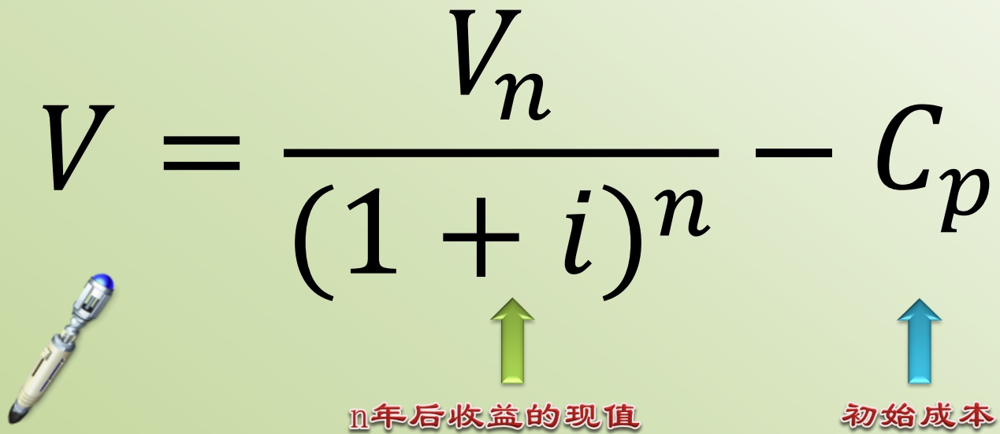

# 林业经济学（双语）-第二讲-2024

> Source: `林业经济学（双语）-第二讲-2024.pptx`
> Generated: 2026-02-25 11:17
> Pages/slides processed: 166

---
## Page 1

## 奥斯特罗姆的经济理论

公地悲剧

囚徒困境

集体行动的逻辑（搭便车现象）

---

## Page 2

# IAD (Institutional Analysis  and Development)框架

Figure1-IADframeworkcomponents 

---

## Page 3

# 第一步：确定行动情景

·行动情景是个体间互动、交换商品和服务、解决问题、互相支配或争斗的社会空间。

·用于描述行动情景结构的一组普遍变量包括：

(1)一群行为者；

(2)拟由参与者填补的具体职位；

(3)一套允许的行动与相应的后果；

−(4)与个体一系列行动相联系的潜在结果;

(5)每个参与者的选择受到的控制程度;

•(6)参与者可获取的关于行动情景结构的信息；

• （7）分配给行动和结果的成本和收益，作为激励和威慑。

---

## Page 4

## 第二步：分析行动者

分析者必须对参与者的价值观、其拥有的资源、信息和信念、信息处理能力以及决策时运用的内在机制做出假设。

奥斯特罗姆综合古典政治经济学和西蒙的有限理性对行动者的一些假设，认为由于信息不完全和处理信息的能力有限，个体在选择实现目标的策略时可能犯错误。然而，随着时间的推移，人们可以更好地了解自己的处境，并采取导致更高回报的策略。互惠可以培养起来，而不是严格的狭隘，追求自身利益短期目标。

---

## Page 5

## 第三步：在行动情景中预测结果

在严格约束的、一次性的、在信息完全条件下的行动情景中，参与者受到激励选择特定的策略或一系列行动，这些策略或一系列行动共同导致稳定的平衡，分析者通常可以做出强有力的推论，并预测可能的行为和结果模式。

然而，个体可能嵌入到共同体(communities)，共同体中初始的公平和保护规则可能会极大地改变情景的结构，因而个体此不会作出完全独立或自主的决策。在这些情景中，参与者可能采取更多的策略。此外，行动者知道了过去行动的结果，可能会不断改变他们的策略。研究这些更开放、更少约束情景的制度分析者会做出更弱的推断，预测在某一特定类型情景中很可能或不太可能出现的结果模式。

---

## Page 6

# 第四步：L 评估结果

## •一般聚焦6个评估标准：

(1）经济效率

(2）财政平衡式公平（equity through fiscal equivalence)

.（3）再分配公平

(4）问责 (accountability)

−(5）对当场行动者价值的遵从（conformance to values of local Actors)

(6）可持续性

---

## Page 7

# 影响行动情景的七种规则

角色规则(Positionrules)定义了“有”哪些参与者,构建了参与者在行动情境中承担的角色集合以及每个角色的数量和类型

边界规则(Boundaryrules)规定了参与者如何“进入”或“离开”那些角色,以及他们能否可以自由地“进入”和“离开”时面临的条件

选择规则(Choicerules)指定了参与者有义务、允许、禁止“做”的行动，行动集合取决于参与者的角色。选择规则确定了将行动与结果联系起来的决策树的形状

聚合规则(Aggregationrules)界定了参与者在行动情境中“共同影响”结果的控制水平。这条规则体现了每个参与者的决策能够对从行动到结果的转换产生多大的功能

范围规则(Scoperules)规定了可能“发生”的潜在结果，它定义了一个结果的集合，集合内的一个结果会因为必须、禁止或可能的行动而受到影响

信息规则(Informationrules)指定了每个角色能够“发送”和“接受”的信息，它授权参与者之间的信息交流通渠道、交流频率以及交流形式

收益规则(Pay-offrules)确定了“支付”的成本和“得到”的收益，它基于采取的一系列行动和达成的结果，并且能够建立行动的激励与阻碍

---

## Page 8

# Forest lnvestment Analysis 

第二讲：林业投资分析

---

## Page 9

## 案例

A村有一片荒山，面积约50亩，现在生长着用材价值不高的杂木林。

将杂木全部砍伐改种马尾松后，树苗、人工及前期管护等需花费2万元，中间每年管护费用为500元，15年后马尾松长成，全部采伐后可得20万元。

若改种果树，初期投入5万元，第三年末挂果，挂果期每年投入0.5万元，第三年起每年需投入农药、化肥等费用约1万元，收入2万元。

假定社会贴现率为5%，A村应该如何选择?

---

## Page 10

Time and the Role of Interest 时间和利息的作用

Interest Rate,Inflation,Risk,and 

Uncertainty 利率、通货膨胀、风险和不确定性

Integrating Economics and Silviculture 营林与经济

Compounding,Discounting,and Present Values 

复利、贴现和现值

Criteria for Investment Decisions投资决策的标准

---

## Page 11

时间和利息的作用

---

## Page 12

关于资金时间价值的一个基本观点：

# 现值高于未来价值

---

## Page 13

同样的钱，早拿到永远比晚拿到好，要晚一点拿到这笔钱，需要的补偿就是利率。

+lnterest 

## 1 

Present value 

Future value

---

## Page 14

# 市场利率  market rate of interest 

The market rate of interest is the price that must be paid to borrow investment capital.

The rate of interest simultaneously reflects the return on investment and the reward for saving.

---

## Page 15

## Two Explanation 

The opportunity cost of capital 

用利息来衡量资本的时间机会成本

## Time preference 

时间偏好：人们更偏好现在而非将来享受某种价值

利息是对延迟消费的补偿

---

## Page 16

# 资本的时间机会成本可用利息来 衡量 

The opportunity cost of capital over time is measured by interest.

---

## Page 17

The Value of timber:1million Fell today?

Or 

Fell next tyear?

---

## Page 18

# 时间偏好：利率是为了延迟消费 所做出的补偿

Time preference refers to the degree to which individuals prefer present over future consumption.

Interest,the return on saving, is the reward for deferring consumption.

---

## Page 19

1万元

今年砍伐

明年砍伐

1万元

延迟消费需获得补偿利率

---

## Page 20

# Compounding,Discounting, and Present Values 

复利贴现和现值

---

## Page 21

# Compound interest  复利 

V = V0(1 + i)n

---

## Page 22

今年采伐树木可得1万元，购买无风险一年期债券，年利率5%

明年的收益是？1*(1+5%)

后年的收益是？1*(1+5%)*(1+5%)

n年后的收益是？1*(1+5%)^n

---

## Page 23

<html><body><table border="1"><tbody><tr><td>时间</td><td>投入</td><td>年利率</td><td>回报</td><td>终值(函数fv)</td><td>函数形式</td></tr><tr><td>0</td><td>1</td><td>5%</td><td></td><td></td><td></td></tr><tr><td>1</td><td></td><td></td><td>1.05</td><td>￥1.05</td><td>=FV(C$2,A3,,-B$2)</td></tr><tr><td>2</td><td></td><td></td><td>1.10</td><td>￥1.10</td><td>= FV(C$2,A4,,- B$3)</td></tr><tr><td>3</td><td></td><td></td><td>1.16</td><td>￥1.16</td><td>=FV(C$2,A5,,-B$4)</td></tr><tr><td>4</td><td></td><td></td><td>1.22</td><td>￥1.22</td><td>= FV(C$2,A6,,- B$5)</td></tr><tr><td>5</td><td></td><td></td><td>1.28</td><td>￥ 1.28</td><td>= FV(C$2,A7,,- B$6)</td></tr><tr><td>10</td><td></td><td></td><td>1.63</td><td>￥1.63</td><td>= FV(C$2,A8,,-B$7)</td></tr><tr><td>50</td><td></td><td></td><td>11.47</td><td>￥ 11.47</td><td>=FV(C$2,A9,,-B$8)</td></tr><tr><td>100</td><td></td><td></td><td>131.50</td><td>￥ 131.50</td><td>=FV(C$2,A10,,-B$9)</td></tr><tr><td></td><td></td><td></td><td></td><td></td><td></td></tr><tr><td></td><td></td><td></td><td></td><td></td><td></td></tr><tr><td></td><td></td><td></td><td></td><td></td><td></td></tr><tr><td></td><td></td><td></td><td></td><td></td><td></td></tr><tr><td></td><td></td><td></td><td></td><td></td><td></td></tr></tbody></table></body></html>

---

## Page 24

# Discounting  贴现 

$V{$ 

Vo 

(1 + i)n

---

## Page 25

# 复利公式变形为贴现公式

Vn V0(1+ i)n 

$$\begin{array}{r}{\textcircled{\sim}V_{0}=\frac{V_{n}}{(1+i)^{n}}}\end{array}$$

---

## Page 26

# Discount Factor 

1

贴现因子：

(1 + i)n

---

## Page 27

## 年利率5%，明年想得到105元

今年应该存入多少钱？

105/(1+5%)=100

10年后想得到5000元，今年应该存入多少钱？

5000/(1+5)^10=3069.57

---

## Page 28

## NPV :Net Present Valu ue 

---

## Page 29

## 课堂练习一

造林成本是1000元，在生长了40年后进行采伐，可获得收入10万元，贴现率为6%

求投资的净现值大小：

If the planting costi $(\mathbf{C}_{\mathsf{p}})$ is ¥1,000, the growth period(n) 40 years,the value of the harvest $(\mathrm{V}_{\mathrm{n}})\neq100,000$ , and the discount rate (i)6%, then the net present value of the venture is:

$$V_{0}=\frac{10}{(1+0.06)^{40}}-0.1=0.87 万元 V_{0}=\frac{10}{(1+0.06)^{40}}-0.1=0.87 万元 V_{0}=\frac{10}{(1+0.06)^{40}}-0.1=0.87 万元$$

---

## Page 30

# 如果每年投入1万元，年利率5%

# 到第n年的总收益是多少？

期初投入1万元再投入1万元

期初投入的1万元变为1.05万元

$$1^{*}(1+5\%)^{\wedge}n+\ldots\ldots+1^{*}(1+5\%)+1$$

---

## Page 31

# 如果每年收入1万元，年利率5%

# 这些钱相当于期初一次投入多少呢？

012折现回第一年第二年期初：收入1万收入1万1/(1+5%)元元折现回期初：1/(1+5%)^2

1/(1+5%)^n+……+1/(1+5%)^2+1/(1+5%)

n年中每年收入1万元

---

## Page 32

PVA Present Value of a Finite Annuity有限年金求现值

$$V_{0}=\frac{a}{1+i}+\frac{a}{(1+i)^{2}}+\cdots+\frac{a}{(1+i)^{n}}$$

$$V_{0}*\frac{1}{1+i}=\frac{a}{(1+i)^{2}}+\ldots\ldots+\frac{a}{(1+i)^{n}}+\frac{a}{(1+i)^{n+1}}$$

---

## Page 33

## 有限年金求现值

$$-\frac{a}{i(1+i)^n}=\frac{a}{i}\cdot\frac{a}{i(1+i)^n}=\frac{a}{i(1+i)^n}\cdot\frac{a}{i(1+i)^n}\cdot\frac{a}{i(1+i)^n}\cdot\frac{a}{i(1+i)^n}\cdot\frac{a}{i(1+i)^n}\cdot\frac{a}{i(1+i)^n}\cdot\frac{a}{i(1+i)^n}\cdot\frac{a}{i(1+i)^n}\cdot\frac{a}{i(1+i)^n}\cdot\frac{a}{i(1+i)^n}\cdot\frac{a}{i(1+i)^n}\cdot\frac{a}{i(1+i)^n}\cdot\frac{a}{i(1+i)^n}\cdot\frac{a}{i(1+i)^n}\cdot\frac{a}{i(1+i)^n}\cdot\frac{a}{i(1+i)^n}\cdot\frac{a}{i(1+i)^n}\cdot\frac{a}{i(1+i)^n}\cdot\frac{a}{i(1+i)^n}\cdot\frac{a}{i(1+i)^n}\cdot\frac{a}{i(1+i)^n}\cdot\frac{a}{i(1+i)^n}\cdot\frac{a}{i(1+i)^n}\cdot\frac{a}{i(1+i)^n}\cdot\frac{a}{i(1+i)^n}\cdot\frac{a}{i(1+i)^n}\cdot\frac{a}{i(1+i)^n}\cdot\frac{a}{i(1+i)^n}\cdot\frac{a}{i(1+i)^n}\cdot\frac{a}{i(1+i)^n}\cdot\frac{a}{i(1+i)^n}\cdot\frac{a}{i(1+i)^n}\cdot\frac{a}{i(1+i)^n}\cdot\frac{a}{i(1+i)^n}\cdot\frac{a}{i(1+i)^n}\cdot\frac{a}{i(1+i)^n}\cdot\frac{a}{i(1+i)^n}\cdot\frac{a}{i(1+i)^n}\cdot\frac{a}{i(1+i)^n}\cdot\frac{a}{i(1+i)^n}\cdot\frac{a}{i(1+i)^n}\cdot\frac{a}{i(1+i)^n}\cdot\frac{a}{i(1+i)^n}\cdot\frac{a}{i(1+i)^n}\cdot\frac{a}{i(1+i)^n}\cdot\frac{a}{i(1+i)^n}\cdot\frac{a}{i(1+i)^n}\cdot\frac{a}{i(1+i)^n}\cdot\frac{a}{i(1+i)^n}\cdot\frac{a}{i(1+i)^n}\cdot\cdot\frac{a}{i(1+i)^n}\cdot\frac{a}{i(1+i)^n}\cdot\cdot\frac{a}{i(1+i)^n}\cdot\cdot\frac{a}{i(1+i}\cdot\cdot\frac{a}{i(1+i)^n}\cdot\cdot\frac{a}{i(1+i)^n}\cdot\cdot\frac{a}{i(1+i}\cdot\cdot\frac{1}{i}\cdot\cdot\frac{i}{i(1+i)^n}\cdot\cdot\cdot\frac{a}{i(1\cdot\cdot\cdot\cdot\frac{1}{i}\cdot\cdot\frac{i}{i}\cdot\cdot\cdot\frac{i}{i}\cdot\cdot\cdot\frac{i}\cdot\cdot\cdot\frac{i}{i}\cdot\cdot\cdot\cdot\frac{i}\cdot\cdot\frac{i}{i}\cdot\cdot\cdot\cdot\cdot\cdot\cdot\frac{i}\cdot\cdot\cdot\cdot\frac{i}\cdot\cdot\cdot\cdot\cdot\cdot\cdot\frac{i}\cdot\cdot\cdot\cdot\cdot\cdot\cdot\cdot\cdot\cdot\cdot\cdot\cdot\cdot\cdot\cdot\cdot\cdot\cdot\cdot\cdot\cdot\cdot\cdot\cdot\cdot\cdot\cdot\cdot\cdot\cdot\cdot\cdot\cdot\cdot\cdot\cdot\cdot\cdot\cdot\cdot\cdot\cdot\cdot\cdot\cdot\cdot\cdot\cdot\cdot\cdot\cdot\cdot\cdot\cdot\cdot\cdot\cdot\cdot\cdot\cdot\cdot\cdot\cdot\cdot\cdot\cdot\cdot\cdot\cdot\cdot\cdot\cdot\cdot\cdot\cdot\cdot\cdot\cdot\cdot\cdot\cdot\cdot\cdot\cdot\cdot\cdot\cdot\cdot\cdot\cdot\cdot\cdot\cdot\cdot\cdot\cdot\cdot\cdot\cdot\cdot\cdot\cdot\cdot\cdot\cdot\cdot\cdot\cdot\cdot\cdot\cdot\cdot\cdot\cdot\cdot\cdot\cdot\cdot\cdot\cdot\cdot\cdot\cdot\cdot\cdot\cdot\cdot\cdot\cdot\cdot\cdot\cdot\cdot\cdot\cdot\cdot\cdot\cdot\cdot\cdot\cdot\cdot\cdot\cdot\cdot\cdot\cdot\cdot\cdot\cdot\cdot\cdot\cdot\cdot\cdot\cdot\cdot\cdot\cdot\cdot\cdot\cdot\cdot\cdot\cdot\cdot\cdot\cdot\cdot\cdot\cdot\cdot\cdot\cdot\cdot\cdot\cdot\cdot\cdot\cdot\cdot\cdot\cdot\cdot\cdot\cdot\cdot\cdot\cdot\cdot\cdot\cdot\cdot\cdot\cdot\cdot\cdot\cdot\cdot\cdot\cdot\cdot\cdot\cdot\cdot\cdot\cdot\cdot\cdot\cdot\cdot\cdot\cdot\cdot\cdot\cdot\cdot\cdot\cdot\cdot\cdot\cdot\cdot\cdot\cdot\cdot\cdot\cdot\cdot\cdot\cdot\cdot\cdot\cdot\cdot\cdot\cdot\cdot\cdot\cdot\cdot\cdot\cdot\cdot\cdot\cdot\cdot\cdot\cdot\cdot\cdot\cdot\cdot\cdot\cdot\cdot\cdot\cdot\cdot\cdot\cdot\cdot\cdot\cdot\cdot\cdot\cdot\cdot\cdot\cdot\cdot\cdot\cdot\cdot\cdot\cdot\cdot\cdot\cdot\cdot\cdot\cdot\cdot\cdot\cdot\cdot\cdot\cdot\cdot\cdot\cdot\cdot\cdot\cdot\cdot\cdot\cdot\cdot\cdot\cdot\cdot\cdot\cdot\cdot\cdot\cdot\cdot\cdot\cdot\cdot\cdot\cdot\cdot\cdot\cdot\cdot\cdot\cdot\cdot\cdot\cdot\cdot\cdot\cdot\cdot\cdot\cdot\cdot\cdot\cdot\cdot\cdot\cdot\cdot\cdot\cdot\cdot\cdot\cdot\cdot\cdot\cdot\cdot\cdot\cdot\cdot\cdot\cdot\cdot\cdot\cdot\cdot\cdot\cdot\cdot\cdot\cdot\cdot\cdot\cdot\cdot\cdot\cdot\cdot\cdot\cdot\cdot\cdot\cdot\cdot $$

---

## Page 34

# PVP：Present Value of  Perpetuity永续年金的现值

perpetuity is when something goes on forever.

假定利率为r,我现在向银行存入多少钱，可以保证每年获得500元?

In finance,it is those kinds of deals where you pay some amount today, and then you get, let's say, $5oo a year forever.

So, how does someone figure out how much $5oo a year forever is worth today?Actually,it is a very simple formula.All you have to dois divide yourpayment by the e yearlyinterest rate.To make a sense out of it, look at the graph.

---

## Page 35

## 讨论

我有一片果林，每年投入1万，收益2万，净赚1万元

假定这片果林属于我，可以子孙后代一直传承下去

现在有人来买这片果林，我应该多少钱卖给他？（贴现率5%）

---

## Page 36

## 永续年金求现值公式

$$\frac{a\left[\left(1+i\right)^{n}-1\right]}{i\left(1+i\right)^{n}}=\frac{a}{i}-\left(\frac{a}{i\left(1+i\right)^{n}}\right)$$

---

## Page 37

$$PVP=a/i=1/5\%=20$$

---

## Page 38

<html><body><table border="1"><tbody><tr><td></td><td></td><td></td><td></td><td></td><td></td><td></td></tr><tr><td></td><td></td><td></td><td></td><td></td><td></td><td></td></tr><tr><td>贴现率</td><td>期数</td><td>年金</td><td>现值</td><td>累积现值</td><td>已知年金求现值函数</td><td></td></tr><tr><td>5%</td><td>1</td><td>1</td><td>0.95</td><td>￥ 0.95</td><td>=PV (A$4, B4,-C4)</td><td></td></tr><tr><td></td><td>2</td><td>1</td><td>0.91</td><td>￥ 1.86</td><td>=PV(A$4,B5, -C5)</td><td></td></tr><tr><td></td><td>10</td><td>1</td><td>0.61</td><td>￥ 7.72</td><td>=PV(A$4,B,-C5)</td><td></td></tr><tr><td></td><td>50</td><td>1</td><td>0.09</td><td>￥ 18.26</td><td>=PV(A$4,B7,-C6)</td><td></td></tr><tr><td>100</td><td>1</td><td>0.01</td><td>￥ 19.85</td><td>=PV(A$4, B8,-C6)</td><td></td><td></td></tr><tr><td>200</td><td>1</td><td>0.00</td><td>￥ 20.00</td><td>=PV (A$4,B9,-C7)</td><td></td><td></td></tr><tr><td>500</td><td>1</td><td>0.00</td><td>￥</td><td>20. 00=PV (A$4, B10,-C7)</td><td></td><td></td></tr><tr><td></td><td>1000</td><td>1</td><td>0.00</td><td>￥</td><td>20. 00=PV (A$4,B11,-C8)</td><td></td></tr><tr><td></td><td>10000</td><td>1</td><td>0.00</td><td>￥</td><td></td><td></td></tr><tr><td></td><td></td><td></td><td></td><td></td><td></td><td></td></tr><tr><td></td><td></td><td></td><td></td><td></td><td></td><td></td></tr><tr><td></td><td></td><td></td><td></td><td></td><td></td><td></td></tr><tr><td></td><td></td><td></td><td></td><td></td><td></td><td></td></tr><tr><td></td><td></td><td></td><td></td><td></td><td></td><td></td></tr><tr><td></td><td></td><td></td><td></td><td></td><td></td><td></td></tr></tbody></table></body></html>

---

## Page 39

## 讨论

如果我有一片林地，自然更新，中间不用任何投入

每10年可采伐一次，除去采伐成本后净利润10万元，可以子子孙孙无穷尽地采伐下去贴现率5%，我这片林地值多少钱?

---

## Page 40

# 每10年获得10万元，如何求现值？

+

01020折现回期初：第十年第二十1/(1+5%)^10收入10年收入万元10万元折现回期初：1/(1+5%)^20

$$1/(1+5\%)\wedge10n+\ldots\ldots+1/(1+5\%)\wedge20+1/(1+5\%)\wedge10$$

---

## Page 41

# Present Value of a periodic  series 周期性收益的现值

林业上最常用：计算一系列经过若干年规则性间隔后（如每一个轮伐期之后）发生的周期性收益和成本的现值公式

$$V_{0}=\frac{V_{t}}{(1+i)^{t}}+\frac{V_{t}}{(1+i)^{2t}}+\cdots\cdots+\frac{V_{t}}{(1+i)^{\infty}} V_{0}=\frac{V_{t}}{(1+i)^{t}}+\frac{V_{t}}{(1+i)^{2t}}+\cdots\cdots+\frac{V_{t}}{(1+i)^{\infty}}$$

$$V_{0}=\frac{V_{t}}{(1+\mu)^{t}-1} V_{0}=\frac{V_{t}}{(1+\mu)^{t}-1}$$

一一无穷递降等比数列的极限求和$l=a1/1-q$ 

记住这个式子！将来要以此为基础来计算林地价值和最优轮伐期

---

## Page 42

## 课堂练习二

假定，造林成本（Cp）为1000元，每年管理费用（m）为100元，森林的轮伐周期(t)是40年，贴现率（i）为8%。

预期每次采伐可获得收入（Vt）10万元

求该造林项目的净现值

lf a tract of forestland can produce a crop worth ¥100,000 in 40years(the rotation period(t) is 40 years), and every 40 years thereafter,planting costs(Cp) are ¥1,000, annual management costs(m) are ¥100, the discount rate(i) is 8%

What is the net present value of this program?

---

## Page 43

# 求解：造林项目的净现值

$$V_{0}=\frac{V_{t}-C_{p}}{(1+i)^{t}-1}-\frac{m}{i}-C_{p}$$

每次采伐之后都要补种，以保障永续利用

$$\angle2=92(\therefore x)=\frac{1}{2}(\frac{1}{2}+2\frac{1}{2}+92)\times((\frac{1}{2}+\frac{1}{2}+\frac{1}{2}+\frac{1}{2}+\frac{1}{2}+\frac{1}{2}+\frac{1}{2}+\frac{1}{2}+\frac{1}{2}+\frac{1}{2}+\frac{1}{2}+\frac{1}{2}+\frac{1}{2}+\frac{1}{2}+\frac{1}{2}+\frac{1}{2}+\frac{1}{2}+\frac{1}{2}+\frac{1}{2}+\frac{1}{2}+\frac{1}{2}+\frac{1}{2}+\frac{1}{2}+\frac{1}{2}+\frac{1}{2}+\frac{1}{2}+\frac{1}{2}+\frac{1}{2}+\frac{1}{2}+\frac{1}{2}+\frac{1}{2}+\frac{1}{2}+\frac{1}{2}+\frac{1}{2}+\frac{1}{2}+\frac{1}{2}+\frac{1}{2}+\frac{1}{2}+\frac{1}{2}+\frac{1}{2}+\frac{1}{2}+\frac{1}{2}+\frac{1}{2}+\frac{1}{2}+\frac{1}{2}+\frac{1}{2}+\frac{1}{2}+\frac{1}{2}+\frac{1}{2}+\frac{1}{2}+\frac{1}{2}+\frac{1}{2}+\frac{1}{2}+\frac{1}{2}+\frac{1}{2}+\frac{1}{2}+\frac{1}{2}+\frac{1}{2}+\frac{1}{2}+\frac{1}{2}+\frac{1}{2}+\frac{1}{2}+\frac{1}{2}+\frac{1}{2}+\frac{1}{2}+\frac{1}{2}+\frac{1}{2}+\frac{1}{2}+\frac{1}{2}+\frac{1}{2}+\frac{1}{2}+\frac{1}{2}+\frac{1}{2}+\frac{1}{2}+\frac{1}{2}+\frac{1}{2}+\frac{1}{2}+\frac{1}{2}+\frac{1}{2}+\frac{1}{2}+\frac{1}{2}+\frac{1}{2}+\frac{1}{2}+\frac{1}{2}+\frac{1}{2}+\frac{1}{2}+\frac{1}{2}+\frac{1}{2}+\frac{1}{2}+\frac{1}{2}+\frac{1}{2}+\frac{1}{2}+\frac{1}{2}+\frac{1}{2}+\frac{1}{2}+\frac{1}{2}+\frac{1}{2}+\frac{1}{2}+\frac{1}{2}+\frac{1}{2}+\frac{1}{2}+\frac{1}{2}+\frac{1}{2}+\frac{1}{2}+\frac{1}{2}+\frac{1}{2}+\frac{1}{2}+\frac{1}{2}+\frac{1}{2}+\frac{1}{}+\frac{1}{2}+\frac{1}{2}+\frac{1}{2}+\frac{1}{}+\frac{1}{2}+\frac{1}{2}+\frac{1}{2}+\frac{}{1}{2}+\frac{1}{2}+\frac{1}{}+\frac{12}{}+\frac{1}{2}+\frac{1}{2}+\frac{1}{}+\frac{1}{2}+\frac{1}{2}+\frac{1}{2}+\frac{}1{2}++\frac{1}{2}+\frac{1}{2}+\frac{1}}+{2}+\frac{1}{2}+\frac{1}+\frac{1}{2}+\frac{1}{2}+\frac{1}+\frac{1}{2}+\frac{1}{2}+\frac{1}+{2}+\frac1{}\frac{}2+1{}\frac{}2+\frac{1}{2}+\frac{1}{}+\frac{1}{2}+\frac{1}{2}++\frac{1}{\frac $$

---

## Page 44

## 思考

如果不是按年计息，而是按月计息呢？

年利率5%，相当于月利率是多少？

如果一年中无限次地计息呢？

年利率5%，相当于连续复利是多少？

---

## Page 45

## 年利率与月利率

年利率5%，期初：100；1年后可得：105假定月利率为r，1年中需要计算12次复利

有：$100^{\ast}(1+r)^{\wedge}12=105$ 

(1+r)^12=1.05=1+5%

讨论：$r=5\%/12$ $r=5\%/12$ 对吗？

---

## Page 46

# 周期（日_月、季度）利率转换 为年利率 

一年中的周期数

(1+1P =1+1↑

周期利率年利率

---

## Page 47

# 连续复利  Continuous compounding 

假定存入银行的100元钱，1年后会翻倍，变为200元，利率为100%

但现在有一家银行表示，你可以在这1年中的任何一个时间点去取钱，每一分每一秒都会为你计息，利息率为1/n,n无穷大

实际上1年后我会得到多少钱?

100*(1+1/n)^n

---

## Page 48

<html><body><table border="1"><tr><td>n $(1+1/n)^{\hat{\mathrm{~n~}}}$</td><td></td></tr><tr><td></td><td></td></tr><tr><td>1 2 2 2.25 3 2.37</td><td></td></tr><tr><td></td><td></td></tr><tr><td>5 2.488 10 2.5937 100</td><td></td></tr><tr><td>2.7048 1,000 2.7169</td><td></td></tr><tr><td>10,000 2.71814 100,000 2.718268</td><td></td></tr><tr><td>1,000,000 2.7182804</td><td></td></tr><tr><td></td><td></td></tr><tr><td></td><td></td></tr><tr><td></td><td></td></tr></table></body></html>

The numbers get bigger and converge around 2.78.

e is defined to be that rate of growth hifwecontinually compound 100%return onsmallerand smaller time periods:

$$growth=e=\lim_{n\to\infty}\left(1+\frac{1}{n}\right)^n $$

---

## Page 49

## 自然对数e?

## e就是增长的极限

表示单位时间内持续的翻倍增长所能达到的极限值

$$\lim_{n\to\infty}\left(1+\frac{1}{n}\right)^n=e $$

e represents the idea that all continually growing systems are scaled versions of a common rate.

---

## Page 50

# 连续复利  Conti nuous Compounding 

年利率为i 

一年里计息n次

每次的利率为i/n 

n无穷大

连续复利1lim )$\textstyle{\left(1+{\frac{i}{n}}\right)^{n}=e^{i}}$

---

## Page 51

## 计算连续复利

银行年利率为5%，存1年，在这1年中连续计算n次复利，当$\mathsf{n}{\to}\infty$ ,有

$$\lim_{n\to\infty}\left(1+\frac{5\%}{n}\right)^n=e^{5\%}$$

存两年，则有

5%*2e 

$$I g r o w t h=\left(e^{r a t e}\right)^{t i m e}=e^{r a t e\cdot t i m e}$$

---

## Page 52

# 连续复利和年利率的关系

假定连续复利为r 

意味着单位投入在t期后可获得回报$\mathbf{e}^{\mathbf{r}t}$ 

假定年利率为i 

单位投入在t期后可获得回报(1+i)t 

如果有某个年利率取值，使连续复利与年利率回报相等，则得到等值年利率（EAR）

---

## Page 53

## 连续复利与年利率

使用相同的利率，连续复利比年利率的终值更高

但是，通过应用等值年利率(equivalent annual rate,EAR）的概念，两者能够进行转换

---

## Page 54

## Equivalent annua l rate,EAR 

this means that interest can be compounded several times in a year depending on the number of times that interest payments are made.The amount of interest received from savings accounts is listed in EAR form.

EAR表示对应某一连续复利利率r可以获得同一终值的年利率

在t年内

$$(1+EAR)^{t}=\mathrm{e}^{rt}$$

$$\mathrm{tln}(1+EAR)=\mathrm{rt}$$

$$(1+EAR)=r $$

$$E A R=\mathrm{e}^{\mathrm{r}}-1$$

---

## Page 55

## 计算

存入100元，连续复利为12%

e=2.718....

1年后的收益是多少？

100*e^12%=112.75元

excel中的函数表达：=100*EXP(12%)

---

## Page 56

## 72 法则

用72除以增长率，得到的结果是投资资金翻倍大约需要的时间

举例：如果银行的利息率是5%的复利，请问100元存款翻倍需要多少时间?

$100*e^{5\%t}=200$ 

$$t=\frac{ln2}{5\%}=\frac{0.693}{5\%}=13.86$$

$$\approx{\frac{72}{5}}=14.4$$

使用72作为分子是因为它有较多因子，容易被整除。使用72作为分子足够计算一般息率 (由6至10%)

---

## Page 57

# Criteria for  Investment Decisions 

投资决策的标准

---

## Page 58

# How should a firm make an  investment decision?

识别有利的投资机会收益>成本

## ldentifying advantageous investments  

The basic rule for identifying investment opportunities is that the benefits must exceed the cost when both are expressed in terms of their present values 

## ldentifying priorities 

Net present value (net benefit)

Benefit/cost ratio 

Internal rate of return on investment 

Comparing criteria 

确定优先顺序

净现值 （净收益）收益/成本率

投资的内部收益率

标准的比较

---

## Page 59

# 净现值Net Present Value 

NPV =−Initial Cost + PV(Expected Future CF's)

每年的现金流

$$ NPV=-Cost+\sum_{t=1}^{T}\frac{CF_{t}}{(1+r)^{t}}=\sum_{t=0}^{T}\frac{CF_{t}}{(1+r)^{t}}$$

where rreflects the risk of the project's cash flows 

Note that this is a generic formula, and we really use the tools from time value of money (annuities, perpetuities, etc.) from before.

Net Present Value (NPV) Rule:

NPV> 0

Accept the project.

NPV < 0

Reject the project.

---

## Page 60

# 案例一

）一块森林40公顷。砍伐后可以选择重新造林或待其自然更新

如果自然更新，不需成本，55年后每公顷生长375立方米低等木材，市场价值为每立方米15元

如重新造林，每公顷需投资400元，55年后每公顷可生产475立方米木材，每立方米木材价值为25元

问：是否应选择重新造林？（贴现率设为3%)

A tract of 40 hectares has been harvested and the choice is between leaving it to regenerate naturally or planting it with young seedlings.

If left to reforest naturally at no cost, in 55years the tract would yield 375 cubic metres per hectare of an inferior species worth only ¥15 per cubic metre.

If planted immediately at a cost of ¥400per hectare, in 55 years the tract would yield 475 cubic metres per hectare worth ¥25 per cubic metre.

If the discount rate is 3%, would it be an efficient choice to plant young seedlings?

---

## Page 61

## 案例求解

## 求解思路：

分别计算自然更新的净现值$v_{g}$ 和人工造林的净现值

$\mathsf{V}_{\mathsf{p}}$ 

造林投资的净收益

$$V_{0}=V_{p}-V_{g}$$

$\mathbf{V}_{\mathrm{g}}=(40^{\star}375^{\star}15)$ 

（1.03）^55

$44272$ 

$V_{p}=\left(40^{\star}475^{\star}25\right)\ I$ 

（1.03）^55-（40*400)

$\textcircled{=}77464$ 

$V_{0}=V_{p}-V_{g}=33192$

---

## Page 62

## 收益/成本率Benefit/Cost Ratio 

在面临固定预算的情况下，如何获取最大的收益？或者说，如何让投入的每一元钱成本产生最大的收益？

How to generate the maximum possible benefits from the funds available, or how to generate the maximum possible benefits for every dollar invested ?

收益/成本率衡量了资金的使用效率

The benefit/ cost ratio measures the efficiency with which funds are expended.

---

## Page 63

# 计算收益/成本率时，如何考虑 机会成本？ 

在前面造林的例子中人工造林的成本是

$400\times40=16000$ 人工造林的收益现值是93464元

自然更新的净现值是44272元

人工造林的收益/成本率是多少？

---

## Page 64

# 收益/成本率

成本：$C=(40^{\circ}400)=16000$ 

人工林收益

收益：B=（40*475*25）1（1.03）^55（40*375*15）1(1.03)^55天然林收益（机会成本）

=93464-44272=49192收益/成本率：$\mathrm{B/C}=49192/16000=3.07$ E $\mathrm{B/C}=49192/16000=3.07$ 

---

## Page 65

## 案例二

与造林相比，投资者还存在其它选择。

如以每公顷550元的成本，间伐60公顷幼林

通过间伐，可以使该林地50年后的产出从425立方米增加到550立方米，木材价格从15元/立方米上涨到25元/立方米

贴现率为3%，选择间伐投资还是造林投资?

Suppose the forest manager could alternatively spend his funds elsewhere on the precommercial thinning of 60hectares of juvenile stands, which would cost ¥550 per hectare, increase yields in 50 years from 425 to 550 cubic meters per hectare, and raise the value of the harvest from ¥15 to ¥25 per cubic meter.

An a discount rate of 3%, which one should we choose between precommercial thinning or planting?

---

## Page 66

# 案例求解

间伐投资净收益：间伐投资收益/成本率$V_{0}=\left(60^{\circ}550^{\circ}25\right)$ $\mathbf{B}/\mathbf{C}=[(60^{\star}550^{\star}25)$ (1.03）^50-/（1.03）^50(60*425*15）1（60*425*15）（1.03）^50-(1.03）^50]/$(60^{\ast}550)=67937$ $(60^{\ast}550)=3.06$ 大于造林项目略小于造林项目

---

## Page 67

## Note 

收益/成本率反映每一单位投资带来的回报

如果所有项目达到最优规模，按照收益/成本率进行优选

能够使有限的资金产生最大净收益

If all projects were designed to their optimal scale, then giving priority to higher benefit/cost will generate maximum benefits from limited investment funds.

## 注意：

根据收益/成本率对不同项目排队的结果

常常与净收益排队结果不一致

Ranking according to benefit/cost ratio seldom corresponds to ranking based on net present values.

---

## Page 68

## 内部收益率lnternal Rate of Return (IRR)

IRR is that discount rate,$\hat{\mathcal{T}}_{\theta}$ that makes the NPV equal to zero.In other words,it makes the present tvalue of future cash flows equal to the initial cost of the investment.

$$\mathrm{NPV}=\sum_{\mathrm{t}=0}^{\mathrm{T}}\frac{\mathrm{CF}_{\mathrm{t}}}{(1+\mathrm{r})^{\mathrm{t}}}\quad0=\sum_{\mathrm{t}=0}^{\mathrm{T}}\frac{\mathrm{CF}_{\mathrm{t}}}{(1+\mathrm{IRR})^{\mathrm{t}}}$$

---

## Page 69

## IRR 内部收益率

内部收益率是指能使项目初始投资在投资期内可增长至期望收益价值的利率

内部收益率越高，项目越有吸引力

The internal rate of return of a project is the percentage rate at which the initial investment grows over the investment period to equal the value of the eventual expected benefits.

The higher the indicated rate of return on the investment, the more attractive the project.

---

## Page 70

## 内部收益率的优点

内部收益率标准多用于投资人追求资本收益最大化的情况，这种技术的优点在于不需要事先选择利率，并且使用起来非常简单

The internal rate of return criterion is used mainly by investors seeking to maximize the return on their financial d capital. It eliminates the needto s select a rate of interest in advance, and has the additional appeal of simplicity.

---

## Page 71

# 内部收益率的适用范围

仅适用于初始投资、后期收益的项目

如果收益早，成本出现较晚，按照IRR标准选择可能产生误导，使这类项目更为可取

如果正负受益在不同时点交替出现，IRR 的计算可能变得各位复杂，甚至可能是不确定的

It is suitable only for projects that involve an initial investment and later returns.

Some projects generate some early returns and impose later costs, and this criterion makes projects with early benefits and late costs appear more favourable.

Calculation of the internal rate of return becomes exceedingly complicated, and sometimes indeterminate, when a project involves positive and negative returns scattered through time.

---

## Page 72

# Unconventiona l Cash Flows  非常规现金流

Unconventional Cash Flows: Cash flows come first and investment cost is paid later. In this case, the cash flows are like those of a loan and the IRR is like a borrowing rate.Thus, in this case a lower IRR is better than a higher IRR.

Multiple rates of return problem: Multiple sign changes in the cash flows introduce the possibility that more than one discount rate makes the NPV of an investment project zero.

---

## Page 73

## Example: Unconventional Cash Flows 

Example: A strip-mining project requires an initial investment of $60. The cash flow in the first year is $155.In the second year, the mine is depleted, but the firm has to spend $100 to restore the land.

$60 = 155/(1 + IRR) − 100/(1 + IRR)²

<html><body><table border="1"><tr><td>Discount Rate (IRR)</td><td>NPV</td></tr><tr><td>0.0%</td><td>-$5.00</td></tr><tr><td>10.00</td><td>- 1.74</td></tr><tr><td>20.00</td><td>- 0.28</td></tr><tr><td>25.00</td><td>0.00 2</td></tr><tr><td>30.00</td><td>0.06</td></tr><tr><td>33.33</td><td>0.00 2</td></tr><tr><td>40.00</td><td>- 0.31</td></tr></table></body></html>

Generally, the number of possible IRRs is equal to the number of changes in the sign of the cash flows.

---

## Page 74

## 计算前面两个例子的IRR 

人工造林

$V_{0}=(40^{\star}475^{\star}25)$ (1+IRR)^55（40*375*15）1(1+IRR)^55

$(40\times400)=0$ 

$\mathrm{IRR}=5.12\%$ 

间伐

间伐带来的最终收益

$$(60^{\star}425^{\star}15)$$

(60*550)*(1+IRR)^50间伐初始成本的终值

$$\mathrm{IRR}=5.36\%$$

略大于造林项目

---

## Page 75

## 案例三：

100公顷森林，15年后可收获350立方米木材，每立方米价值15元

一种虫害可能导致25%的木材损失，喷洒农药的成本是每公顷350元

贴现率3%，求虫害控制的净收益、收益/成本率以及内部收益率

A 100-hectare tract of forest scheduled for harvest in 15 years, with an expected yield of 350 cubic metres worth ¥15 per cubic metre, and an insect infestation threat that can destroy 25% of the timber unless control measures are undertaken immediately. The cost of spraying is ¥350 per hectare.

At a discount rate of 3%, please compute the net benefit of the insect control activity,the benefit/cost ratio,and the internal rate of return.

---

## Page 76

## 案例求解结果

$V_{0}=$ 

收益：虫害控制所能减少的损失

（100*350*15*0.25）

贴现：.15年后这一收益才能实现/*(1+0.03）*15(100*350）

=84244-35000

$=49244$ 

收益/成本率：

$B/C=84244/35000$ 

$2.41$ 

内部收益率：35000*（1+IRR）$\lambda_{15}=$ 

(100*350*15*0.25)

$\mathrm{IRR}=9.21\%$

---

## Page 77

## 对三个项目的比较

<html><body><table border="1"><tbody><tr><td>标准</td><td>造林项目</td><td>间伐项目</td><td>虫害控制</td></tr><tr><td>净收益</td><td>33194</td><td>67639</td><td>49244</td></tr><tr><td>收益/成本率</td><td>3.07</td><td>3. 06</td><td>2.41</td></tr><tr><td>内部收益率</td><td>5.1 12%</td><td>5. 36%</td><td>9. 21%</td></tr></tbody></table></body></html>

三个项目收益都超过成本，因而都是可行的，但按照不同标准排序，不同项目的优先序并不一样

---

## Page 78

## How to choose?

## The net benefit criterion 

It often used to find the maximum return to some fixed factor, such as a trach of land,favourlarge projects.

## 净收益标准

用于选择追求固定生产要素（如一块林地）收益最大化的互斥项目

---

## Page 79

## How to choose?

## Benefit/cost ratio 

When managers have budget limitations, they may not be able to afford to expand all investments until their marginal benefits equal their marginal costs,they must apply alternative criteria, such as the bebefit/cost ratio.

## 收益/成本率

当投资者面临预算约束时，他们无法按照边际收益等于边际成本的法则扩大投资规模，此时必须选择其他替代标准，例如收益/成本率

---

## Page 80

## 案例

A村有一篇100亩的林地，可以选择种果树或是马尾松，果树和马尾松不能混种

投资决策目标：让这块林地的收益最大化

A村现有10万元集体资产，考虑什么样的投资方式比较好

投资决策目标：让这10万元的收益最大化——收益/成本比最大化

---

## Page 81

## How to choose?

净净现值标准对利率较为敏感Sensitive to the interest rates used 

收益成本率

当利率改变时，按净现值或收益/成本率标准判断的项目相对吸引力也会发生变化

希望从固定预算中获得最大回报的投资人应该选择内部收益率标准对项目进行排序Investors seeking to maximize their return from a fixed budget may therefore choose to rank projects by their internal rates of return

---

## Page 82

## 时间周期的影响

## 按净收益或收益/成本率

假定项目按给定贴现率再投资

When they have different time horizons, net benefit and the benefit/cost ratio assume that returns are reinvested datt the discount rate.

## 按内部收益率

假定项目按内部收益率再投资

Internal rate of return assumes that returns are reinvested at the project rate(or internal rate of return).

---

## Page 83

## 不同周期项目的投资决策

项目一：投入10万项目二：投入20万造造林，10年后收益林，30年后收益10020万元万元

社会折现率5%

<html><body><table border="1"><tbody><tr><td></td><td>投入</td><td>n</td><td>FV</td><td></td></tr><tr><td>项目一</td><td>-10</td><td>10</td><td>20</td><td>5%</td></tr><tr><td>项目二</td><td>-20</td><td>30</td><td>100</td><td>5%</td></tr><tr><td></td><td></td><td></td><td></td><td></td></tr><tr><td colspan="5"></td></tr><tr><td>投资决策标准</td><td></td><td></td><td></td><td></td></tr><tr><td></td><td>净现值</td><td>收益/成本</td><td>IRR</td><td></td></tr><tr><td>项目一</td><td>¥2.28</td><td>1.23</td><td>7.18%</td><td></td></tr><tr><td>项目二</td><td>¥3.14</td><td>1.16</td><td>5.51%</td><td></td></tr></tbody></table></body></html>

---

## Page 84

## 注意：

项目一：投资10年的净现值为2.28万元，10年后获得20万元回报

这20万还可以再投入两次项目一（收益率7.18%），或者投入到其它项目中（收益率5%)

---

## Page 85

项目一的再投资（一)

回报

净现值：2.28万

$$20^{*}(1+5\%)\wedge(30-10)/(1+5\%)\wedge30=20/(1+5\%)\wedge10=12.28$$

假定项目一在10年后获得的回报全部用于再投资，且投资收益率=社会折现率，则30年总投资的净现值和10年投资的净现值相等

---

## Page 86

项目一的再投资（二）

---

## Page 87

## 项目规模的影响

当某类项目存在多个规模时，净收益标准假设未投向小规模项目的资金在其他投资项目中可以赚得和贴现率同样的回报水平

而收益/成本率和内部收益率标准假设项目可以被复制，这样未投向较小规模项目的资金在其他项目中可以获得同样的项目回报率

When there are different project scales, net benefit assumes that funds not used for the smaller project are invested in projects earning the discount rate,whereas benefit/cost ratio and internal rate of return assume that the project can be duplicated so that funds not used for the smaller project are invested in similar projects earning the project rate.

---

## Page 88

# 项目规模的不可分割性

# Thei indivisibilities of project scale 

可分割：60公顷森林，可以其中30公顷用于间伐、30公顷用于自然更新（假设资金有限，只够间伐30公顷森林）

不可分割：打农药除虫，如果只对其中30公顷除虫则没有任何效果，没有除虫的森林遭受虫害后，还是会影响到已除虫的森林

---

## Page 89

# 互斥项目  mutually exclusive projects 

One may face two constraints: mutually exclusive projects for the same sites and a limited total budget.

投资人还可能面临两类限制：同一地点的多个互斥项目和有限预算

In these cases, areasonable rule of thumb is to cslect the project with the highest net benefit for each site and then rank projects in order of decreasing benefit/cost ratio until the budget is exhausted.

这种情况下，合理的经验法则是选择每个地点净收益最高的项目，并按递减的成本收益率对项目进行排序，直到投资预算耗尽为止

---

## Page 90

## 中国林业投资项目评估

1985-2005 年期间，世界银行参与建设的中国大型林业项目有6个，其中世界银行投入达到8亿多美元。

根据世界银行的规程，1985年在准备第一个林业项目，即“林业发展项目”时，引入了动态分析法，即采用现金流量分析方法，通过计算内部收益率和净现值等，对林业项目的投资方案进行比选，这一分析方法一直沿用到今天。

---

## Page 91

# 中幼林价值评估

Valuing Pre-Merchantable Timber

---

## Page 92

# 什么是中幼林？

---

## Page 93

中幼林林分：

那些未达到经济成熟，无法采伐并作为加工林产品原料销售的林分

Pre-Merchantable Timber： Stands composed of trees too immature to yield timber that can be profitably harvested and sold for manufacturing forest products

---

## Page 94

# 中幼林价值的评估方法

参照（立地）价格法

重置成本法

收入法

内部收益率法

---

## Page 95

# 参照（立地）价格法

The Sales Comparison Approach

---

## Page 96

# 参照（立地）价格法

立地特征回归（立地价格模型）

把被评估对象的构成特征进行分解，然后估计每个特征对商品价值的贡献

---

## Page 97

## 要求及困难

适用条件：存在可比交易案例

需掌握特征：

立木林分特征

立地特征

## 困难：

很难获得有关区域中关于拟售中幼林分与参照交易案例的林分和立地特征参数值

---

## Page 98

## 立木林分特征

林龄、树种造林密度种苗质量生长状况

---

## Page 99

## 立地特征

地理位置.面积立地生产力（立地指数）其他潜在的更好用途

---

## Page 100

案例：使用回归分析评价中幼林价值一个林业公司提供了某地区7个县在2001-2007年内共77笔中幼林交易案例数据

并给出其有关变量的描述统计和回归分析结果

---

## Page 101

描述统计结果

<html><body><table border="1"><tr><td>变量</td><td>均值</td><td>标准差</td><td>最小值</td><td>最大值</td><td>预期显著 性</td></tr><tr><td>因变量： 每亩中 幼林林分价格 （2001年不变价）</td><td>1487.38</td><td>556.38</td><td>619.61</td><td>3256.53</td><td></td></tr><tr><td>面积 （亩）</td><td>259.63</td><td>285.46</td><td>20.00</td><td>1500.00</td><td>?</td></tr><tr><td>立地指数</td><td>88.39</td><td>4.16</td><td>80.00</td><td>95.00</td><td></td></tr><tr><td>林分年龄 （年）</td><td>5.05</td><td>5.16</td><td>0</td><td>15</td><td></td></tr><tr><td>销售时间 （2001=1, 2007=7)</td><td>4.56</td><td>1.67</td><td>1</td><td>7</td><td></td></tr><tr><td>临近道路情况 （1, 0）</td><td>0.60</td><td></td><td>0</td><td>1</td><td></td></tr><tr><td>更优用途 (1,0)</td><td>0.09</td><td></td><td>0</td><td>1</td><td></td></tr></table></body></html>

---

## Page 102

## 回归结果

（因变量：每亩林分价格的自然对数）

<html><body><table border="1"><tbody><tr><td>变量 面积</td><td>系数 0.0002 *</td><td>标准误 0.0001</td><td>预测效应 0.0002</td></tr><tr><td>立地指数</td><td>0.0085 0.0155 0.0751</td><td>0.0086</td><td>0.0887 0.0156</td></tr><tr><td>林龄 销售时间 道路临近状况</td><td>** ** 0.0502</td><td>0.0074 0.0222 0.0772</td><td>0.0780 0.0515</td></tr><tr><td>更优用途 常数 调整后的R2</td><td>0.2974 ** **</td><td>0.1260 0.7678</td><td>0.3466 381.41</td></tr><tr><td></td><td>5.9465 0.2908</td><td></td><td></td></tr><tr><td>F统计量 观测样本数</td><td>4.78*** 77</td><td></td><td></td></tr><tr><td></td><td></td><td></td><td></td></tr><tr><td></td><td></td><td></td><td></td></tr><tr><td></td><td></td><td></td><td></td></tr><tr><td></td><td></td><td></td><td></td></tr><tr><td></td><td></td><td></td><td></td></tr></tbody></table></body></html>

102*10%显著性水平,**5%显著性水平,***1%显著性水平。预测效应=exp（βi）-1

---

## Page 103

## 要点：

与其他评估方法不同，参照价格法评价结果同时包括木材与林地价值

因此评价过程既要考虑林分特征，也要考虑土地地块大小，潜在更优用途等立地特征

---

## Page 104

replacement cost method 

重置成本法

---

## Page 105

## Replacement Cost 

The cost to replace the assets of a company or a property of the same or equal value.

This cost can change depending on changes in market value.

Also referred to as the price that will have to be paid to replace an existing asset with a similar asset.

---

## Page 106

## 什么是重置成本法？

## 某项资产重置成本的估计值

## 重新营造该片中幼林的成本

将中幼林生产中的各项生产成本，如整地、造林、以及其它林分建设和维护成本，都通过复利公式折算到林分评价当期时点

---

## Page 107

## 案例：

假设：一片生长了7年的松木林，七年前每亩营造成本为250元，所有者期待的名义回报率为8%

目前以成本复利计算的投资价值是：

259元/亩$1.08^{\wedge}7=428.46$ 元/亩

再加上参照市场类似交易案例，或使用复利公式对七年前土地购买成本进行重置得到的土地现值

---

## Page 108

## 适用性和缺陷

适用于林分年龄较小的林木

林分年龄越小，运用复利成本估计的投资价值越准确

但这种方法低估了林分给土地所有者回报的潜力

所以估计值通常偏低

---

## Page 109

## 注意事项

评估价值仅仅是买卖双方决定是否交易或按什么价格交易的参考信息

投资者：评判其打算购买资产的价值所有者：确定其出售资产时的参考价格

---

## Page 110

# 收入法

---

## Page 111

## income approach 

A real estate appraisal method that allows investors to estimate the value of the property based on the income produced.

The income approach is computed by taking the net operating income of the rent collected and dividing it by the capitalization rate (the investor's rate of return).

---

## Page 112

## 什么是收入法？

估计某项资产预期收入的现值

对中幼林，将未来的木材收入贴现到当期时点，得到其价值

---

## Page 113

## 案例

造林成本250元/亩。基准名义回报率为8%。已造林7年。

预期30年后作为锯材原木采伐，出材量为10MBF/亩，当期价格为400元/MBF，预期价格会以2%的实际增长率上涨求该七年生幼林的投资价值

---

## Page 114

## 案例解答

预计的立木价值为

10MBF/亩（400元/MBF）*1.02^(30-7)=6307.60元/亩对预期收入进行贴现6307.60元/亩/1.08^(30-7)=1074.30元/亩

---

## Page 115

# 数学表达式：

成熟时的立木价格成熟时的立木蓄积P(t)Q(t)

(1+()t t −X ↑

[]中幼林分熟年龄当年林龄

---

## Page 116

## 收入法VS 重置成本法

## 收入法

## 重置成本法

林分林龄越高，用收入贴现估计的林分价值越准确

经常会高估中幼林木材的投资价值

林分年龄越小，运用复利成本估计的投资价值越准确

经常会低估林分的投资潜力

---

## Page 117

无林地”Bare Forestland 无林地价值可以参照同一地区类似土地的交易案例定价也可将未来土地贴现至当下

L(t)

在第t年采伐并出售所有林木后，出售剩下的无林地的价格（未来价值）

(1+ i)t t −X

---

## Page 118

## 选择什么贴现利率？

使用投资人的期望回报率作为贴现利率可以得到对特定投资人最高的中幼林分价值

---

## Page 119

# 选择什么样的轮伐期(t)

实际营林过程中，由于选择的用途不同，可能存在不同轮伐期

如一片生长5年的松林

15年后，林分可用于纸浆材工艺

30年后，林分自然成熟，可用于锯材

使用15年和30年林分价值评估，可能得到完全不同的贴现结果

---

## Page 120

<html><body><table border="1"><tbody><tr><td>5800</td><td>38</td></tr><tr><td>5750</td><td>36</td></tr><tr><td>5620</td><td>34</td></tr><tr><td>5400</td><td>32</td></tr><tr><td>5100</td><td>30</td></tr><tr><td>4700</td><td>28</td></tr><tr><td>4260</td><td>26</td></tr><tr><td>3800</td><td>24</td></tr><tr><td>3240</td><td>22</td></tr><tr><td>2730</td><td>20</td></tr><tr><td>2250</td><td>18</td></tr><tr><td>1750</td><td>16</td></tr><tr><td>1500</td><td>15</td></tr><tr><td>930</td><td>12</td></tr><tr><td>650</td><td>10</td></tr><tr><td>450</td><td>8</td></tr><tr><td>300</td><td>6</td></tr><tr><td>200</td><td>4</td></tr><tr><td>77</td><td>2</td></tr><tr><td>0</td><td>0</td></tr><tr><td>($/acre) Total stumpage revenue</td><td>year</td></tr><tr><td>（美元/英亩) 活立木总收益</td><td>年份</td></tr></tbody></table></body></html>

---

## Page 121

Figure 3.3: Value of a pre-merchantable loblolly pine timber stand:Difference between discounting at age 30, when the stand is ready for a final harvest (valued at B), and at age 15, when the stand just becomes merchantable (valued at A) 

---

## Page 122

追求利润最大化的林主相信未来林分将处于最优经营状态因此会选择最高的贴现价值来作为幼林当期的价值

在这个案例中，林主会基于30年采伐收益价格的贴现值来对中幼林进行价格评估

---

## Page 123

# Internal rate of return method

---

## Page 124

# 重置成本法与收入法评估结果不同

重置成本法

评估结果：

428.46元/亩

收入法：

评估结果：

1074.30元/亩

对同一片七年生松林

---

## Page 125

# 不同评估方式，买家和卖 家的收益率不同

---

## Page 126

## 重置成本法  

卖家

七年前投入250元现在以428.46元卖出回报率：8%

买主

现在投入428.46元

23年后得到6307.6元

（预期收入）

回报率：12.4%

---

## Page 127

## 收入法  

卖家

七年前投入250元

现在以1074.30元卖出

回报率

23.16%

买主

现在以1074.30元买

23年后收益6307.6元

（预期收入）

回报率：8%

---

## Page 128

# 用内部收益率估价

得到双方都能接受的中间值

---

## Page 129

如何用内部收益率估价？

初始投入250元

30年后回报6307.6元

$\mathrm{IRR}=\sqrt[3]{\frac{6307.6}{250}}-1$ 

=11.36%

---

## Page 130

## 得到一致的估价值

重置成本法〇收入法

=250*(1+11.36%)^7$=6307.61$ 

=530.95元(1+11.36%)^23

O=530.95元

---

## Page 131

# Interest Rate,Inflation, Risk, and Uncertainty 

利率-通货膨胀一风险和不确定性

---

## Page 132

# social  discount rate  社会贴现率

Social discount rate (SDR) is the discount rate used in computing the value of funds spent on social projects.

Determining this rate is not always easy and can be the subject of discrepancies in the true net benefit to certain projects, plans and policies.

一般来说，考虑到风险、税收、通货膨胀等各种因素，以及社会效益，社会偏好率<由相互独立的储蓄与投资者相互作用形成的市场利率

一些人认为，对森林这种长期、跨代的公共投资项目，应该采用零利率甚至时间递减利率

美国政府采用4%的实际利率评价林业投资项目

---

## Page 133

# 中国林业基准贴现率选择

商品林建设的贷款年利率：4%-5%

反映资金的成本

中国商品林业的平均收益水平：2%-3%

加上1.5%的风险系数

一般认为林业行业的基准贴现率选择5%的年利率可能比较合适

---

## Page 134

通货膨胀INFLATION

---

## Page 135

# 如何处理通货膨胀的影响？

---

## Page 136

# 价格指数

来源：国家统计局发布时间：2013-10-2913:09

打印本页

关闭窗口

居民消费价格指数是反映一定时期内城乡居民所购买的生活消费品和服务项目价格变动趋势和程度的相对数，是对城市居民消费价格指数和农村居民消费价格指数进行综合汇总计算的结果。通过该指数可以观察和分析消费品的零售价格和服务项目价格变动对城乡居民实际生活费支出的影响程度。

城市居民消费价格指数是反映一定时期内城市居民家庭所购买的生活消费品价格和服务项目价格变动趋势和程度的相对数通过该指数可以观察和分析消费品的零售价格和服务项目价格变动对城镇居民收入和消费支出的影响。

农村居民消费价格指数是反映一定时期内农村居民家庭所购买的生活消费品价格和服务项目价格变动趋势和程度的相对数该指数可以观察农村消费品的零售价格和服务项目价格变动对农村居民收入和生活消费支出的影响。

商品零售价格指数是反映一定时期内城乡商品零售价格变动趋势和程度的相对数。商品零售价格的变动与国家的财政收入市场供需的平衡、消费与积累的比例关系有关。因此，该指数可以从一个侧面对上述经济活动进行观察和分析。

农业生产资料价格指数指反映一定时期内农业生产资料价格变动趋势和程度的相对数。其编制目的是了解农业生产中投入物质资料价格的变动状况，服务于国民经济核算。1994年以前，农业生产资料价格指数仅仅是商品零售价格指数的一个类别，此后，从商品零售价格指数中分离出来，单独编制。

农产品生产价格指数是反映一定时期内，农产品生产者出售农产品价格水平变动趋势及幅度的相对数。该指数可以客观反映全国农产品生产价格水平和结构变动情况，满足农业与国民经济核算需要。其中某代表品生产价格指数是通过对全部有出售该产品行为的调查单位的个体指数进行几何平均求得的，类价格指数是通过对其所属的类（或代表品）的价格指数进行加权平均求得的。季度累计价格指数的计算方法与分季指数的计算方法相同。

工业生产者出厂价格指数是反映一定时期内全部工业产品出厂价格总水平的变动趋势和程度的相对数，包括工业企业售给

---

## Page 137

## 简单查询

简单查询

高级查询

数据地图

## 价格指数

## 各种价格指数

各种价格定基指数

居民消费价格分类指数（上年=10城市居民消费价格分类指数（上年农村居民消费价格分类指数（上年商品零售价格分类指数（上年=10城市商品零售价格分类指数（上年农村商品零售价格指数（上年=10农业生产资料价格分类指数（上农产品生产价格指数（上年=100)按工业行业分工业生产者出厂价工业生产者出厂价格分类指数（工业生产者购进价格指数（上年=固定资产投资价格指数（上年=10人民生活

## m   

<html><body><table border="1"><tbody><tr><td>指标 居民消费价格指数(上年=100)</td><td></td><td>2014年 102.0</td><td>2013年 2012年 102.6</td><td>2011年 = 2 102.6 105.4</td></tr><tr><td>城市居民消费价格指数(上年=100) 农村居民消费价格指数(上年=100)</td><td></td><td>102.1 101.8</td><td>102.6 102.8</td><td>102.7 105.3 102.5 105.8</td></tr><tr><td>商品零售价格指数(上年=100) 工业生产者出厂价格指数（上年=100) 工业生产者购进价格指数(上年=100)</td><td></td><td>101.0 98.1 97.8</td><td>101.4 98.1 98.0</td><td>102.0 104.9 98.3 106.0</td></tr><tr><td>固定资产投资价格指数(上年=100)</td><td></td><td>100.5</td><td>100.3</td><td>98.2 109.1 101.1 106.6</td></tr><tr><td></td><td></td><td></td><td></td><td></td></tr><tr><td></td><td></td><td></td><td></td><td></td></tr><tr><td></td><td></td><td></td><td></td><td></td></tr><tr><td></td><td></td><td></td><td></td><td></td></tr></tbody></table></body></html>

经济图表

---

## Page 138

## 价格指数

## 各种价格指数

## 各种价格定基指数

居民消费价格分类指数（上年=10城市居民消费价格分类指数（上农村居民消费价格分类指数（上年商品零售价格分类指数（上年=10城市商品零售价格分类指数（上年农村商品零售价格指数（上年=10农业生产资料价格分类指数（上农产品生产价格指数（上年=100)按工业行业分工业生产者出厂价工业生产者出厂价格分类指数（工业生产者购进价格指数（上年=固定资产投资价格指数（上年=10人民生活

## 

<html><body><table border="1"><tbody><tr><td>指标</td><td>2014年</td><td>2013年</td><td>2012年</td><td>$2011 年 ^{\circ}$</td></tr><tr><td>居民消费价格指数 $(1978{\xlongequal{}}100)$</td><td>606.7</td><td>594.8</td><td>579.7</td><td>565.0</td></tr><tr><td>城市居民消费价格指数</td><td>652.8</td><td>639.4</td><td>623.2</td><td>606.8</td></tr><tr><td>农村居民消费价格指数</td><td>| 458.0</td><td>449.9</td><td>437.6</td><td>426.9</td></tr><tr><td>商品零售价格指数（1 | $978=100)$</td><td>445.2</td><td>440.8</td><td>434.7</td><td>426.2</td></tr><tr><td>工业生产者出厂价格指数</td><td>| 378.6</td><td>385.9</td><td>393.4</td><td>400.2</td></tr><tr><td>6 工业生产者购进价格指数</td><td>357.1</td><td>365.1</td><td>372.5</td><td>379.3</td></tr><tr><td>固定资产投资价格指数</td><td>276.6</td><td>275.2</td><td>274.4</td><td>271.4</td></tr></tbody></table></body></html>

---

## Page 139

## 如何将当年价转换为不变价？

第n年名义价值/第n年物价指数（定基）

=真实价格（可比价格，不变价格）

环比指数连乘=定基指数

---

## Page 140

<html><body><table border="1"><tbody><tr><td></td><td>A</td><td>B</td><td>C</td><td>D</td><td>E</td></tr><tr><td>1</td><td>指标</td><td>居民消费价 格指数 (1978=100)</td><td>居民消费价 格指数(上年 =100)</td><td></td><td></td></tr><tr><td>2</td><td>2008 年</td><td>522.7</td><td>105.9</td><td></td><td></td></tr><tr><td>3</td><td>2009 年</td><td>519</td><td>99.3</td><td></td><td></td></tr><tr><td>4</td><td>2010 年</td><td>536.1</td><td>103.3</td><td></td><td></td></tr><tr><td>5</td><td>2011 年</td><td>565</td><td>105.4</td><td></td><td></td></tr><tr><td>6</td><td>2012 年</td><td>579.7</td><td>102. 6</td><td></td><td></td></tr><tr><td>7</td><td>2013 年</td><td>594.8</td><td>102.6</td><td></td><td></td></tr><tr><td>8</td><td>2014 年</td><td>606.7</td><td>102</td><td></td><td></td></tr></tbody></table></body></html>

2012年城镇居民家庭人均消费现金支出16674.3元（名义价格）

这相当于1978年的多少钱？(1978年不变价）

16674.3*100/579.7=2876.4元

相当于2014年的多

少钱？（2014年不

变价）

16674.3*606.7/579.7=17450.9元

---

## Page 141

## 真实回报率

真实回报率ir 通货膨胀率f 名义回报率i 

$$\begin{aligned}&\dot{\boldsymbol{i}}=\left(1+\dot{\boldsymbol{i}_{r}}\right)\left(1+\dot{\boldsymbol{\ell}}\right)-1\\&\quad=\dot{\boldsymbol{i}_{r}}+\dot{\boldsymbol{\ell}}+\dot{\boldsymbol{i}_{r}}\dot{\boldsymbol{\ell}}\\ \end{aligned}$$

$$\dot{u_{r}}=\frac{(1+i)}{(1+f)}-1$$

---

## Page 142

## 思考

投入100元，名义回报率5%，通货膨胀率3%

1年后获得的真实收益是？

真实回报率是?

---

## Page 143

# 常见错误：利率和价格不匹配

真实（不变）价格

名义价格

实际利率

名义利率

Real price Nominal price Real interest rate Nominal interest rate

---

## Page 144

## 案例

投入1万元植树，10年后木材价值10万元，通货膨胀率为3%，社会折现率为5%5%的社会折现率是名义回报率，其中已经包括了3%的通货膨胀率

这时候，就不要把10万元

的名义价格折算为不变价

名义利率5%

真实利率$i_{r}=\frac{1+5\%}{1+3\%}-1=1.94\%$ 名义价值10万元

真实价值$V=\frac{10}{(1+3\%)^{10}}=7.44$ 万元用名义价值、名义利率计算净现值$V0=10/(1+5\%)\wedge10-1=5.14$ 万元用真实价值、真实利率计算净现值$\frac{\frac{10}{(1+3\%)^{10}}}{(\frac{1+5\%}{1+3\%})^{10}}-1=10/(1+5\%)\wedge10-1=5.14$ 万元

---

## Page 145

Figure 3.2: Correct and incorrect match nof interest rateandtimber price in forest investment analysis 

<html><body><table border="1"><tr><td colspan="3">Real price Nominal price</td></tr><tr><td>Real interest rate</td><td>7</td><td>× (inflates the returns of forest projects)</td></tr><tr><td>Nominal interest rate</td><td>× (biased against forest projects)</td><td></td></tr></table></body></html>

$\sqrt{}=\mathrm{c o r r e c t}$ match,$\times=\mathrm{i n c o r r e c t}$ match.

---

## Page 146

## 名义利率和名义价格

$$V_{0}=\frac{V_{n}}{V_{n}}=\frac{V_{n}^{r}}{\left(1+i\right)^{n}}=\frac{V_{n}^{r}\left(1+f\right)^{n}}{\left(1+i_{r}+f+i_{r}f\right)^{n}}$$

---

## Page 147

## Risk and Uncertainty 风险和不确定性

Risk: We don't know Uncertainty: We what is going to don't know what is happen next, but we going to happen do know what the next, and we do not distribution looks know what the like.possible distribution looks like.

---

## Page 148

# How to measure the risk?

标准差：

Standard Deviation 

SD 

变异系数：

Coefficient of Variation 

CV 

$$\sigma=\sqrt{\frac{1}{N}\sum_{i=1}^{N}(x_{i}-\mu)^{2}}$$

$$\mathit{C V}=\frac{\sigma}{\mu}$$

标准差和变异系数越大,风险越大

---

## Page 149

# 风险溢价

---

## Page 150

## Risk Premium 

The return in excess of the risk-free rate of return that an investment is expected to yield.An asset's risk premium is a form of compensation for investors who tolerate the extra risk - compared to that of a risk-free asset - in a given investment.

投资者承担项目风险所要求的补偿

风险调整贴现率（riskadjusted discount rate ,RADR）=无风险利率$(i_{f})+$ 风险溢价水平 (k)

$K>0\rightarrow$ 风险厌恶型

$K=0$ →风险中性

$K<0$ →风险偏好型

---

## Page 151

## RADR:风险调整贴现率

E（R）：项目期望收入

CE（certainty equivalent）:确定性等价——会给投资人带来相同满意度的其它确定性项目收入——通常使用零风险利率$(i_{f})$ 的政府债券投资收益决定使n内两个项目投资的现值相等，解得RADR 

$$\frac{CE}{\left(1+\dot{\tau_{f}}\right)^{n}}=\frac{E(R)}{\left(1+\overline{R}\overline{A}\overline{D}R\right)^{n}}$$

给定确定性等价(CE)和无风险贴现率(if)RADR（以及风险溢价水平$k=\mathrm{RADR}-i_{\mathrm{f}}$ 取决于1、投资期限n 2.项目期望收益E （R)

风险越高，期望收益越大

---

## Page 152

## Payback Period投资回收期

The length of time required to recover the cost of an investment. The payback period of a given investment or project is an important determinant of whether to undertake the position or project, as longer payback periods are typically not desirable for investment positions.

(static)Payback $\mathsf{P e r i o d}=\mathsf{C o s t}$ $\mathsf{P e r i o d}=\mathsf{C o s t}$ of Project / Annual Cash Inflows

---

## Page 153

## 投资回收期

好处：在不确定性较强的国家和地区，倾向于更短的投资回收期

坏处：排除了那些投资回收期更长，但实际收益率更高的项目

---

## Page 154

# Sensitivity Analysis敏感性分析

A technique used to determine how different values of an independent variable will impact a particular dependent variable under a given set of assumptions.

This technique is used within specific boundaries that will depend on one or more input variables, such as the effect that changes in interest rates will have on a bond's price.

Sensitivity analysis is a way to predict the outcome of a decision if a situation turns out to be different compared to the key prediction(s)

---

## Page 155

## 敏感性分析

从众多不确定性因素中找出对投资项目经济效益指标有重要影响的敏感性因素，并分析测算其对项目经济效益指标的影响程度和敏感性程度，进而判断项目承受风险能力的一种不确定性分析方法。

---

## Page 156

# 敏感性分析法的步骤

## 1、 确定敏感性分析指标

敏感性分析的对象是具体的技术方案及其反映的经济效益。因此，技术方案的某些经济效益评价指标，例如息税前利润、投资回收期、投资收益率、净现值、内部收益率等，都可以作为敏感性分析指标。

## 2、 计算该技术方案的目标值

一般将在正常状态下的经济效益评价指标数值，作为目标值。

## 3、 选取不确定因素

在进行敏感性分析时，并不需要对所有的不确定因素都考虑和计算，而应视方案的具体情况选取几个变化可能性较大，并对经效益目标值影响作用较大的因素。例如：产品售价变动、产量规模变动、投资额变化等；或是建设期缩短，达产期延长等，这些都会对方案的经济效益大小产生影响。

## 4、 计算不确定因素变动时对分析指标的影响程度

若进行单因素敏感性分析时，则要在固定其它因素的条件下，变动其中一个不确定因素；然后，再变动另一个因素（仍然保持其它因素不变），以此求出某个不确定因素本身对方案效益指标目标值的影响程度。

5、找出敏感因素，进行分析和采取措施，以提高技术方案的抗风险的能力。

---

## Page 157

## “决策树”方法

为不同的结果赋予可能的概率

通过图形对面临的选择、事件发生的顺序一概率和可能的结果来进行表述

---

## Page 158

Figure 3.1: Decision tree for a pest control project 

---

## Page 159

# 计算结果

喷洒农药的期望成本：

0.2*35000+0.24*119244+0.56*35000=55219

不喷洒农药的期望成本0.2*0+0.8*84244=67395

不喷洒农药的期望成本更高，所以选择喷洒农药

---

## Page 160

# “最小最大标准

极其厌恶风险的投资人

尽量避免坏结果

比较两种选择“喷药”“不喷药”分别可能造成的最大损失

喷洒农药可能带来的损失更大（119224>84244）

选择损失比较小的那种决策（不喷洒农药）

仅关注最小可能收益，却忽视了概率

---

## Page 161

# 森林经营的经济分析

Integrating Economics and 

Silviculture

---

## Page 162

# 确定森林经营的最佳行动方案

## 经济学：

掌握经济分析方法

成本、价格、利率等其它经济数据

## 林学：

理解森林生长动态

生长量、各种营林措施带来的结果及对森林未来收获量的影响

评估各种经营方案，指导决策

---

## Page 163

# 税收与社会注意事项

Taxes and Social Considerations

---

## Page 164

## 税收

计算回报时一般不包含税收或假设税收已被扣除

投资人想要明确地识别各类投资机会相关的税收，仅需将税收当作一个成本项，并计算税前与税后的回报率

---

## Page 165

## 公共投资需考虑社会效益

1、从广泛意义上关心资源利用的整体效率——收益/成本比率标准更适用

2_决策者的目标更为多样化——就业效果、对区域经济长期稳定性的影响、对其它资源使用者的影响税收与转移支付的变化

3一外部性问题——谁支出？谁受益?

---

## Page 166

## Key words 

## Interest 

Unconventional cash flows 

Time preference 

Mutually exclusive projects 

Compounding 

The sales comparison approach 

Discounting 

Replacement cost method 

Net present value 

Income approach 

Present value of a finite annuity 

Social discount rate 

Present value of perpetuity 

Inflation 

Present value of a periodic series 

Risk 

Continuous compounding 

Uncertainty 

Equivalent annual rate 

Risk premium 

Benefit/ cost ratio 

Payback period 

Internal rate of return 

Sensitivity analysis 

Decision tree

---
