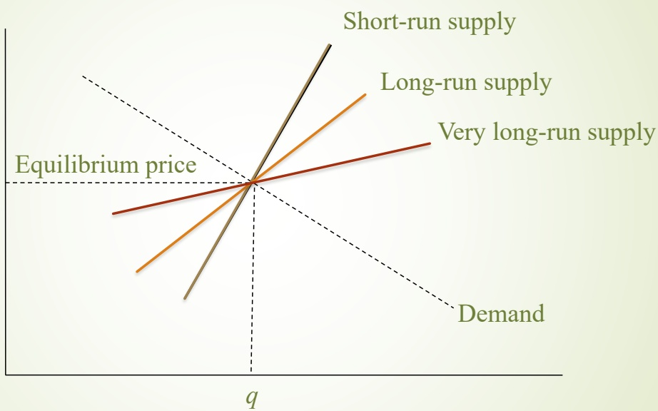
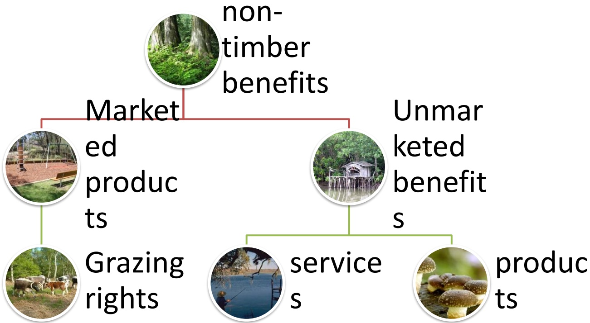
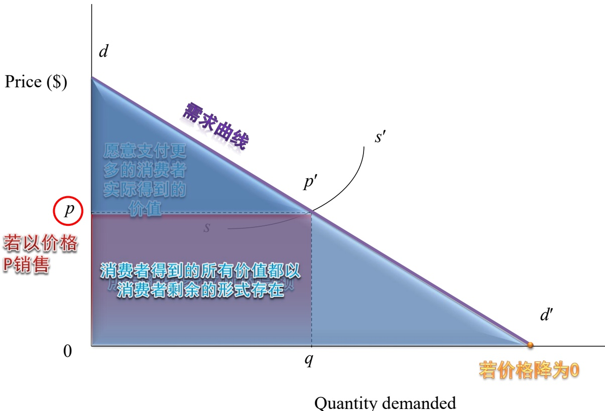
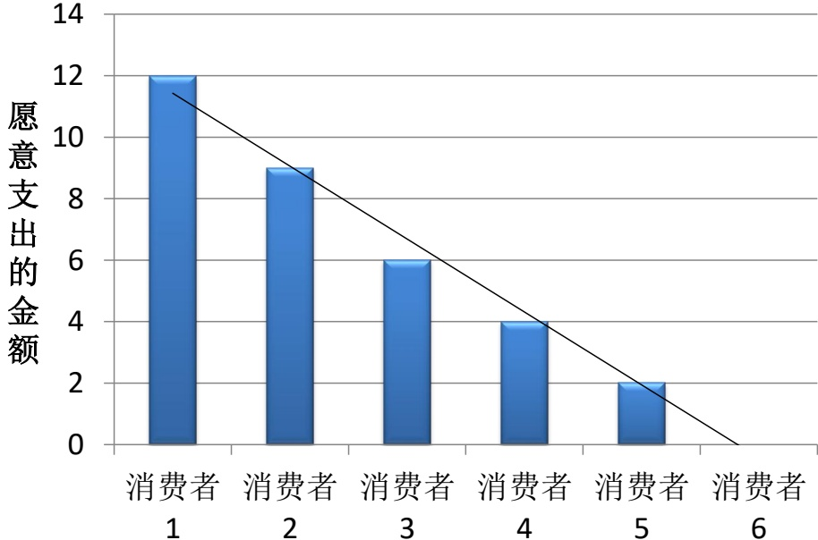
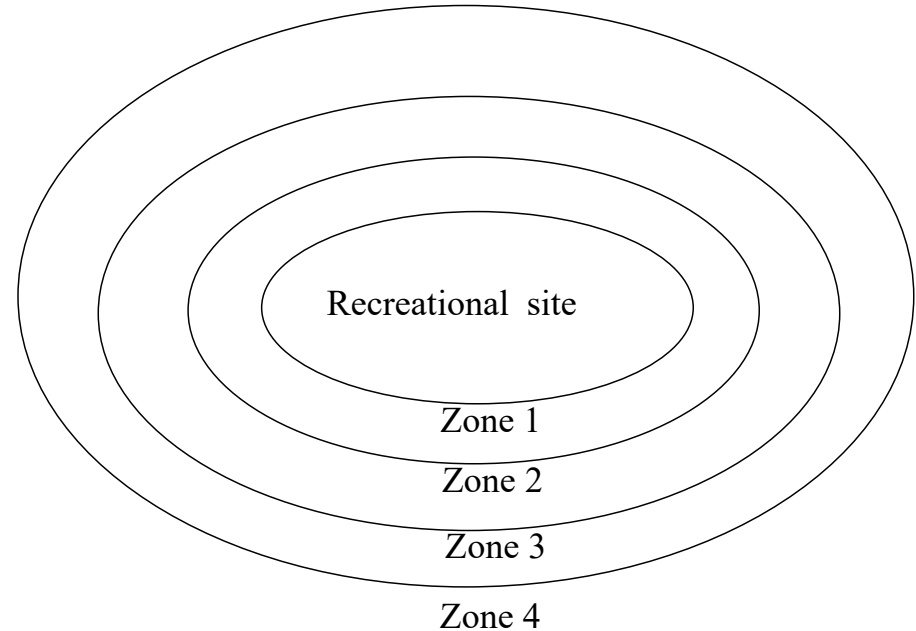
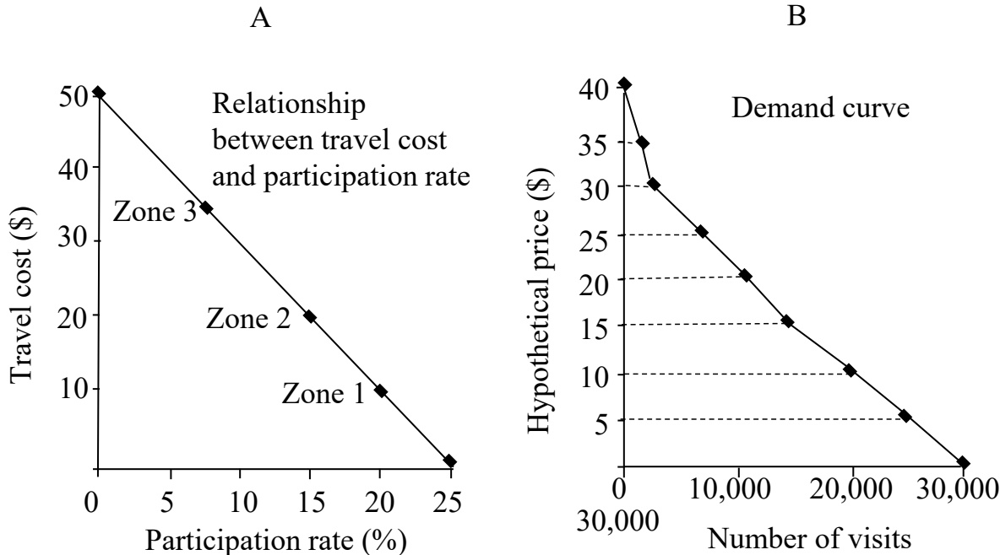
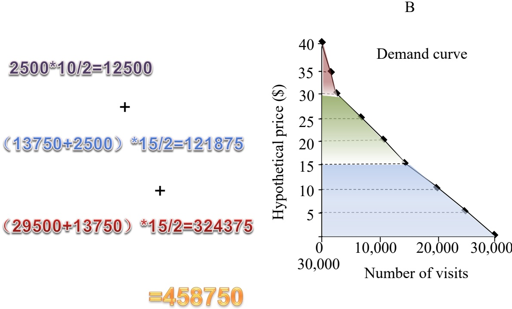
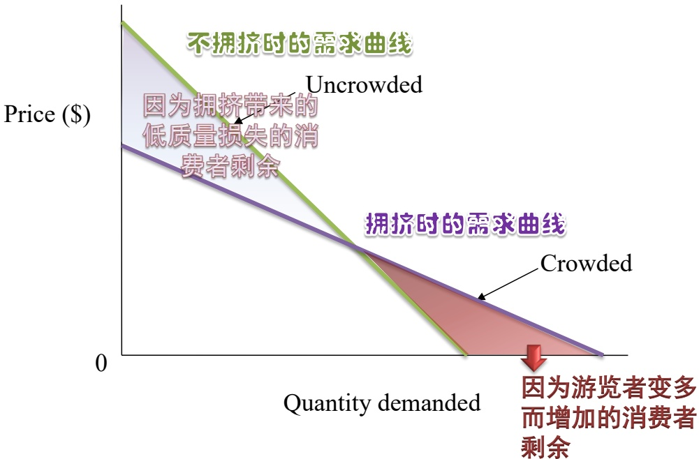

# 林业经济学（双语）第三讲-木材价格与无市场价格的森林价值-2024

> Source: `林业经济学（双语）第三讲-木材价格与无市场价格的森林价值-2024.pptx`
> Generated: 2026-02-25 11:00
> Pages/slides processed: 75

---
## Page 1

木材价格

Supply, Demand and Price Equilibrium 

供给和需求决定木材价格

---

## Page 2

---

## Page 3

Standing timber 

+

Logging and transportation costs 

Delivered logs 

Manufacturing costs 

Forest Products

---

## Page 4

# 林产品的供给和需求

## 林产品供给

$Q=\left(P_{putout}\right)$ C1,$\ldots\ldots(\mathrm{G}n)$ 

Q是产品供给量，$\mathsf{P}_{\mathsf{p u t o u t}}$ 是产品价格，C1到Cn是各种投入的单位成本，包括木材、资本（机械或设备）、劳动力和能源等

## 林产品需求

总量测算法（通过产品价格、人均收入、替代品价格等，测出总的消费量）

利用因子法（识别每一个不同终端市场对产品的平均需求；再估算总需求）

## 价格（模型）方程

WP供给（p，供给因素）=WP需求（p，需求因素，政策变量）

$\mathsf{P}=\mathsf{f}$ （需求因素，供给因素，政策变量）

---

## Page 5

## 木材的供给和需求

## 木材的需求

是一种派生需求，取决于对最终木材制品的需求

派生原木的需求量，与原木价格、林产品价格、以及制造该林产品的投入（劳动力、资本和能源）价格有关

■，是包括原木在内的所有投入品价格和林产品产量的函数

●是原木价格、采伐成本和活立木蓄积量的函数

---

## Page 6

# 短期和长期的木材供给

短期

无法改变固定成本，在边际收益=边际可变成本时，实现利润最大化

Q=(P，I，Z)

Q：年采伐量；I：目前的蓄积量；Z：一系列影响供给的因素（如利率、森林所有权的特征等）所组成的向量

由于短期内蓄积量变化极为缓慢，可假定蓄积量的供给弹性为1，将函数形式写为

$Q/\mathbb{I}=\mathbb{f}$ (P，Z)

---

## Page 7

# 短期和长期的木材供给

## 长期

生产者可以调整生产能力，对价格变化的反应更灵活

长期供给曲线比短期供给曲线更有弹性

但森林资本尚未发生明显变化

## 超长期

森林资本发生变化（需要经历至少一个完整的生长周期）

生产者可以调整所有投入（可变投入、厂房、机器等固定投入、森林资本）

供给对市场价格上升的反应更大

## 长期木材供给预测

根据林地面积、蓄积量、树木年龄组成和生长率，以及永续利用采伐政策等，可预测未来50到100年的长期木材供给

然而，在这种预测中，并未考虑价格的影响，其结果只能在政府干预下才能实现（有时甚至在政府干预下也难以实现）

---

## Page 8

Figure 4.7:Long-run supply response when demand shifts upward

---

## Page 9

Figure 4.6: Timber demand and supply for timber in short and long-run 

Quantity of timber demanded and supplied per period 

---

## Page 10

# 立木价格的决定因素

树种组成

木材的大小和质量（产品组合）

活立木密度 （影响采伐成本）

集材道大小及所处的地形，活立木与集材道间的距离（影响采伐成本）

位置（与市场或加工厂间的距离）

法律法规

销售方式

---

## Page 11

# Unpriced Forest  Valu ues  

无市场价格的森林价值

---

## Page 12

## Contents 

Unpriced Values: A Problem of Measurement 

Consumer Surplus as a Measure of Value 

Evaluating Unpriced Recreation Other Considerations in Valuing Recreational Resources Externalities and Intrinsic Value Other Practical Complications

---

## Page 13

# 一题一无价格的价值：计量问 Unpriced Values:ＡProblem  of Measurement

---

## Page 14

# 森林的非木材效益 non-timber benefits 

---

## Page 15

# Why some forest benefits are not  priced and sold ? 

## The technical reason 

Certain forest values are difficult to price and market in the usual way 

## The political reason 

Some products and services are not marketed because of public choice 

It is typically a nominal administrative fee rather than a market-determined price

---

## Page 16

Pressure from voters who argue that they have a right to free use of the public domain, that they pay for such use through taxes 

And that prices are unfair to people with low incomes 

---

## Page 17

# The absence of prices to  indicate the value of these  resources to consumers  raises the problem of  measuring their value  by other means 

没有价格并非意味着没有价值

如何在没有市场价格指标的情况下来衡

量森林产品及服务的价值？

---

## Page 18

基本思路：从需求出发估计消费者愿意支付多少?

---

## Page 19

# Consumer surplus as a  measure of value 

二、消费者剩余作为价值的计量

---

## Page 20

## Willingness-to-pay 

支付意愿willingness-to-pay（WTP)

The value or utility that consumers gain from a good or service is reflected in their willingness to pay for it 

Their willingness to pay indicates their willingness to give up other things, or income, in order to obtain that particular good

---

## Page 21

## The value or utility 

产品或服务的价值或效用

## Willingne ss to pay 

·消费者的支付意愿

## Demand curve 

·消费者的需求曲线

---

## Page 22

Figure 5.1: Market demand and consumer surplus 

Adapted from Forest Economics by Daowei Zhang and Peter H. Pearse, published by UBC Press, 2011.

---

## Page 23

要找出没有收费的商品或服

务的价值

需要估计它所产生的消费者剩余

需要确定消费者的需求曲线并测

量曲线以下的面积

---

## Page 24

# Evaluating unpriced  recreation 

三、对无价格的野外游憩的评价

---

## Page 25

## 对野外游憩地的需求

许多游乐活动由期望、往返于自的地的旅行、在目的地活动和活动后重新整理回忆等环节组成

对某一特定游憩地点的需求，是由它所能提供的游憩活动的需求中派生出来的

任务是预测在价格大于零时消费游乐的数量

---

## Page 26

1.估计消费者剩余的直接方法

(Direct Measures sofConsumer 

Surplus)

一一直接向消费者询问

---

## Page 27

条件价值方法（contingent valuation method,CVM)

Contingent valuation refers to the method of valuation used in cost benefit analysis and environmental accounting.

It is conditional (contingent) on the construction of hypothetical markets,reflected in expressions of the willingness to pay for potential environmental benefits or for the avoidance of their loss.

---

## Page 28

如果在晓南湖玩需要收费，最多愿意交多少钱？如果把晓南湖填平，最少能接受的补偿是多高?

---

## Page 29

# 愿意支付的最大值：等值差 异(Equivalent Variation) 失去时可接受的最小补偿：补偿 差异(Compensating  Variation)

---

## Page 30

等值差异：向潜在的游乐者询问，为了参观访问某地以及参加游乐活动，最多准备支出多少钱？

把所得的结果从高到低进行排列

---

## Page 31

补偿差异：向游乐者询问，如果不让他们具有这种机会，他们所愿意得到的最小赔偿额

“收入效果”原则：

人们对现金的损失比现金的增加给予更高的权数

最小可以接受的补偿≥愿意支付的最大费用

---

## Page 32

# 哪种方法更为合适？

## 等值差异法

消费者期望具有较高水平的消费或利用的权力需要获得某种产品或服务所愿意支付的最大值(Willingness to Pay,WTP)

## 补偿差异法

消费者已有消费或利用的权力

已经拥有的产品将被拿走

要求维持失去这种产品以前同样利用水平所需要的最小补偿额

(Willingness to accept， WTA)

---

## Page 33

理论基础：消费支出函数

---

## Page 34

## 问卷设计要点:

1、事先测试一—预调查

2、对所评价的游憩地状况、功能和人们付费的方式进行详细的描述

3、注意避免答案的扭曲（回答人猜测提问目的，假设情况下的回答与实际选择并不一致）

---

## Page 35

## 一 些补充方法

对回答者的一致性进行检验

运用回归分析的方法确定回答者的支付意愿是否与他们的社会经济和人口统计特征相关

检验支付意愿是否与经济理论相一致

---

## Page 36

显示型方法(Revealed preference）：了解被调查者的实际选择结果

Conti ngent choic

---

## Page 37

# 什么是条件选择法？

条件选择方法

Contingent Choice Model 

要求人们对假设的问题进行选择

针对具有多重用途资产的不同特征的偏好从人们在许多实际选项中推断出消费者对资产价值的评价

一片森林，可以（1）采伐后为当地人提供就业机会和收入

（2）建为森林公

园，免费开放

（3）严格保护其

生态功能，限制人

为破坏

愿意选择哪一种?

---

## Page 38

2计量消费者剩余的间接方法(Indirect Measures of Consumer Surplus)

一一从观察到的间接证据中推断

---

## Page 39

# 显示型的支付意愿法(Reveal  willingness to pay) 旅行费用法、特征法（享乐法） the travel cost approach  hedonic price method

---

## Page 40

## (1) Theory of Recreation Behavior 

游乐行为理论

Fixedcosts：固定成本不随在游乐地所花时间的长短而变化

The cost of travelling to and from the site 往返于游乐地的旅行费用

Any fee that must be paid for access 所需要支付的门票

Variablecosts：可变成本取决于游乐时间的长短

The cost of food and suppies

---

## Page 41

Figure 5.2: Equilibrium level of recreation consumption at two levels of fixed cost 

$$T_{X}$$

$$\mathbb{T}_{\mathbb{N}}\mathbb{T}_{\mathbb{N}}了了进入游$$

$$T_{M}V_{M^{2}}$$

---

## Page 42

旅行费用法：The travel cost approach 

$\mathbb{T}_{\mathbb{M}}\mathbb{T}_{\mathbb{X}^{\sharp}}$ 为了进入游乐地所愿意支付的部分（等值差异）

这也是消费者愿意为游乐地支付门票的最高值

同时也是其对已经免费享受到的游乐资源的价值评价一一即其消费者剩余

要计算这一价值，需要先了解游乐者往返于游乐地的费用信息

---

## Page 43

## 旅行费用法

假定所有游乐者有相同的支付意愿

旅行费最高的游乐者：是边际的游乐者

其它所有人的消费者剩余：各自旅行费用和

边际游乐者旅行费用的差额

举例：边际游乐者：40元旅费

其它所有游乐者的平均值：15元旅费

平均消费者剩余：40-15=25元

---

## Page 44

## 需满足的假设

无论游乐者的收入或其它情况如何，所有人都有同样的支付意愿

进入游乐地点所发生的全部费用就是其旅行的现金支出

对进入费的反应和旅行费的反应一样

付出最高旅行费的游乐者是处在边际上的这些假设不可能和现实情况一致，从而限制了这种方法的可信程度

---

## Page 45

# 相同支付意愿假设可能夸大消费者剩余

如何解决这一问题?

可以测量游乐者对进入某地所必须支付的成本的敏感程度

并用这些信息去估计他们对进入费用的反应

---

## Page 46

Figure 5.3: Zones of travel origin to a recreational site 

根据居住地与游乐地点的距离分成几个中心区

每个中心区的总人口数、去游乐地的人次数和平均旅行费用可估算出来

---

## Page 47

TABLE5.1Visitationdataforarecreationalsiteandtotalvisitsperyearwithsimulatedincreasesintravelcost 

<html><body><table border="1"><thead><tr><td>Zones Zone 1 Zone 2</td><td>Population (number) 50,000</td><td>Travel cost ($) 10 20</td><td>Participation rate (%) 20.0 $P r i c e=0(o b s e r v e d)$</td><td>Participation (number) 10,000</td><td></td><td>Participation rate (%) 17.5 12.5 5.0 $P r i c e=\S5\left(s i m u l a t e d\right)$</td><td>Participation (number) 8,750 12,500</td><td>Participation Participation rate (%) (number) 15.0 7,500 10.0 10,000 2.5 1,500 0 $P r i c e=\S10(s i m u l a t e d)$</td></tr><tr><td>Zone 3</td><td>100,000 60,000</td><td></td><td>35</td><td>15.0 7.5</td><td>15,000 4,500 0</td><td>0.0</td><td>3,000 0 24,250</td><td>0.0</td></tr><tr><td>Zone 4 rotal</td><td>20,000</td><td></td><td>50</td><td>0.0 12.5 $P r i c e=\S15\:(s i m u l a t e d)$</td><td>29,500 6,250</td><td>$P r i c e=\S20(s i m u l a t e d)$</td><td>5,000</td><td>7.5 $P r i c e=\S25(s i m u l a t e d)$</td></tr><tr><td>Zone 1 Zone 2</td><td>230,000</td><td></td><td></td><td>7.5 0.0</td><td>7,500 0</td><td>10.0</td><td>5,000 0</td><td>19,000 2.5 0.0 0</td></tr><tr><td>rotal</td><td></td><td></td><td></td><td>0.0</td><td>0 13,750</td><td>5.0 0.0 0.0</td><td>0 10,000</td><td>3,750 2,500 0.0 0 6,250</td></tr><tr><td>Zone 3 Zone 4 Zone 1</td><td></td><td></td><td></td><td>5.0</td><td>2,500</td><td></td><td></td><td>0 0 0 $P r i c e=\S40(s i m u l a t e d)$</td></tr><tr><td></td><td></td><td></td><td></td><td></td><td>$P r i c e=\S30(s i m u l a t e d)$</td><td></td><td>2.5 1,250 0.0 0.0 0.0 $P r i c e=\S35(s i m u l a t e d)$</td><td></td></tr><tr><td>Zone 2 Zone 3 Zone 4</td><td></td><td></td><td></td><td>0.0 0.0 0.0</td><td>2,500</td><td>0 0 0</td><td>0 0 0 1,250</td><td>0.0 0.0 0.0 0.0 0 0</td></tr><tr><td>rotal</td><td></td><td></td><td></td><td></td><td></td><td></td><td></td><td></td></tr><tr><td></td><td></td><td></td><td></td><td></td><td></td><td></td><td></td><td></td></tr><tr><td></td><td></td><td></td><td></td><td></td><td></td><td></td><td></td><td></td></tr><tr><td></td><td></td><td></td><td></td><td></td><td></td><td></td><td></td><td></td></tr><tr><td></td><td></td><td></td><td></td><td></td><td></td><td></td><td></td><td></td></tr><tr><td></td><td></td><td></td><td></td><td></td><td></td><td></td><td></td><td></td></tr><tr><td></td><td></td><td></td><td></td><td></td><td></td><td></td><td></td><td></td></tr><tr><td></td><td></td><td></td><td></td><td></td><td></td><td></td><td></td><td></td></tr><tr><td></td><td></td><td></td><td></td><td></td><td></td><td></td><td></td><td></td></tr></tbody></table></body></html>

---

## Page 48

Figure 5.4: Derivation of the demand curve for a recreational site from travel costs 

---

## Page 49

# 以第1、2区为例，

当价格为0时

第一区和第二区与旅行成本相对应的参与率差别为：

(15%-20%)/（￥20-￥10)=0.5%/￥1

当价格上升1元，参观人数将减少0.5%

当门票价格增加到5元

第一区的参观者总成本从￥10增加到￥15

参观者的比例下降$0.5\%*5=2.5\%$ 即从20%降至17.5%

---

## Page 50

## 据此推算

可以得到每个区在门票增加为5元后的实际参观人数

并将各个区的人数进行加总

得到门票为￥5时总的参观人数为24250人同理，能够计算出所有价格水平时的参观者比率和参观人数

根据计算值汇出一条倾斜向下的需求曲线需求曲线以下的部分即为总消费者剩余

---

## Page 51

Figure 5.4: Derivation of the demand curve for a recreational site from travel costs 

---

## Page 52

# 上述方法依赖于对总人口的参与率的估计

因此在哪些人口众多、游乐选择余地较广的地区则显得不太可靠

其它方法：通过收入分类、通过教育程度、年龄、家庭环境等可能影响游乐者支付意愿的其它因素进行分类

---

## Page 53

# 区别游乐者不同支付意愿的其它技术

如：用收入来对人们进行分类

假设相近收入水平的游乐者支付意愿相似

在每个收入阶层中，用发生的固定成本对他们进行分类

假定付出最高固定成本的人位于或接近边际

每个游乐者所享受的消费者剩余就等于他的固定成本和位于同一收入阶层的边际游乐者的固定成本的差额

通过这种方法，人们可以获得某一特定价格下对某一游乐设施的参观人数，从而得到需求曲线

---

## Page 54

## 特征法（享乐法）The Hedonic Method 

The hedonic method use information about the characteristics of a variety of sites to estimate the value that recreationists ascribe to them 

并非孤立评价一个游乐地资源的价值，而是根据各种地点特征的有关信息来进行估计

---

## Page 55

）根据游乐者对不同地点的选择的观察，来估计其潜在价格或一定组成特征的价值

包括：1、参观人数；2、游乐天数；3、旅行支出

计算每个特征的“影子价格”

把参观各个不同游乐地点的消费者所支出的费用，对不同地点特征进行回归

该值就是游乐者对每个特征的支付意愿的估计值

任何特定地点都可以用它的质量特征来加以评价

---

## Page 56

如何用特征法计算晓南湖的价值？

1、寻找参照物：东湖、西湖、东

西湖...

2、分解特征：湖面大小、水质、

知名度....

3、回归分析，求解各个特征对消

费者花费金钱的影响程度大小

4、将晓南湖的特征变量代入模型

中，求解消费者愿意为其花费的

平均费用

---

## Page 57

# 特征法的优点和困难

## 优点

对游乐机会质量特征的认识

在这些特征基础上解释不同地点价值差异的能力

## 困难

旅游者的目标并非单一如果在很长的旅游活动中偶然造访某地点，将所有旅行费用归结于该地点的价值并不合适

在多用途情况下，需将成本

进行适当分配

未能考虑时间成本支出

---

## Page 58

# 基于费用支出的方法  用重新建设该设施或场所所需要 的成本估算来代替其价值估算 Expenditure-Based Methods

---

## Page 59

## 三 种成本的估计方法

## Replacement cost 

重置成本

对于已经失去或即将失去的某项设施的重建成

本

## Damage avoided cost 

损失避免成本

避免已经发生的、或即将发生的损失而愿意支

付的费用

## Substitute cost 

替代品成本

能够提供同样效用的替代设施的成本

---

## Page 60

# Cost-Effectiveness  Analysis   成本-有效性分析

---

## Page 61

The expenditure-based methods are closely related to another concept in benefit/cost analysis: costeffectiveness 

基于费用的方法与成本-有效性分析（或成本-效果分析）非常相近

在某些情况下，比较提供某种收益的不同途径的成本就足够了，而不用去考虑无价格的效益

这是一种为实现事先决定的森林管理目标，而保证其目标一致的有效性的有用技术

---

## Page 62

# Other Considerations in  Valuing Recreational  Resources  

四、在评价游憩资源时需要考虑的其它问题

---

## Page 63

# 对人类不具有直接效益的森林效益

野生动物、美学、生物多样性、自然环境质量….

将这些价值作为游憩地最终游乐价值的中间产品

垂钓者的最终目的不是收获钓到的鱼，而是享受垂钓的乐趣

不能仅仅使用所收获到的中间产品（如钓到的鱼）的价值来评价游憩地的游乐价值

增加上述中间产品，可以提高游乐活动质量、吸引更多游乐者、增加消费者剩余

---

## Page 64

# 游乐设施容量、质量和拥挤现象

---

## Page 65

Figure 5.5: Effect of crowding on demand for a recreational opportunity 

---

## Page 66

# “适当的拥挤”——good  crowd  

“从众效应”使得人们更愿意前往拥挤的游览胜地

---

## Page 67

# 拥挤会导致质量的下降，如何改进?

增加投资、提高容量或质量

但在收费低于均衡价格的情况下，缺乏投资者

利用价格或拍卖机制实现最大效益

但对低收入人群不公平

抽签或先到先进机制

相对更为公平

但不会实现最大收益

---

## Page 68

Externalities and Intrinsic Value 五、外部性和内在价值

---

## Page 69

## Externalities 

溢出价值：not only provide benefits to its user but also increase the value of adjacent private properties 增加临近私人财产的价值

可用特征法进行估算

不反映在任何市场价格上的价值

理论上可用条件价值法对样本群体进行估算

但对所有受到外部性影响的人群进行评价则通

常不太现实

---

## Page 70

# 森林管理中的两种外部效果

保存一片森林的价值可能是消费者剩余、选择价值、保存价值的混合。而公共品可能产生所有以这些形式存在的价值。

对这些价值的估计必须依赖于主观评价方法，或为揭示不愿意失去它们的支付意愿而进行的公共调查。

---

## Page 71

## Intrinsic -Value 

Some philosopher and conservation biologists view all living organisms and works of nature as having their own intrinsic value, independent of human perceptions of their usefulness or their aesthetic and spiritual appeal 

认为自然资源的价值不取决于人们对其的消费和利用

更多基于道德角度，否定经济学分析的必要性

---

## Page 72

Other practical complications 六、其它实用上的局限性

---

## Page 73

## 缺乏市场价格导致森林效益价值评价的

## 困难

尽可能利用市场价格对森林效益进行评价

所有方法都只提供了粗略的估计结果，但为确定如何最好地使用和发展森林提供了有益的依据

在忽略供给成本的情况下，往往高估森林资源的价值

---

## Page 74

## 本章小结

条件价值法：

最直接的评估方法

调查假设情况下消费者的支付意愿

旅行费用法、特征法、费用支出法

间接评价方法

从需求、供给等角度出发

可能出现高估：

只考虑需求曲线以下的部分，更多估计的是使用价值而非交换价值。

---

## Page 75

## Key words 

Stumpage Contingent choice Delivered logs method Forest products Travel cost approach markets The Hedonic Method Derived demand Expenditure-Based Long-run supply & Very Methods long-run supply Cost-Effectiveness Unpriced values Analysis Consumer surplus 

Willingness to pay 

Contingent valuation 

method

---
